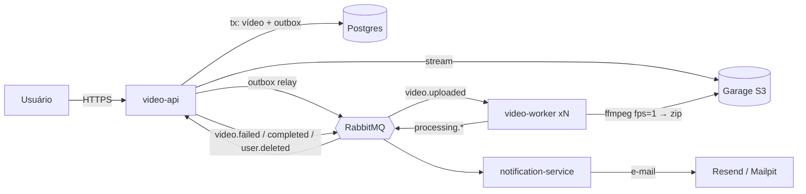

# FIAP Frames: processamento de vídeos em microsserviços

Hackathon da pós-graduação **Software Architecture (FIAP, turma 14SOAT), Fase 5**. A FIAP X
(empresa fictícia do enunciado) contratou um sistema que recebe vídeos, extrai **um frame por
segundo** e entrega um `.zip` com as imagens. O produto se chama **FIAP Frames**
(<https://frames.asdevit.com>).

O projeto base (um único programa em Go, síncrono e sem persistência) foi reescrito como três
microsserviços NestJS que se comunicam por fila:

| Serviço | Papel | Interface |
|---|---|---|
| `video-api` | Cadastro/login (JWT), upload em streaming, status, download assinado, outbox, LGPD (`/api/me`), frontend estático | HTTP `:3000` (prefixo `/api`) + `:9464` interno |
| `video-worker` | ffprobe/ffmpeg (`fps=1`) e zip em streaming para o storage; escala por fila (KEDA) | só `:9464` interno (`/health`, `/metrics`) |
| `notification-service` | E-mail de falha (e de sucesso, opcional): Resend em produção, Mailpit local | só `:9464` interno (`/health`, `/metrics`) |

Infra: PostgreSQL 16, RabbitMQ 4.3 (filas quorum, retry por filas `.retry.N`, DLQ), Redis 7
(throttling e `Idempotency-Key`), Garage (S3), Mailpit (local). Produção: K3s na VM, com
Prometheus, Grafana, Loki e Grafana Alloy (`infra/k8s/`).



## Como rodar (5 minutos)

Pré-requisitos: Docker com Compose v2 (OrbStack ou Docker Desktop), `make`, `curl`, `jq` e
Node 22.13+ (`.nvmrc`) para os testes. O `engines` aceita `^22.13.0 || >=24.0.0` (no Node 25 o
`npm ci` avisa `EBADENGINE` do `@prometheus-io/client`; é esperado).

```bash
npm ci                 # dependências + hook de pre-commit (gitleaks + lint-staged)
make up                # gera o .env (segredos locais) e sobe infra + migrações + apps
make up WORKERS=3      # idem, com 3 réplicas do video-worker
make smoke             # health, métricas protegidas, buckets, ffmpeg só no worker
make demo-happy        # cadastro → upload → COMPLETED → download do zip (examples/)
make demo-sad          # vídeo corrompido → FAILED P0001 → e-mail no Mailpit
make down              # derruba (make down-v apaga também os volumes)
```

| O quê | Onde (portas só em `127.0.0.1`) |
|---|---|
| Frontend | <http://127.0.0.1:8080/> |
| Swagger | <http://127.0.0.1:8080/api/docs> |
| Mailpit (e-mails) | <http://127.0.0.1:8025> |
| RabbitMQ (usuário `fiapx`, senha `RABBITMQ_PASSWORD` do `.env`) | <http://127.0.0.1:15672> |
| Garage S3 / Admin API | <http://127.0.0.1:3900> / <http://127.0.0.1:3903> |

**Exemplos passo a passo** (curl de todos os endpoints com respostas reais, fila no RabbitMQ,
e-mail no Mailpit, frontend): [`docs/exemplos.md`](docs/exemplos.md). Mesmas requisições para o
VS Code REST Client: [`docs/exemplos.http`](docs/exemplos.http). Vídeos de exemplo:
[`examples/`](examples).

Ordem de subida do compose: infraestrutura (healthy) → one-shots `garage-init` (buckets e chave
S3), `video-api-migrate` e `notification-migrate` (mesma imagem do app, `node dist/migrate.js`)
→ apps. Escalar workers com o stack no ar: `docker compose up -d --scale video-worker=3` (cada
réplica tem o próprio `/work` em tmpfs).

Os segredos locais ficam **só** no `.env` (gitignored), gerado por `scripts/dev-secrets.sh` a
partir do `.env.example`; rodar de novo nunca sobrescreve valores existentes. Variáveis
exportadas no shell ganham do `.env` (ex.: `ZIP_RETENTION_DAYS=0.0005 make up`).

### Desenvolvimento sem Docker (apps)

Os três apps sobem um servidor interno de `/health` e `/metrics` em `METRICS_PORT` (padrão 9464).
Rodando juntos na mesma máquina, cada um precisa da sua porta:

```bash
npm run start:dev:video-api                                  # http://localhost:3000/api/docs · métricas :9464
METRICS_PORT=9465 npm run start:dev:video-worker             # http://localhost:9465/health
METRICS_PORT=9466 npm run start:dev:notification-service     # http://localhost:9466/health
```

## Testes

| Comando | O que faz |
|---|---|
| `npm run lint` | ESLint (flat config, zero warnings) + Prettier `--check` |
| `npm run typecheck` | `tsc --noEmit` em todo o monorepo e, de novo, só no código de produção (`tsconfig.build.json`) |
| `npm test` | Unitários de todos os projects |
| `npm run test:cov [-- <project>]` | Cobertura **por project**, threshold de 80% em cada um |
| `npm run test:e2e` | E2E do `video-api` (Testcontainers: Postgres, Redis, RabbitMQ, Garage) |
| `npm run test:int` | Integração com dependências reais (Testcontainers + **ffmpeg** no PATH para o worker) |
| `make test-bdd` | Sobe o stack de BDD (3 workers, retenção do zip de ~43 s) e roda `npm run test:bdd`: **cenários BDD em pt-BR** (`tests/bdd/features`, jest-cucumber) contra o stack real |
| `npm run test:bdd` | Só os cenários BDD, contra um stack já no ar (o de retenção é pulado se a retenção for longa) |
| `make load VUS=20 DURATION=30s` | Pico com k6 (`tests/load/spike.js`): 100% `202` e 100% `COMPLETED` |
| `make fixtures` | Gera `tests/fixtures/*.mp4` (ffmpeg); `tests/fixtures/generate.sh --examples` regera `examples/` |

Cenários BDD (`tests/bdd/features/*.feature`): usuário processa vídeo e baixa o zip; vídeo
corrompido termina em FALHOU e o usuário recebe e-mail (com o mesmo `correlationId`); usuário não
vê vídeo de outro (404) e sem token recebe 401; pico de 15 uploads simultâneos, todos `202` e
`COMPLETED` com 2+ workers e DLQs vazias; LGPD (aceite obrigatório, cadastro concorrente,
exportação, eliminação com linhas/objetos apagados e notificações anonimizadas, retenção do zip →
410); observabilidade (`/metrics` com token, histograma HTTP, `correlationId` em API, worker e
notificação); e, por último, **nenhum dado pessoal nos logs** de todos os containers.

## Estrutura

```
apps/
  video-api/              # HTTP público (/api), Swagger, frontend em public/, migrações, outbox, LGPD
  video-worker/           # consumidor + ffmpeg (sem HTTP público)
  notification-service/   # consumidor + e-mail (Resend/SMTP), retenção/anonimização
libs/
  common/                 # AppError + catálogo A/V/P/X, filtro global, config zod, TypeORM, ZodValidationPipe
  observability/          # pino (redação LGPD, log de acesso enxuto), correlation id, métricas e /health internos
  messaging/              # topologia, publicador com confirm, consumidor com retry/DLQ, MessagingModule
  contracts/              # envelope e eventos (zod), createEvent; fixtures em @fiapx/contracts/fixtures
  storage/                # porta IObjectStorage, adaptador S3/Garage, StorageModule
test/support/             # @fiapx/testing: Testcontainers e waitFor (integração)
tests/bdd/                # E2E BDD (features pt-BR + steps jest-cucumber) contra o compose
tests/load/               # k6 (spike.js + README)
tests/fixtures/           # generate.sh (vídeos de teste, fora do git)
examples/                 # vídeos pequenos versionados (ok 5 s, ok 10 s, corrompido)
docker/                   # Dockerfile único parametrizado (APP, WITH_FFMPEG) + healthcheck
compose.yaml              # stack local e do CI (infra, one-shots de migração, 3 apps)
infra/garage, infra/postgres   # config/init do compose
infra/k8s/                # Kustomize (base, overlays prod/local, jobs, observabilidade)
infra/vm/                 # K3s na VM compartilhada: instalação, firewall, Caddy, deploy.sh (forced command)
scripts/                  # dev-secrets.sh, compose-smoke.sh, test-cov.mjs, demo/, git-hooks/
docs/                     # contratos, libs, exemplos, LGPD, observabilidade, runbooks, estudos
legacy/projeto-base/      # o "antes": código Go original
```

Cada módulo de app segue Clean Architecture (`domain/`, `application/`, `infrastructure/`,
`interfaces/`). Convenções em [`CLAUDE.md`](CLAUDE.md); nomes de filas, eventos, erros, tabelas,
variáveis e métricas em [`docs/arquitetura/contratos.md`](docs/arquitetura/contratos.md).

## Observabilidade e LGPD (resumo)

- **Métricas**: `@prometheus-io/client` (sucessor do `prom-client`) em `:9464/metrics` com Bearer;
  histograma HTTP `fiapx_http_request_duration_seconds` e métricas de negócio `fiapx_*`
  (contratos.md, seção 11). **Prometheus + Grafana** no cluster, 2 dashboards provisionados.
- **Logs**: pino JSON com `correlationId`; **Grafana Alloy** (o Promtail foi descontinuado) envia
  ao **Loki** (72 h). O mesmo id liga HTTP → outbox → fila → worker → e-mail.
- **SLOs, não SLA**: 5 SLOs numa janela de 7 dias com orçamento de erro e 8 alertas
  (disponibilidade ≥ 99,5%, upload p95 < 5 s, processamento p95 < 120 s, sucesso ≥ 99%, nenhuma
  requisição perdida). Detalhes: [`docs/observabilidade.md`](docs/observabilidade.md).
- **LGPD**: aceite da política no cadastro (data + versão), vídeo original apagado ao terminar,
  zip por 7 dias, notificações anonimizadas em 30 dias, `GET /api/me/data` (exportação) e
  `DELETE /api/me` (eliminação), logs só com IDs (verificado pelo BDD). Detalhes:
  [`docs/lgpd.md`](docs/lgpd.md) e o runbook [`docs/runbooks/incidente-dados.md`](docs/runbooks/incidente-dados.md).

## CI/CD

`.github/workflows/ci.yml` roda em todo PR e em push na `main`:

| Job | O que faz |
|---|---|
| `quality` | `npm ci`, lint, typecheck, build, actionlint, hadolint e shellcheck |
| `test` | matrix por app/lib, cobertura ≥ 80% em cada um (artefato `coverage-<project>`) |
| `e2e` | E2E do `video-api` com containers reais |
| `integration` | `npm run test:int` (Testcontainers + ffmpeg instalado no runner) |
| `security` | **gitleaks** no histórico inteiro (`.gitleaks.toml`) e `npm audit --omit=dev --audit-level=high` (não bloqueia; aviso) |
| `k8s-validate` | `infra/k8s/scripts/validate.sh`: kustomize dos overlays, regras do deploy e da quota, **kubeconform** estrito, promtool (regras + testes), Loki, Alloy, dashboards |
| `build-images` | build das 3 imagens **uma vez** (cache do Actions), `APP_VERSION=sha-<7>`, exportadas como artefato |
| `e2e-bdd` | carrega essas imagens (sem rebuild), sobe o compose com 3 workers, roda o smoke e o **BDD**; em falha, anexa os logs do compose |
| `images` | só no push na `main` e com tudo verde: publica **as mesmas imagens** em `ghcr.io/arthurfcs98/fiapx-<app>:sha-<7>` e `:main` |
| `ci-ok` | agregador: único check exigido na branch protection |
| `deploy` | só no push na `main`, depois de `ci-ok` e `images`: SSH com chave restrita (forced command `infra/vm/deploy.sh`), aplica `infra/k8s/overlays/prod` com as imagens `sha-<7>` fixadas por digest, migrações, rollout, smoke público (`/api/health/live` == `sha-<7>`) e rollback automático se falhar. Environment `production`, um deploy por vez |

Rollback manual: `.github/workflows/rollback.yml` (aba Actions → *rollback* → *Run workflow*).

### Configuração do GitHub para o deploy

| Onde | Nome | Valor |
|---|---|---|
| Environment `production` (Deployment branches: `main`) → secret | `VM_HOST` | IPv4 público da VM (impresso pelo `infra/vm/40-deployer-access.sh --yes`) |
| idem | `VM_SSH_KEY` | chave privada ed25519 **restrita** do usuário `fiapx-deploy` (a pública fica na VM com forced command) |
| idem | `VM_KNOWN_HOSTS` | linha `<ip> ssh-ed25519 AAAA...` impressa pelo `40-deployer-access.sh` (host key fixado, sem TOFU) |
| Repositório → variable + secret (opcional) | `DOCKERHUB_USERNAME` / `DOCKERHUB_TOKEN` | login no Docker Hub para evitar rate limit de pull |
| Packages | `fiapx-video-api`, `fiapx-video-worker`, `fiapx-notification-service` | visibilidade **pública** (o `deploy.sh` resolve o digest sem credencial) |
| Branch protection / ruleset da `main` | check obrigatório | `ci-ok` |

Passo a passo da VM (K3s, firewall, Caddy, usuário de deploy, Secrets do namespace):
[`infra/vm/README.md`](infra/vm/README.md) e [`infra/k8s/README.md`](infra/k8s/README.md).

Actions fixadas pelo SHA do commit e imagens de ferramentas por tag + digest; o Dependabot
(`.github/dependabot.yml`) propõe as atualizações. **Sempre fixar `sha-<7>`**, nunca `:main`.

## Segurança do repositório

- Nenhum segredo no git: local só no `.env` (gitignored); produção só em Secrets do K8s criados
  na VM (`infra/k8s/scripts/bootstrap-secrets.sh`) e nos secrets do environment do GitHub.
- **pre-commit** (instalado pelo `npm ci` via `simple-git-hooks`):
  `gitleaks protect --staged` (regras em `.gitleaks.toml`; sem o binário, usa a imagem Docker do
  CI) e `lint-staged` (ESLint `--fix` + Prettier nos arquivos staged). O job `security` do CI
  repete o gitleaks no histórico inteiro.

## Documentação

- Exemplos de uso: [`docs/exemplos.md`](docs/exemplos.md) · [`docs/exemplos.http`](docs/exemplos.http)
- Contratos entre serviços: [`docs/arquitetura/contratos.md`](docs/arquitetura/contratos.md)
- API das libs: [`docs/arquitetura/libs.md`](docs/arquitetura/libs.md)
- LGPD: [`docs/lgpd.md`](docs/lgpd.md) · runbook de incidente: [`docs/runbooks/incidente-dados.md`](docs/runbooks/incidente-dados.md)
- Observabilidade e SLOs: [`docs/observabilidade.md`](docs/observabilidade.md)
- Kubernetes: [`infra/k8s/README.md`](infra/k8s/README.md) · VM/K3s: [`infra/vm/README.md`](infra/vm/README.md) · estudos: [`docs/estudos/`](docs/estudos)
- Teste de carga: [`tests/load/README.md`](tests/load/README.md)
- Projeto original em Go: [`legacy/projeto-base/`](legacy/projeto-base/)
