# Arquitetura do FIAP Frames

> Documento principal de arquitetura do Hackathon FIAP SOAT (turma 14SOAT, Fase 5). Lido de
> cima para baixo, ele é o roteiro da apresentação: problema → visão geral → implantação →
> fluxos → decisões → como cada requisito do enunciado foi atendido.
>
> - Produção: <https://frames.asdevit.com>
> - Repositório: <https://github.com/arthurfcs98/fiap-fase5-fiapx>
> - Nomes exatos (filas, eventos, tabelas, erros, variáveis, métricas):
>   [`docs/arquitetura/contratos.md`](arquitetura/contratos.md). Em caso de dúvida, vale o código.

## Sumário

1. [Problema e contexto](#1-problema-e-contexto)
2. [Visão geral (C4)](#2-visão-geral-c4)
3. [Implantação](#3-implantação)
4. [Fluxos principais](#4-fluxos-principais) (upload e download, falha com e-mail, retry e
   DLQ, pico, dependência fora do ar)
5. [Máquina de estados do vídeo](#5-máquina-de-estados-do-vídeo)
6. [Mensageria](#6-mensageria)
7. [Dados](#7-dados)
8. [Picos e processamento paralelo](#8-picos-e-processamento-paralelo)
9. [Segurança e LGPD](#9-segurança-e-lgpd)
10. [Observabilidade](#10-observabilidade)
11. [Qualidade, testes e CI/CD](#11-qualidade-testes-e-cicd)
12. [Matriz de requisitos do enunciado](#12-matriz-de-requisitos-do-enunciado)
13. [Decisões (ADRs)](#13-decisões-adrs)
14. [Limitações conhecidas e evoluções](#14-limitações-conhecidas-e-evoluções)

**Com pouco tempo?** Leia a seção 1.2 (antes e depois), os diagramas das seções 2 e 4.1, a
seção 8 e a matriz da seção 12.

---

## 1. Problema e contexto

### 1.1 O pedido

A FIAP X (empresa fictícia do enunciado) tem um protótipo que recebe um vídeo, extrai **um
frame por segundo** com o ffmpeg e devolve um `.zip` com as imagens. Ele funciona para uma
pessoa enviando um vídeo por vez. O enunciado pede que o sistema:

- processe **mais de um vídeo ao mesmo tempo** e **não perca requisições em picos**;
- seja **protegido por usuário e senha** e **liste o status dos vídeos de cada usuário**;
- **avise o usuário por e-mail** quando o processamento falhar;
- persista os dados, tenha arquitetura escalável, testes, CI/CD e código versionado no GitHub.

O produto entregue se chama **FIAP Frames**. O código original em Go continua intacto em
[`legacy/projeto-base/`](../legacy/projeto-base/) para comparação. Do projeto base foi mantido
o comportamento funcional: o campo multipart `video`, as mesmas 7 extensões aceitas
(`.mp4 .avi .mov .mkv .wmv .flv .webm`), o comando `ffmpeg -i <vídeo> -vf fps=1` com saída
`frame_%04d.png` e um zip com todos os frames.

### 1.2 Antes e depois

Linhas conferidas em [`legacy/projeto-base/main.go`](../legacy/projeto-base/main.go) e
[`legacy/projeto-base/Dockerfile`](../legacy/projeto-base/Dockerfile).

| # | Antes: projeto base (Go) | Onde | Depois: FIAP Frames |
|---|---|---|---|
| 1 | **Processamento síncrono dentro da requisição.** O handler do upload chama o ffmpeg e só responde no fim: um vídeo longo prende a conexão (a Cloudflare corta em 100 s) e um pico dispara N ffmpeg de uma vez | `handleVideoUpload` (l. 75) chama `processVideo` (l. 117) | `POST /api/videos` só grava (storage + banco) e responde **`202`** em segundos. O vídeo vai por **fila** (RabbitMQ) para o `video-worker`, que processa um por vez por réplica e escala pelo tamanho da fila |
| 2 | **Colisão de nomes.** Upload, pasta temporária e zip usam um carimbo com precisão de **segundo**: dois uploads no mesmo segundo misturam frames, o `defer os.RemoveAll` de um apaga a pasta do outro e o zip é sobrescrito | l. 94-96, 129-131, 160-161 | Cada vídeo tem um **UUID**. Chaves `{userId}/{videoId}{ext}` e `{userId}/{videoId}.zip` (o nome enviado nunca vira caminho) e uma pasta de trabalho por execução (`/work/{videoId}/{runId}`, no disco da própria réplica) |
| 3 | **Download sem dono.** `GET /download/:filename` entrega qualquer zip pelo nome, e o nome é previsível (`frames_<timestamp>.zip`) | l. 58 e 236-251 | Pedir o link exige **JWT e ser o dono** (vídeo alheio → `404`). O link é assinado com **HMAC-SHA256 e vale 5 min**; o zip vem em stream de um bucket privado |
| 4 | **Arquivos públicos.** `r.Static("/uploads")` e `r.Static("/outputs")` expõem vídeos e zips de todo mundo | l. 48-49 | **Buckets privados** no Garage (S3). O storage não é exposto na borda: só o `video-api` e o `video-worker` têm chave, cada um com o mínimo de permissão |
| 5 | **Sem usuário; "listagem" global.** `GET /api/status` lista os zips de todos | l. 60 e 253-279 | Cadastro e login (bcrypt + JWT). `GET /api/videos` paginado e **filtrado pelo dono**, com status, erro e histórico |
| 6 | **Sem persistência.** O estado é o disco do container: um restart perde tudo e não dá para ter duas réplicas | todo o arquivo | **PostgreSQL** (2 bancos), **RabbitMQ** (filas quorum em disco) e **Garage** (S3), todos com volume persistente |
| 7 | **Erro cru e HTTP 200 na falha.** A saída inteira do ffmpeg volta para o cliente, e a resposta é `200` mesmo quando falhou | l. 142-147 e 123 | Falha vira estado **`FAILED` com código** (`P0001` etc.) e mensagem amigável; o detalhe técnico fica só no log. Erros HTTP seguem um catálogo (`A/V/P/X`) |
| 8 | **ffmpeg sem limites.** Sem timeout, sem `ffprobe`, sem restrição de protocolo | l. 135-140 | `ffprobe` antes (duração máxima), `ffmpeg -nostdin -protocol_whitelist file -format_whitelist <contêineres de vídeo> -threads 2`, `nice -n 10`, timeout, frames limitados (1 por segundo da duração máxima, lado maior até 1920 px, `MAX_FRAMES_MB` no disco), processo não-root e teto de CPU/memória por réplica |
| 9 | **Validação só pela extensão e sem limite de tamanho.** A mensagem de erro ainda cita 4 das 7 extensões aceitas | l. 76, 86-89 e 281-291 | Extensão **+ magic bytes** do arquivo, limite de **95 MiB** (`MAX_UPLOAD_MB`, abaixo dos 100 MB do proxy) e duração máxima no worker |
| 10 | **Upload com falha nunca é apagado** (só remove em caso de sucesso) | l. 119-121 | Vídeo original apagado ao terminar (COMPLETED **ou** FAILED); zip guardado por 7 dias; `/work` limpo em `finally` |
| 11 | **Ninguém é avisado de falha** | — | `notification-service` manda e-mail (Resend) no `FAILED`, sem duplicar e sem perder o aviso |
| 12 | **CORS `*` e operação improvisada**: `fmt.Printf`, `log.Fatal(r.Run(":8080"))`, sem health, sem shutdown gracioso, sem testes | l. 36, 62-65 | CORS só para `https://frames.asdevit.com`, CSP e cabeçalhos de segurança; logs JSON com `correlationId`; `/api/health/live` e `/ready`; métricas Prometheus; SIGTERM gracioso; mais de 1.000 testes |
| 13 | **Dockerfile "como NÃO fazer"** (o próprio comentário diz): estágio único `golang:1.21-alpine`, `COPY . .`, `go mod tidy` no build, `CMD ["go", "run", "main.go"]` (compila a cada start), roda como **root**, sem healthcheck | Dockerfile l. 1-2, 4, 13, 16, 25 | [`docker/node-service.Dockerfile`](../docker/node-service.Dockerfile): multi-stage, base fixada por **digest**, só dependências de produção, usuário **1000**, `tini`, `HEALTHCHECK`, labels OCI; a imagem publicada é a mesma que passou nos testes |

---

## 2. Visão geral (C4)

**Em uma frase:** três microsserviços NestJS que conversam por eventos no RabbitMQ; o
`video-api` responde rápido e grava o pedido de forma durável (Transactional Outbox), o
`video-worker` faz o trabalho pesado no ritmo que a fila permite e escala com ela, e o
`notification-service` avisa o usuário.

### 2.1 Nível 1: contexto

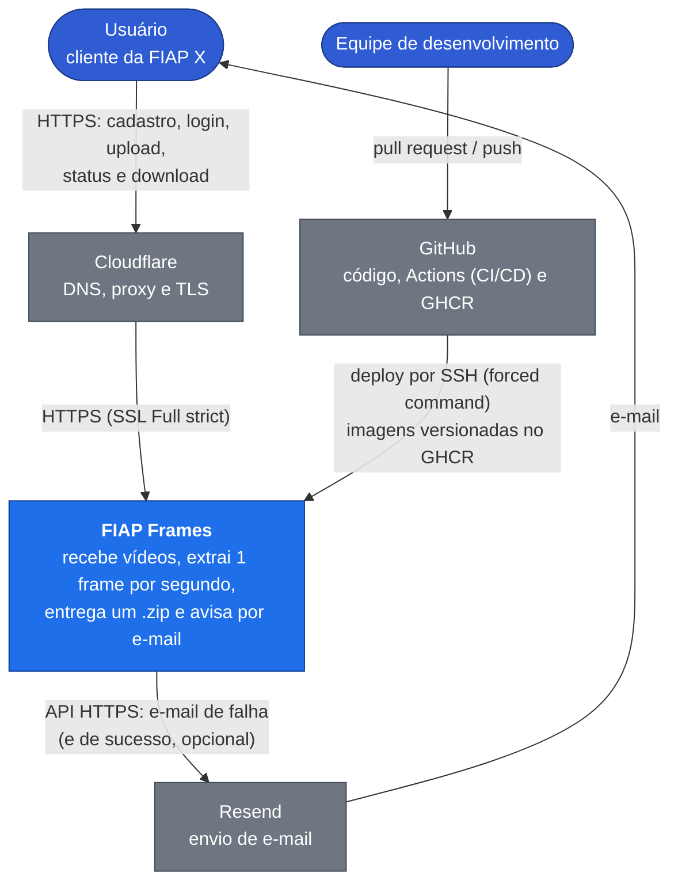

### 2.2 Nível 2: containers

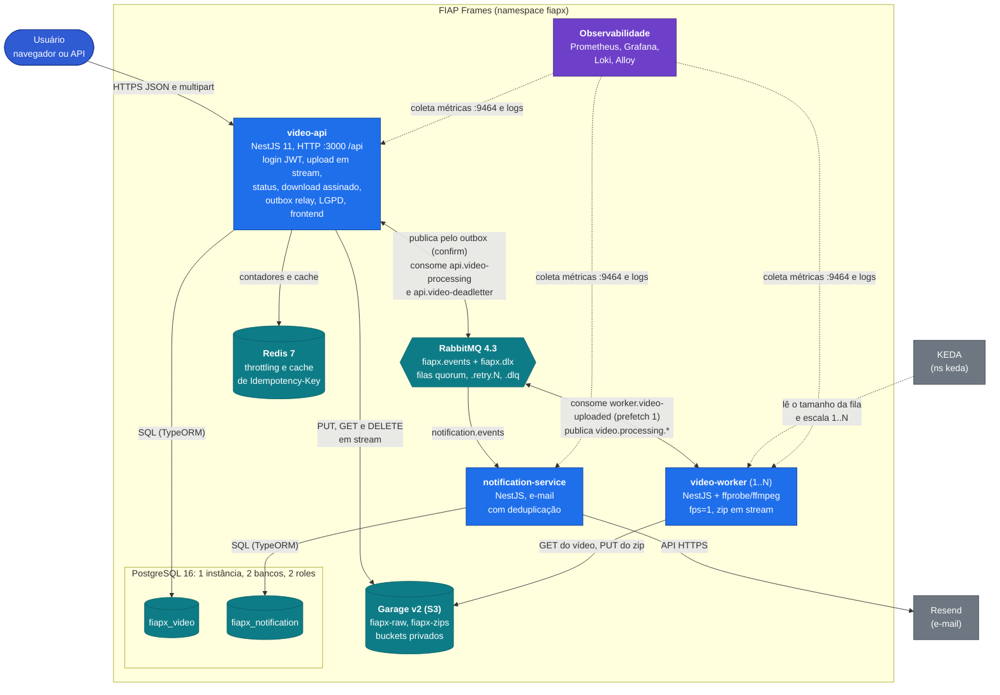

### 2.3 Responsabilidades

| Container | Tecnologia | Responsabilidade | Dados que possui | Escala |
|---|---|---|---|---|
| `video-api` | NestJS 11 (Express 5), TypeScript | Cadastro/login (JWT), upload em streaming, listagem e detalhe, link de download assinado, **outbox relay**, consumo dos eventos do worker (máquina de estados), LGPD (`/api/me`), Swagger e frontend estático | banco `fiapx_video`; objetos nos dois buckets | HPA por CPU, 1 a 2 réplicas na VM |
| `video-worker` | NestJS + ffprobe/ffmpeg (Alpine) | Baixa o vídeo, valida com `ffprobe`, extrai 1 frame/s com limites (duração máxima, lado maior até 1920 px, `MAX_FRAMES_MB` de frames), gera o zip em stream e publica o resultado | nenhum (stateless; `/work` efêmero, uma pasta por execução) | KEDA pelo tamanho da fila, 1 a 2 réplicas na VM |
| `notification-service` | NestJS | E-mail de falha (o de sucesso é opcional e fica desligado em produção) com deduplicação e orçamento diário; anonimização LGPD | banco `fiapx_notification` | 1 réplica |
| PostgreSQL 16 | StatefulSet | Um banco e um usuário **por serviço** (database per service) | — | 1 réplica |
| RabbitMQ 4.3 | StatefulSet | Exchanges `fiapx.events` e `fiapx.dlx`, filas quorum com retry e DLQ; no K8s, um usuário por serviço com permissões mínimas; plugin shovel para o redrive das DLQs | — | 1 réplica |
| Redis 7 | Deployment, sem persistência | Contadores de throttling e cache `Idempotency-Key` → vídeo | — | 1 réplica |
| Garage v2 | StatefulSet (S3 compatível) | Buckets privados `fiapx-raw` e `fiapx-zips`, com quota | — | 1 réplica |
| Prometheus, Grafana, Loki, Alloy | Deployment / StatefulSet / DaemonSet | Métricas, dashboards, logs e alertas (seção 10) | — | 1 réplica |

Frontend: HTML/CSS/JS sem framework, servido pelo próprio `video-api` em `/` (login, cadastro,
upload múltiplo com até 3 envios em paralelo, tabela com atualização a cada 3 s, download e
"Meus dados").

### 2.4 Organização do código

- **Monorepo NestJS** ([ADR-0001](adr/0001-microsservicos-em-monorepo.md)): `apps/` com os 3
  serviços e `libs/` com o código compartilhado (uma cópia só): `@fiapx/messaging` (topologia,
  publicador com confirm, consumidor com retry/DLQ), `@fiapx/contracts` (envelope e eventos
  validados com zod), `@fiapx/storage` (porta S3), `@fiapx/observability` (logs, métricas,
  correlation id) e `@fiapx/common` (erros, config, TypeORM). API das libs:
  [`docs/arquitetura/libs.md`](arquitetura/libs.md).
- **Clean Architecture por módulo**: `modules/<nome>/{domain,application,infrastructure,interfaces}`.
  O `domain` não importa Nest, TypeORM nem SDKs; portas no domínio/aplicação, adaptadores em
  `infrastructure`, controllers e consumidores em `interfaces`. Ex.: a máquina de estados vive em
  `apps/video-api/src/modules/videos/domain/video.ts`, sem nenhuma dependência de framework.

---

## 3. Implantação

### 3.1 Produção: K3s numa VM compartilhada

Produção roda num **K3s de nó único** dentro de uma VM que já hospeda outros projetos em
Docker ("os vizinhos"), atrás do proxy de borda deles. O objetivo nº 1 do desenho é **não
atrapalhar os vizinhos**; o nº 2 é CI/CD de ponta a ponta. Porquê e alternativas:
[ADR-0006](adr/0006-k3s-na-vm-compartilhada.md). Runbook completo: [`infra/vm/README.md`](../infra/vm/README.md).

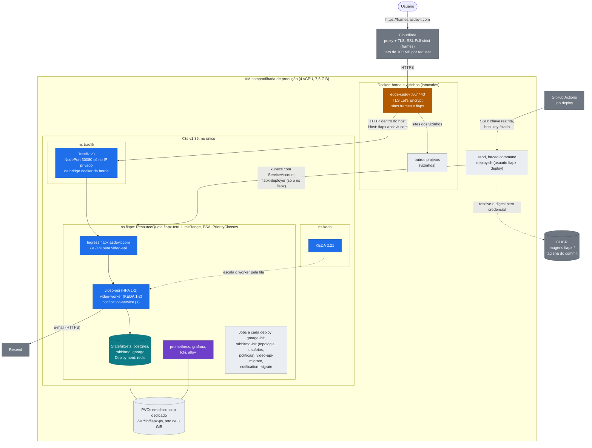

Caminho de uma requisição: navegador → **Cloudflare** (proxy e TLS) → **edge-caddy** da VM (dono
das portas 80/443, certificado Let's Encrypt, teto de 100 MB por request) → **Traefik** num
NodePort publicado só no IP privado da bridge docker da borda → **Ingress** `fiapx.asdevit.com` →
`video-api`. O endereço público `frames.asdevit.com` é repassado ao mesmo Ingress com
`Host: fiapx.asdevit.com` (o host técnico que o deploy e o smoke usam).

**Onde há TLS.** Do navegador até a Cloudflare e da Cloudflare até o Caddy da VM: a regra
"SSL: Full (strict)" da Cloudflare cobre o endereço oficial `frames.asdevit.com` (ela fala HTTPS
com a origem e confere o certificado). Do Caddy ao Traefik e aos pods o tráfego é **HTTP, mas não
sai do host**: passa pela bridge docker interna e pela rede dos pods, que a internet não alcança
(UFW e a guarda `fiapx-netguard` na tabela raw do iptables, em IPv4 e IPv6). O host técnico
`fiapx.asdevit.com`, não divulgado e usado pelo smoke do deploy, está fora da regra: nele a
Cloudflare fala HTTP com a VM (pendência P13 do [`infra/vm/README.md`](../infra/vm/README.md),
seção 12; ver a seção 14).

| Namespace | O que roda | Quem instala |
|---|---|---|
| `fiapx` | os 3 apps, Postgres, RabbitMQ, Redis, Garage **e a observabilidade** (Prometheus, Grafana, Loki, Alloy) | o CD (`deploy.sh`) a partir de [`infra/k8s/overlays/prod`](../infra/k8s/overlays/prod) |
| `traefik` | Ingress Controller (Traefik v3, chart fixado) | root, `infra/vm/30-ingress.sh` |
| `keda` | KEDA 2.21 (escala por fila) | root, `infra/vm/35-keda.sh` |
| `kube-system` | CoreDNS, local-path, metrics-server | K3s |

A observabilidade fica **dentro** do `fiapx` de propósito (decisão D21 do `infra/vm`): o CD só
enxerga esse namespace e não cria RBAC; um namespace próprio exigiria um passo manual de root a
cada mudança de dashboard ou alerta.

### 3.2 Como os vizinhos ficam protegidos

| Risco para os outros projetos da VM | Mecanismo |
|---|---|
| O FIAP Frames consumir memória demais | `kubepods.slice` com parede de memória (RAM − 3 GiB); ResourceQuota `fiapx-teto` (requests 1600m/2304Mi, limits 7 CPU/4608Mi, 20 pods); todo pod com request < limit (QoS Burstable): num OOM global, os pods do fiapx morrem antes dos processos do host |
| ffmpeg disputar CPU | teto de 1 vCPU por worker × no máximo 2 workers; `nice -n 10`; `-threads 2`; prioridade `fiapx-lote` (primeiro a sair sob pressão, a mensagem volta para a fila) |
| Encher o disco | volumes num **loop de 8 GiB dedicado** (`/var/lib/fiapx-pv`) dentro de um loop de 20 GiB do K3s; quota de storage 8Gi; quotas de bucket no Garage (1 GiB raw, 2,5 GiB zips); `max-length-bytes` por fila (e TTL de 7 dias nas DLQs); retenção de métricas e logs; `/work` com `sizeLimit` e, antes dele, o limite `MAX_FRAMES_MB` por vídeo |
| Sequestrar as portas 80/443 ou expor portas | `servicelb` desligado; NodePort só no IP da bridge; UFW + guarda na tabela `raw` do iptables (IPv4 e IPv6); quota proíbe NodePort/LoadBalancer; `DenyServiceExternalIPs` |
| Pod privilegiado ou prioridade de sistema | Pod Security `baseline` no namespace (os pods do fiapx seguem o perfil `restricted`: não-root, sem capabilities, root filesystem só leitura); política de admissão só aceita PriorityClasses `fiapx-*` |
| Quem faz merge ganhar poder na VM | chave de deploy com **forced command** (só roda `deploy.sh`); ServiceAccount do CD só no namespace `fiapx`, sem RBAC, sem Secrets, sem `exec` |

Orçamento completo (CPU, memória, disco por workload) e os 12 achados da revisão de segurança:
[`infra/vm/README.md`](../infra/vm/README.md), seções 4, 11 e 14.

### 3.3 Objetos Kubernetes (Kustomize)

| Componente | Objeto | Réplicas | CPU req/lim | Mem req/lim | Detalhe |
|---|---|---|---|---|---|
| `video-api` | Deployment + **HPA** + Ingress | 1-2 (CPU 70%) | 150m / 500m | 160Mi / 320Mi | RollingUpdate (surge 1, indisponível 0), `preStop sleep 5`, probes `/api/health/live` e `/ready` |
| `video-worker` | Deployment + **ScaledObject (KEDA)** | 1-2 (fila) | 250m / 1 | 256Mi / 512Mi | **Recreate**, grace de 720 s (termina o vídeo em curso inteiro: ffprobe + ffmpeg + transferências), `/work` emptyDir de 2Gi |
| `notification-service` | Deployment | 1 | 25m / 200m | 96Mi / 192Mi | Recreate |
| postgres, rabbitmq, garage | StatefulSet + PVC | 1 | — | — | PVCs de 1Gi, 1Gi e 4Gi |
| redis | Deployment | 1 | 25m / 100m | 32Mi / 64Mi | sem persistência (só contadores e cache) |
| prometheus, grafana, loki, alloy | Deployment / StatefulSet / DaemonSet | 1 | — | — | Grafana e Prometheus sem Ingress (port-forward) |
| setup e migração | 4 Jobs por deploy | — | 50m / 250m | 96Mi / 192Mi | idempotentes; rodam antes do rollout dos apps. O `rabbitmq-init` tem um initContainer que cria a topologia do código como administrador (`setup-topology.js` da imagem do `video-api`) e depois cria os usuários por serviço, o do KEDA e as políticas das filas |

Tabela completa, segurança de cada pod e segredos: [`infra/k8s/README.md`](../infra/k8s/README.md).

### 3.4 Ambiente local: Docker Compose

O mesmo sistema sobe na máquina do desenvolvedor e no CI com [`compose.yaml`](../compose.yaml):
infraestrutura (Postgres, Redis, RabbitMQ, Garage e **Mailpit** no lugar do Resend) → one-shots
(`garage-init`, `video-api-migrate`, `notification-migrate`) → os 3 apps. `make up WORKERS=3`
sobe 3 réplicas do worker; portas publicadas só em `127.0.0.1`. O job `e2e-bdd` do CI roda os
cenários BDD nesse mesmo compose, com as imagens que depois vão para produção.

---

## 4. Fluxos principais

### 4.1 Login, upload, processamento, status e download

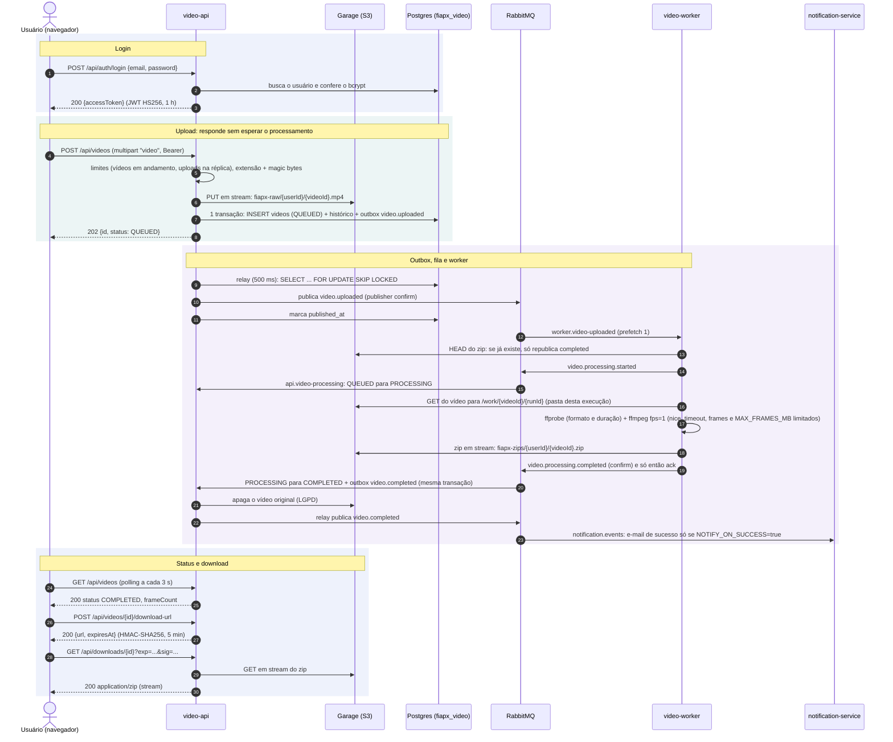

Pontos que valem a pena notar:

- **Nada de arquivo inteiro em memória**: o upload vai em stream do navegador para o storage
  (busboy → `lib-storage`), o worker baixa para disco, o zip é montado em stream (`archiver`, sem
  compressão, porque PNG já é comprimido) e o download sai em stream do bucket.
- **Nunca `202` sem commit**: se a transação falhar, o objeto já gravado é apagado. O
  `correlationId` do upload (header `x-correlation-id`) acompanha o outbox, a mensagem, o worker e
  o e-mail (seção 10).
- **Reenvio seguro**: o header opcional `Idempotency-Key` faz um reenvio do mesmo upload devolver
  o mesmo vídeo (cache no Redis + índice único no Postgres).
- **Capacidade protegida antes de ler o corpo**: no máximo `MAX_PENDING_VIDEOS_PER_USER` (5)
  vídeos em andamento por usuário (acima disso, `429 V0007` com `Retry-After`) e
  `MAX_CONCURRENT_UPLOADS` (8) uploads em stream por réplica (acima, `503 X0003` com
  `Retry-After`). O frontend espera o `Retry-After` e reenvia sozinho: é espera, não perda.
- **E-mail**: em produção só a falha gera e-mail (`NOTIFY_ON_SUCCESS=false`, o que o enunciado
  pede); no compose o e-mail de sucesso fica ligado para o BDD conferir os dois.

### 4.2 Vídeo corrompido: FAILED e e-mail

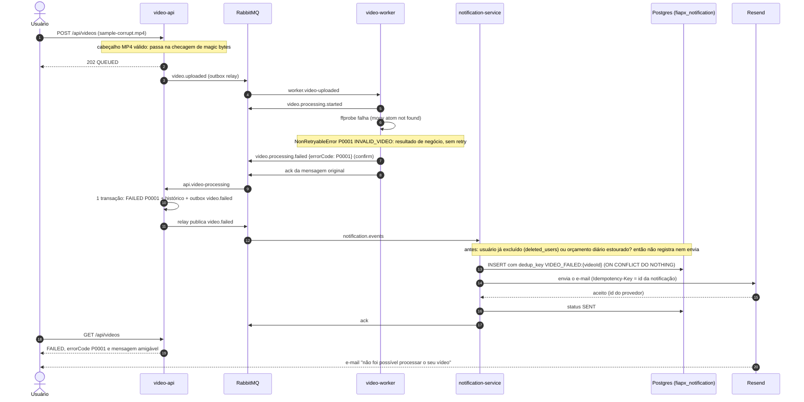

Erros **permanentes** não gastam retry: viram resultado de negócio. Os de entrada vão de `P0001`
(vídeo inválido) a `P0006` (frames acima de `MAX_FRAMES_MB` ou disco de trabalho cheio), passando
por `P0003` (longo demais) e `P0004` (timeout do ffmpeg numa 2ª tentativa); `P0007` (bucket de
zips na quota) é permanente, mas conta como erro do sistema. Lista completa: `contratos.md`,
seção 4.

No notificador: e-mail recusado pelo provedor (ex.: endereço inválido) vira `FAILED` sem retry;
provedor fora do ar ou limitando (conexão recusada, 5xx, 429, timeout) **não** gasta tentativas:
a notificação fica `PENDING`, a mensagem volta para a fila e o consumo pausa até o provedor
responder (fluxo 4.5). Um orçamento diário de e-mails (`NOTIFICATION_DAILY_LIMIT_PER_USER` = 10
por usuário e `NOTIFICATION_DAILY_LIMIT` = 80 no total) impede que o cadastro sem verificação de
e-mail vire fonte de spam, e um evento de quem já excluiu a conta não gera e-mail
(`deleted_users`).

### 4.3 Falha transitória: retry com atraso, DLQ e FAILED P0098

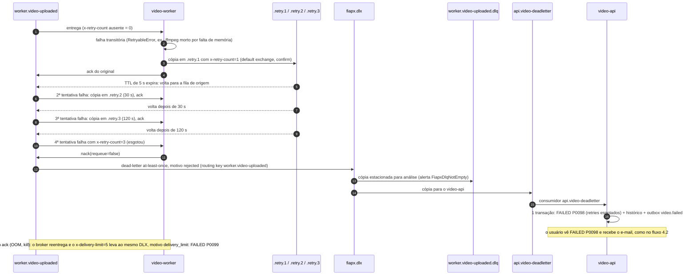

Toda falha termina num **estado visível**: ou o vídeo conclui numa nova tentativa, ou chega a
`FAILED` (com e-mail) e a mensagem fica estacionada na DLQ para análise. Não existe caminho em
que a mensagem some ou fique girando para sempre (seção 6.4). Como o vídeo já está `FAILED` e o
original foi apagado, a `worker.video-uploaded.dlq` é **purgada** depois da análise, não
reenviada (as outras DLQs são reenviadas pelo "Move messages" do RabbitMQ).

Uma dependência fora do ar (Postgres, storage, provedor de e-mail) **não** entra neste caminho:
ela não gasta retry nem leva nada à DLQ (fluxo 4.5).

### 4.4 Pico de uploads: 202 imediato, a fila absorve, o KEDA escala

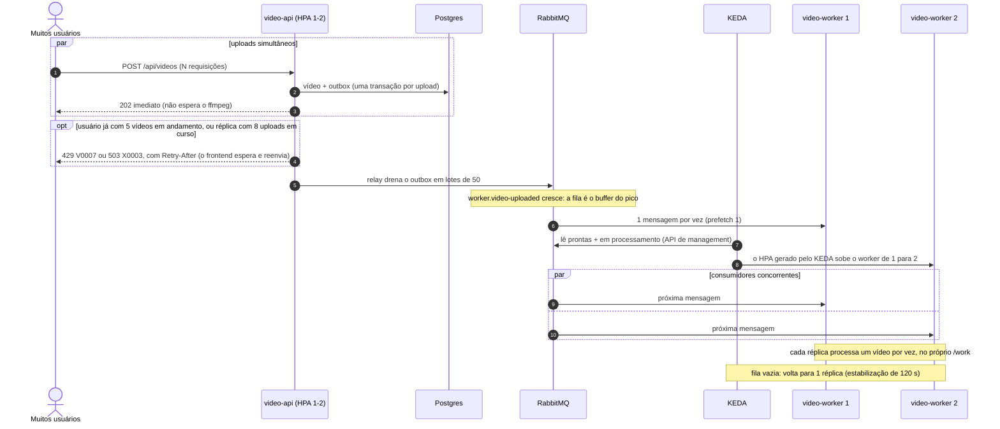

O custo de um upload para a API é só I/O (stream para o storage e uma transação curta), então
ela aceita pedidos muito mais rápido do que o ffmpeg processa. A diferença vira **fila**, não
erro. Para um único usuário não monopolizar a fila, cada um tem no máximo 5 vídeos em andamento:
o 6º upload recebe `429 V0007` com `Retry-After` e o frontend reenvia sozinho quando um termina.
Detalhes e evidências na seção 8.

### 4.5 Dependência fora do ar: o consumo pausa, nada se perde

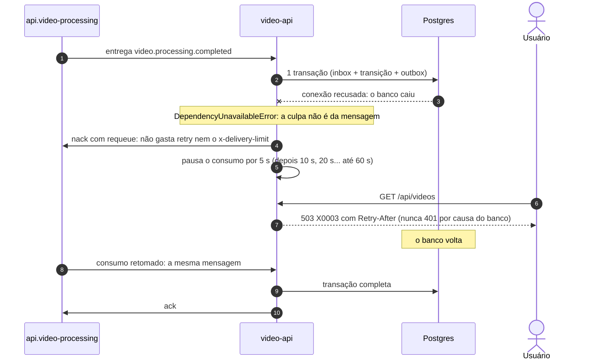

O mesmo vale para o storage no worker e para o provedor de e-mail no notificador: a mensagem
espera na fila (resultado `deferred` na métrica `fiapx_messages_consumed_total`), a DLQ continua
vazia e nenhum vídeo vira `FAILED` por uma queda de infraestrutura. Se a pausa passar de 5 min,
o alerta `FiapxQueueWithoutConsumer` dispara. Teste contra um RabbitMQ real:
`libs/messaging/test/messaging.int-spec.ts`, caso "(g) dependência fora".

---

## 5. Máquina de estados do vídeo

Dona: o `video-api` (entidade `Video` em `apps/video-api/src/modules/videos/domain/video.ts`).
Cada transição grava `video_status_history` e, para COMPLETED/FAILED, o evento no outbox **na
mesma transação**.

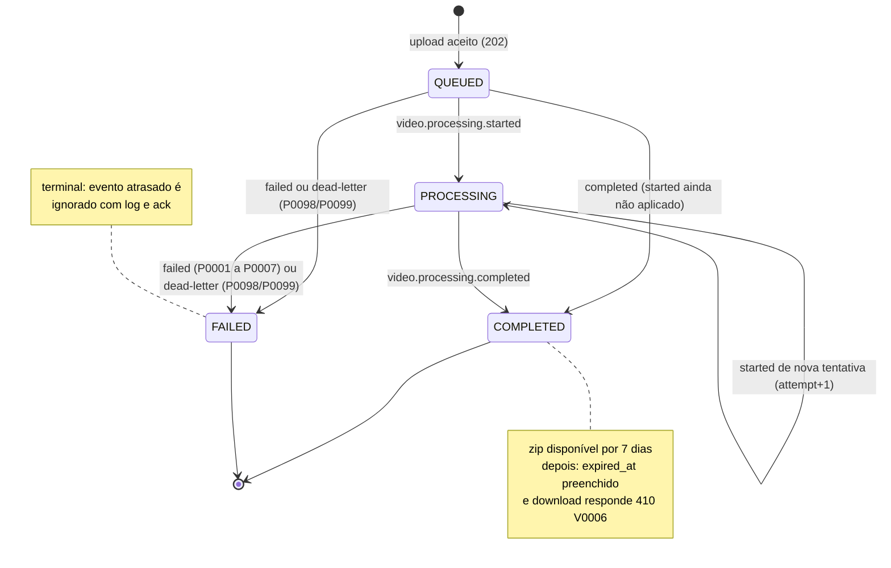

- `completed`/`failed` também são aceitos a partir de `QUEUED`: o `video-api` consome com
  prefetch 10, então o `started` da mesma tentativa pode ser aplicado depois deles.
- Transição inválida (ex.: `started` depois de `COMPLETED`) é **ignorada com log e ack**: é assim
  que eventos repetidos ou atrasados não corrompem o estado.
- A mesma mensagem entregue duas vezes encontra a linha em `processed_messages` (inbox) e não
  muda nada.

---

## 6. Mensageria

RabbitMQ 4.3, vhost `/`. A topologia é **código** ([`libs/messaging/src/topology.ts`](../libs/messaging/src/topology.ts)):
no K3s ela é criada pelo Job `rabbitmq-init` antes dos apps (um initContainer roda o
`setup-topology.js` da imagem do `video-api`) e cada serviço a redeclara, de forma idempotente, a
cada conexão; no compose os próprios serviços a criam. Nenhum consumidor começa antes de a fila
existir. Em produção cada serviço tem **usuário próprio** no broker, com permissões mínimas e
*topic permissions* (o worker só consegue publicar `video.processing.*`; o notificador não
publica nada). Porquê RabbitMQ e não Kafka/BullMQ: [ADR-0003](adr/0003-rabbitmq-quorum-retry-dlq.md).

### 6.1 Roteamento

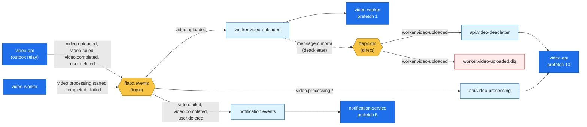

| Fila (todas quorum e duráveis) | Recebe | Consumidor |
|---|---|---|
| `worker.video-uploaded` | `video.uploaded` | `video-worker` (prefetch 1) |
| `api.video-processing` | `video.processing.*` (started, completed, failed) | `video-api` (prefetch 10) |
| `api.video-deadletter` | mensagens mortas de `worker.video-uploaded` (via `fiapx.dlx`) | `video-api` → `FAILED P0098` (retries esgotados) ou `P0099` (crash em loop) |
| `notification.events` | `video.failed`, `video.completed`, `user.deleted` | `notification-service` (prefetch 5) |

Cada uma das 4 filas principais tem ainda `.retry.1`, `.retry.2`, `.retry.3` e `.dlq`: são **20
filas** no total, 2 exchanges e 10 bindings. Envelope (JSON, validado com zod dos dois lados):
`{ id, type, version: 1, occurredAt, correlationId, payload }`, com `id` igual ao `messageId`
do AMQP.

### 6.2 Retry e dead-letter (o mesmo padrão em todas as filas)

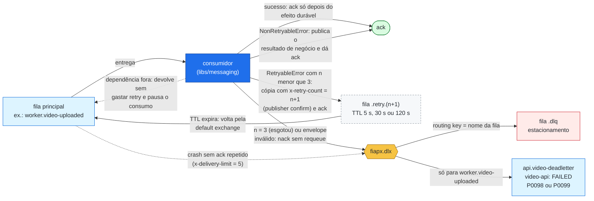

### 6.3 Regras de consumo e publicação

Implementadas uma única vez em [`libs/messaging`](../libs/messaging/src) (`ConsumerRunner` e
`MessagePublisher`); os serviços só escrevem o `handle` de cada fila.

| Regra | Por quê |
|---|---|
| **`ack` só depois do efeito durável** (commit no banco, zip gravado, e-mail aceito) | se o processo cair antes, o broker reentrega; nada é confirmado "no escuro" |
| **Publisher confirms** em toda publicação, `persistent`, `mandatory`, `messageId`, `correlationId`, `type`, `timestamp` | só se considera publicado o que o broker gravou; mensagem sem fila de destino vira erro, nunca descarte silencioso |
| **Filas quorum** (Raft, gravadas em disco) com `x-overflow=reject-publish` | sobrevivem a restart do broker; fila cheia recusa a publicação (o outbox tenta de novo) em vez de descartar as mais antigas |
| **Retry com atraso por filas `.retry.N`** (5 s, 30 s, 120 s; TTL fixo por fila) com o contador `x-retry-count` gravado na cópia | falha transitória ganha tempo para passar, sem bloquear a fila principal (sem head-of-line blocking) |
| **`x-delivery-limit=5`** nas filas principais | crash em loop (poison message) termina no DLX em vez de girar para sempre |
| **Dead-letter `at-least-once`** para `fiapx.dlx` | a mensagem morta não se perde entre a fila e a DLQ |
| **Erro permanente = resultado de negócio** (`NonRetryableError` → publica `video.processing.failed` e dá ack) | vídeo inválido não gasta 4 tentativas nem polui a DLQ |
| **Consumidores idempotentes** | at-least-once implica duplicatas: `video-api` usa inbox (`processed_messages`) + guarda de estado; `video-worker` usa a chave determinística do zip (`HEAD` antes de processar); `notification-service` usa `dedup_key` única e manda o id da notificação como `Idempotency-Key` ao provedor |
| **Dependência fora = pausa, não retry** (Postgres, storage, provedor de e-mail inalcançáveis): `nack` com requeue e consumo pausado de 5 s a 60 s (fluxo 4.5) | a culpa não é da mensagem: uma queda longa não gasta as tentativas nem enche a DLQ; o consumo volta sozinho |
| **Canal fechado no meio do processamento**: cada entrega carrega um sinal de abort que dispara quando o canal dela fecha; o worker mata o ffmpeg e aborta as transferências, e nada é confirmado nem publicado depois disso. Cada execução usa a própria pasta (`/work/{videoId}/{runId}`) e entregas com o mesmo `messageId` rodam uma depois da outra | o broker já vai reentregar; publicar o resultado de uma entrega perdida geraria estado duplicado, e a reentrega nunca mexe nos arquivos da execução antiga |
| **Ciclo de retry novo** para mensagem que chega por dead-letter ou por redrive de DLQ; o motivo original da morte segue nas cópias de retry pelo header `x-origin-death-reason` | sem isso, a primeira falha transitória em `api.video-deadletter` iria direto para a DLQ, herdando o contador do worker; e o `video-api` precisa do motivo original para escolher `P0098` ou `P0099` |
| **Consumer cancelado pelo broker**: o consumidor se re-assina sozinho (1 s a 30 s); no worker e no notificador, 60 s sem consumer derrubam o `/health` e o Kubernetes reinicia o pod | uma fila nunca fica sem ninguém consumindo em silêncio (alerta `FiapxQueueWithoutConsumer`, que também cobre o `video-api`) |
| **Menor privilégio no broker** (K8s): um usuário por serviço (`fiapx-api`, `fiapx-worker`, `fiapx-notification`), `read` só nas filas que consome e *topic permission* no `fiapx.events` | um serviço comprometido não consegue ler as filas dos outros nem forjar eventos (ex.: o worker não publica `video.completed` nem `user.deleted`) |
| **DLQs com limite**: operator policy `fiapx-dlq-limits` com TTL de 7 dias, 64 MiB e `reject-publish`; redrive pelo "Move messages" (plugin shovel), exceto a `worker.video-uploaded.dlq`, que é purgada (o vídeo já está `FAILED`). Runbook: `FiapxDlqNotEmpty` em [`docs/observabilidade.md`](observabilidade.md#fiapxdlqnotempty) | as DLQs guardam envelopes com dados pessoais (LGPD) e não podem encher o disco; nada é descartado calado |
| **Shutdown gracioso**: SIGTERM cancela o consumer e espera a mensagem em curso | deploy e scale-in não interrompem um vídeo no meio (grace de 720 s no worker, o pior caso de ffprobe + ffmpeg + transferências) |

### 6.4 O bug de requeue infinito da fase anterior e a correção

Na Fase 4 do curso, o consumidor de RabbitMQ lia um contador de tentativas no header da
mensagem, mas **nunca o gravava**, e fazia `nack(requeue=true)`. O broker devolvia a **mesma**
mensagem, idêntica: o contador valia sempre 1, a mensagem nunca chegava à DLQ e girava num loop
quente, sem atraso. No notificador, o erro do provedor de e-mail era só logado e a mensagem era
confirmada: o e-mail se perdia.

Correção nesta fase:

1. O retry **não usa requeue**: publica uma **cópia** com `x-retry-count = n+1` numa fila
   `.retry.N` com TTL (publisher confirm) e só então dá `ack` no original. O contador sempre
   avança ([`libs/messaging/src/retry-decision.ts`](../libs/messaging/src/retry-decision.ts)).
2. Esgotou (3 retries, 4 tentativas no total) → `nack(requeue=false)` → DLX → DLQ.
3. Nenhum caminho devolve a mensagem em loop quente: quando a própria cópia de retry não é
   confirmada pelo broker, a mensagem volta com `reject`, que conta no `x-delivery-limit` da fila
   quorum (teto de 5 devoluções, depois o DLX); quando uma dependência está fora, ela volta sem
   gastar retry, mas o consumidor **pausa** com backoff (5 s a 60 s) antes de pegar outra.
4. O adaptador de e-mail **lança** o erro e o classifica (provedor fora → pausa; outro erro
   temporário → retry; recusa definitiva → `FAILED`); nenhuma falha é confirmada em silêncio.

Provas automatizadas: o teste de integração
[`libs/messaging/test/messaging.int-spec.ts`](../libs/messaging/test/messaging.int-spec.ts)
("(b) regressão da Fase 4": a falha transitória faz exatamente 3 retries com atraso crescente e
cai na DLQ **uma** vez; "(d) poison message": crash a cada entrega termina no DLX por
`delivery_limit`), contra um RabbitMQ real, e o `retry-decision.spec.ts` (unitário).

### 6.5 Transactional Outbox

O `video-api` nunca publica direto no broker dentro de uma requisição. O evento é gravado em
`outbox_events` **na mesma transação** do dado (upload, COMPLETED/FAILED, eliminação de conta) e
um relay (a cada 500 ms, lotes de 50, `SELECT ... FOR UPDATE SKIP LOCKED` com lease em
`locked_until`) publica com confirm e marca `published_at`. Consequências:

- **RabbitMQ fora do ar não derruba o upload**: o evento espera no banco e sai quando o broker
  voltar (backoff de 1 s até 60 s). O readiness do `video-api` nem consulta o RabbitMQ.
- **Várias réplicas do api** publicam sem duplicar trabalho (`SKIP LOCKED` + lease de 30 s;
  nenhuma publicação começa nos últimos 10 s do lease: o resto do lote é devolvido).
- Um crash entre o confirm e o `UPDATE` republica o evento (at-least-once): os consumidores
  deduplicam pelo `messageId`.

Detalhes e alternativas: [ADR-0004](adr/0004-outbox-e-consumidores-idempotentes.md).

---

## 7. Dados

**Database per service**: uma instância de PostgreSQL 16 com **dois bancos e dois usuários**; um
serviço nunca lê o banco do outro (o `notification-service` recebe tudo o que precisa no
payload dos eventos). O `video-worker` não tem banco.

### 7.1 Banco `fiapx_video` (dono: `video-api`)

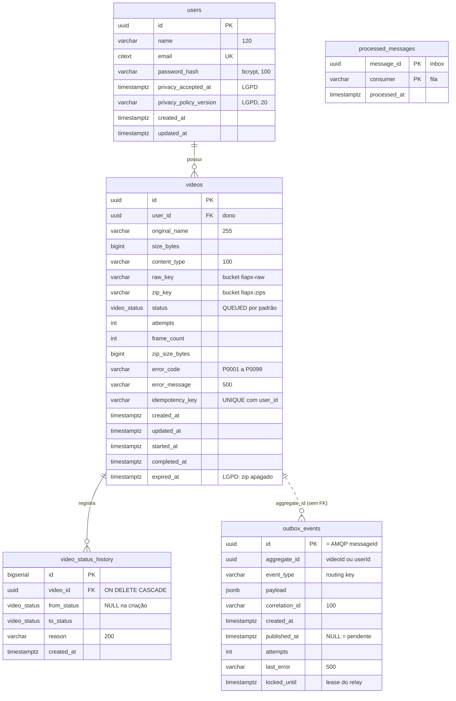

Índices: `ix_videos_user_created (user_id, created_at DESC)` para a listagem do usuário,
`ix_video_status_history_video (video_id)` para o histórico no detalhe e na exportação, e
`ix_outbox_pending (created_at) WHERE published_at IS NULL` (índice parcial: só o que falta
publicar). `video_status` é um `ENUM` (`QUEUED`, `PROCESSING`, `COMPLETED`, `FAILED`). Duas
migrações hoje: a inicial e a do índice do histórico.

### 7.2 Banco `fiapx_notification` (dono: `notification-service`)

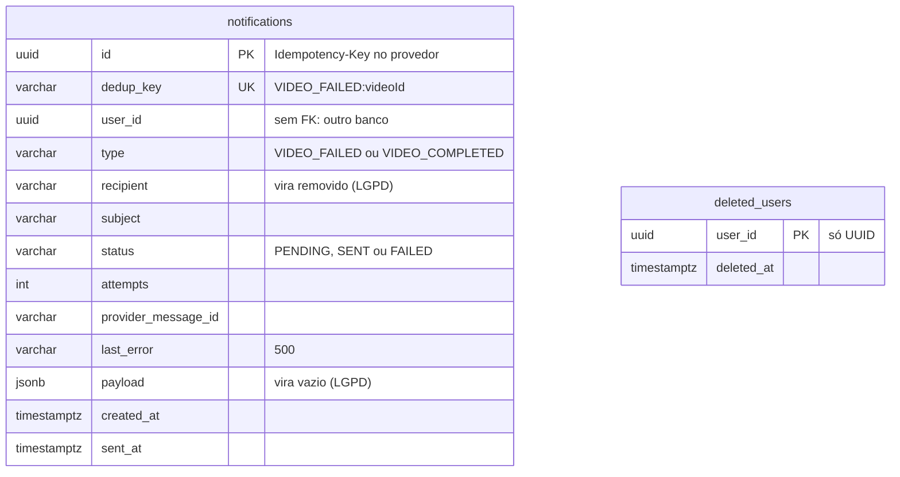

- `deleted_users`: ids dos usuários cujo `user.deleted` já foi aplicado, gravados na mesma
  transação da anonimização. Um `video.failed`/`video.completed` desse usuário que chegue depois
  (retry, redrive) não volta a gravar e-mail nem nome, e nenhum e-mail sai (LGPD).
- Índices: `ix_notifications_user (user_id)` para a anonimização e `ix_notifications_created
  (created_at)` para o orçamento diário de e-mails e a retenção. Duas migrações hoje.

### 7.3 Scripts de criação (entregável do enunciado)

| O quê | Onde | Quem roda |
|---|---|---|
| Bancos e usuários (`fiapx_video`, `fiapx_notification`, um role para cada, `REVOKE ALL FROM PUBLIC`) | [`infra/postgres/init/00-create-databases.sh`](../infra/postgres/init/00-create-databases.sh) (cópia idêntica em `infra/k8s/base/data/postgres/init/`) | entrypoint do Postgres, na 1ª inicialização do volume |
| Schema (caminho oficial) | migrações TypeORM em SQL: `apps/video-api/src/database/migrations/`, `apps/notification-service/src/database/migrations/` | one-shots `node dist/migrate.js` (serviços `*-migrate` no compose, Jobs no K3s) antes dos apps |
| **Schema legível, equivalente às migrações** | [`infra/db/schema/fiapx_video.sql`](../infra/db/schema/fiapx_video.sql) e [`infra/db/schema/fiapx_notification.sql`](../infra/db/schema/fiapx_notification.sql) | referência para leitura (ou criação manual com `psql`); conferidos com `pg_dump` contra as migrações reais |
| Filas e exchanges, buckets e chaves S3, Secrets, cluster | `libs/messaging/src/topology.ts`, Jobs `garage-init`/`rabbitmq-init`, `bootstrap-secrets.sh`, `infra/vm/*.sh` | ver o índice completo |

Índice de todos os scripts de criação, ordem de execução e como a equivalência foi conferida:
**[`infra/db/README.md`](../infra/db/README.md)**.

### 7.4 Storage e cache

| Onde | O quê | Regras |
|---|---|---|
| Garage, bucket `fiapx-raw` | vídeo enviado, chave `{userId}/{videoId}{ext}` | privado; quota de 1 GiB (cheio: o upload recebe `503 X0003` com `Retry-After`); **apagado quando o vídeo chega a COMPLETED ou FAILED** |
| Garage, bucket `fiapx-zips` | zip dos frames, chave `{userId}/{videoId}.zip` (determinística: idempotência do worker), metadados `video-id` e `frame-count` | privado; quota de 2,5 GiB (cheio: o vídeo termina `FAILED P0007`; o alerta `FiapxZipStorageHigh` avisa a partir de 2 GiB); retenção de 7 dias (`ZIP_RETENTION_DAYS`) |
| Redis | contadores de throttling (IP com hash) e `Idempotency-Key` → `videoId` por 24 h | sem persistência; se cair, o throttling libera (fail-open) e o cache cai para o índice do Postgres |

Menor privilégio no storage: o `video-api` usa a chave `svc-api` (leitura e escrita nos dois
buckets) e o `video-worker` a `svc-worker` (só leitura no `fiapx-raw`). Porquê Garage:
[ADR-0005](adr/0005-storage-s3-garage-com-streaming.md). Porquê Redis:
[ADR-0012](adr/0012-redis-throttling-e-cache.md).

---

## 8. Picos e processamento paralelo

### 8.1 "Em caso de picos, o sistema não perde uma requisição"

| Ponto de falha | O que poderia se perder | Mecanismo que impede |
|---|---|---|
| Mais uploads do que capacidade de processar | pedidos recusados ou com timeout | o `video-api` só faz I/O e responde `202`; o processamento é assíncrono e a **fila quorum durável** é o buffer. Os workers consomem no próprio ritmo (prefetch 1) e o KEDA adiciona réplicas |
| RabbitMQ fora do ar durante o upload | o evento `video.uploaded` | **Transactional Outbox**: o evento é gravado na mesma transação do vídeo e publicado quando o broker voltar |
| Crash do `video-api` depois do commit | a publicação pendente | a linha do outbox continua pendente; qualquer réplica a publica depois que o lease vence |
| Broker reiniciar ou cair | mensagens em memória | filas **quorum** (em disco), mensagens `persistent`, **publisher confirms** (publicado = gravado pelo broker), `mandatory` e `reject-publish` (nunca descarte silencioso) |
| Worker morrer no meio de um vídeo (OOM, deploy, despejo) | o vídeo em processamento | **ack só no fim**: o broker reentrega; `x-delivery-limit` impede loop; SIGTERM espera o vídeo em curso inteiro (grace de 720 s) |
| Vídeo que gera frames demais para o disco do worker | o pod inteiro (no K8s, um `emptyDir` cheio faz o kubelet despejar o pod) | a pasta dos frames é medida a cada 1 s: passou de `MAX_FRAMES_MB`, o ffmpeg para e o vídeo termina `FAILED P0006`, sem retry e sem derrubar o pod |
| Broker reiniciar no meio do processamento (canal fechado) | resultado publicado em dobro, arquivos de duas execuções misturados | sinal de abort por entrega: o worker mata o ffmpeg e nada é publicado nem confirmado; a reentrega roda depois da antiga terminar, numa pasta própria |
| Consumer cancelado pelo broker (fila recriada, `consumer_timeout`) | fila parada, sem ninguém consumindo | re-assinatura automática com backoff; 60 s sem consumer derrubam o `/health` do worker ou do notificador e o Kubernetes reinicia o pod; alerta `FiapxQueueWithoutConsumer` |
| Bucket de zips na quota | vídeos presos em retry | `FAILED P0007` na hora, sem retry (conta no SLO como erro do sistema); o alerta `FiapxZipStorageHigh` avisa a partir de 2 GiB, e a retenção de 7 dias libera espaço |
| Falha transitória (ffmpeg morto por falta de memória, timeout na 1ª tentativa, erro inesperado) | a tentativa | **retry com atraso** (5 s, 30 s, 120 s) em filas separadas |
| Postgres, storage ou provedor de e-mail fora do ar durante o consumo | as mensagens em processamento | a mensagem volta para a fila **sem gastar retry** e o consumidor pausa (5 s a 60 s) até a dependência voltar; nada vai para a DLQ por uma queda longa |
| Retries esgotados ou mensagem envenenada | o vídeo ficar para sempre "em processamento" | **DLX**: a DLQ guarda a mensagem (alerta `FiapxDlqNotEmpty`) e o `video-api` marca `FAILED` (`P0098` retries esgotados, `P0099` crash em loop) com e-mail: todo vídeo aceito chega a um estado terminal |
| Mesma mensagem processada duas vezes (at-least-once) | estado corrompido ou e-mail duplicado | inbox `processed_messages`, guarda da máquina de estados, zip determinístico, `dedup_key` |
| Cliente reenviar após timeout | vídeo duplicado | header `Idempotency-Key` (Redis + índice único) |
| Storage fora ou cheio, réplica no limite de uploads simultâneos, usuário com vídeos demais em andamento, limite de taxa | a memória do pod ou a vez dos outros usuários | recusa **explícita e recuperável**, antes de ler o corpo: `503 X0003`, `429 V0007` ou `429 X0429`, sempre com `Retry-After` (o frontend espera e reenvia sozinho); nunca `202` sem o dado gravado |
| Deploy durante o pico | requisições em andamento | `video-api` em RollingUpdate (surge 1, indisponível 0) com `preStop`; worker em `Recreate`: a fila segura as mensagens durante a troca |

**Evidências:** cenário BDD [`04-pico.feature`](../tests/bdd/features/04-pico.feature) (15
uploads simultâneos, todos `202`, todos `COMPLETED` com 2 ou mais workers, DLQs vazias e outbox
zerado) e o teste de carga k6 [`tests/load/spike.js`](../tests/load/spike.js): 20 usuários
virtuais por 20 s, **422 uploads, 100% `202`, 422 `COMPLETED`, 0 perdidos**, p95 do upload de
1.634 ms (SLO: < 5 s).

### 8.2 "Processar mais de um vídeo ao mesmo tempo"

- **Competing consumers**: todas as réplicas do `video-worker` consomem a mesma fila; o broker
  entrega cada mensagem a uma só. Com **prefetch 1**, cada réplica processa um vídeo por vez e
  a fila distribui o resto (nenhuma réplica acumula trabalho enquanto outra está ociosa).
- **KEDA** ([`scaledobject.yaml`](../infra/k8s/base/apps/video-worker/scaledobject.yaml)): lê
  pela API de management as mensagens prontas **e** em processamento e mira 1 mensagem por
  réplica. Na VM compartilhada o teto é **2 réplicas** (1 vCPU cada, para proteger os vizinhos);
  num cluster dedicado basta subir o `maxReplicaCount`. No compose, `--scale video-worker=N`.
- **HPA** no `video-api` (1 a 2 réplicas por CPU a 70%): o outbox com `SKIP LOCKED`, o
  throttling no Redis e o estado no Postgres fazem réplicas extras funcionarem sem coordenação.
- **Isolamento entre vídeos**: UUID por vídeo, chaves próprias no storage e uma pasta por
  execução dentro do `/work` da réplica (volume efêmero por pod); nada é compartilhado em disco.
- **Do lado do usuário**: o frontend aceita vários arquivos e envia até 3 em paralelo, cada um
  num request próprio (progresso, erro e reenvio por arquivo).
- **Justiça entre usuários**: cada usuário tem no máximo 5 vídeos em andamento
  (`MAX_PENDING_VIDEOS_PER_USER`); o excedente espera com `429 V0007` + `Retry-After`, então um
  usuário sozinho não ocupa todos os workers.

Decisão e números: [ADR-0007](adr/0007-autoescala-keda-e-hpa.md).

### 8.3 Limites que protegem a capacidade

Todo limite responde de forma **explícita e recuperável** (código de erro, e `Retry-After` quando
basta esperar): nenhum deles perde um pedido em silêncio. Valores de produção
(`infra/k8s/base/apps/*/config.env` e padrões do código; detalhes em `contratos.md`, seção 10):

| Variável | Produção | O que limita | Passou do limite |
|---|---|---|---|
| `MAX_UPLOAD_MB` | 95 MiB | tamanho de um upload (abaixo dos 100 MB do proxy) | `413 V0003` |
| `MAX_CONCURRENT_UPLOADS` | 8 por réplica | uploads em stream ao mesmo tempo numa réplica do `video-api` (memória do pod) | `503 X0003` + `Retry-After` |
| `MAX_PENDING_VIDEOS_PER_USER` | 5 | vídeos em andamento de um usuário (na fila, processando ou sendo enviados) | `429 V0007` + `Retry-After` de 15 s |
| `THROTTLE_REGISTER_LIMIT`, `THROTTLE_LOGIN_LIMIT`, `THROTTLE_LOGIN_IP_LIMIT`, `THROTTLE_UPLOAD_LIMIT` | 10/h por IP, 5/min por IP + e-mail, 30/min por IP, 30/min por usuário | cadastro, login (cada tentativa custa um bcrypt) e upload | `429 X0429` + `Retry-After` |
| `MAX_VIDEO_DURATION_S` | 600 s | duração do vídeo e, por consequência, o número de frames (no máximo 601) | `FAILED P0003` |
| `FFMPEG_TIMEOUT_MS` | 600 000 ms | tempo do ffmpeg | retry na 1ª vez; depois `FAILED P0004` |
| `MAX_FRAMES_MB` | 1536 MiB (compose: 900) | bytes de frames de um vídeo no disco de trabalho | `FAILED P0006` |
| `NOTIFICATION_DAILY_LIMIT_PER_USER`, `NOTIFICATION_DAILY_LIMIT` | 10 por usuário e 80 no total, em 24 h | e-mails enviados (abaixo da cota gratuita do provedor) | a notificação não é registrada nem enviada (métrica `SKIPPED`) |
| `NOTIFY_ON_SUCCESS` | `false` | e-mail de sucesso | só a falha gera e-mail |

O compose local folga os limites de cadastro, upload e e-mail para o BDD e o k6 rodarem.

---

## 9. Segurança e LGPD

| Tema | Medida |
|---|---|
| Autenticação | cadastro com senha (8 a 72 bytes) guardada com **bcrypt custo 12**; login devolve **JWT HS256 de 1 h** (`iss`, `aud`, só o `sub`); guard global, rotas públicas marcadas explicitamente (`@Public()`); token de conta excluída deixa de valer na hora ([ADR-0008](adr/0008-autenticacao-jwt-e-download-assinado.md)) |
| Autorização | toda consulta filtra pelo dono; vídeo de outro usuário responde `404` (não revela que existe) |
| Download | link assinado **HMAC-SHA256, 5 min**, comparação em tempo constante; bucket nunca exposto |
| Abuso | throttling em Redis: cadastro 10/h por IP, login 5/min por IP + e-mail e 30/min por IP, upload 30/min e exclusão de conta 5/min por usuário; até 5 vídeos em andamento por usuário. E-mail: só o de falha em produção, orçamento diário (por usuário e total), nome e nome de arquivo nunca viram link, nome do cadastro sem endereço de site (o cadastro não verifica o e-mail) |
| Upload e processamento | extensão + magic bytes, limite de 95 MiB, nome do arquivo nunca vira caminho; `ffprobe`/`ffmpeg` só com os formatos de vídeo esperados, sem acesso à rede e com frames limitados (1 por segundo da duração máxima, lado maior até 1920 px) |
| Mensageria | um usuário do RabbitMQ por serviço com permissões mínimas e *topic permissions* (ninguém publica evento que não é seu); o administrador fica só para o broker e o Job de setup |
| Transporte e borda | TLS do navegador até a Cloudflare e da Cloudflare até o Caddy da VM no endereço oficial `frames.asdevit.com` (regra SSL Full (strict): certificado da origem conferido); do Caddy ao Traefik e aos pods, HTTP que não sai do host (bridge docker interna + rede dos pods, fora do alcance da internet pelo UFW e pela guarda `fiapx-netguard`). O host técnico `fiapx.asdevit.com` está fora da regra (seção 3.1). CSP sem script inline, `frame-ancestors 'none'`, CORS só para o domínio público |
| Segredos | nenhum no Git (gitleaks no pre-commit e no CI, no histórico inteiro); produção só em Secrets do K8s (criptografados em repouso pelo K3s), montados como arquivo (`<VAR>_FILE`); local num `.env` gerado |
| Containers | não-root, root filesystem só leitura, sem capabilities, `seccomp RuntimeDefault`, imagens fixadas por digest |

**LGPD by design** ([ADR-0010](adr/0010-lgpd-by-design.md)): aceite da política no cadastro
(data e versão gravadas); minimização (só nome, e-mail, hash da senha e o vídeo); vídeo original
apagado ao terminar; zip por 7 dias; notificações anonimizadas em 30 dias; `GET /api/me/data`
(acesso e portabilidade) e `DELETE /api/me` (eliminação em uma transação, propagada ao
`notification-service` pelo evento `user.deleted`, que também impede um evento atrasado de
regravar os dados); DLQs com TTL de 7 dias; logs só com IDs (o último cenário BDD lê os logs de
todos os containers e falha se aparecer e-mail, nome, nome de arquivo ou link assinado); logs
guardados por 72 h. Documento completo para a banca: **[`docs/lgpd.md`](lgpd.md)**;
incidentes: [`docs/runbooks/incidente-dados.md`](runbooks/incidente-dados.md).

---

## 10. Observabilidade

Três sinais, todos no cluster e provisionados como código em
[`infra/k8s/observability/`](../infra/k8s/observability)
([ADR-0009](adr/0009-observabilidade-e-slos.md)):

| Sinal | Como | Onde ver |
|---|---|---|
| Métricas | `@prometheus-io/client` em `:9464/metrics` (Bearer) nos 3 serviços: histograma HTTP, uploads, concluídos, falhas por `error_code` (todos os códigos nascem em 0), `fiapx_video_turnaround_seconds` (do upload ao COMPLETED, com a espera na fila), outbox pendente, `fiapx_zip_storage_bytes` (zips guardados, contra a quota do bucket), duração do processamento, jobs do worker, mensagens consumidas por fila e resultado (inclusive `deferred` e `aborted`), e-mails. Mais RabbitMQ, Garage, KEDA e CPU/memória por pod | Grafana: dashboards "FIAP Frames — Pipeline de vídeos" (`fiapx-pipeline`) e "FIAP Frames — SLOs" (`fiapx-slos`) |
| Logs | pino JSON no stdout, com `correlationId`; **Grafana Alloy** (sucessor do Promtail, descontinuado) lê pela API do Kubernetes e envia ao **Loki** (72 h) | Grafana → Explore: `{namespace="fiapx"} \| json \| correlationId="<id>"` |
| Rastreamento | o mesmo `correlationId` atravessa HTTP → outbox → AMQP → worker → e-mail (vai até no cabeçalho `X-Correlation-Id` do e-mail) | o mesmo filtro no Loki mostra o caminho inteiro de um upload |

**SLOs (metas internas, janela de 7 dias, com orçamento de erro; não é SLA):**

| SLI | SLO |
|---|---|
| Disponibilidade da API | ≥ 99,5% das requisições sem 5xx |
| Aceite do upload | p95 de `POST /api/videos` < 5 s |
| Tempo de processamento | p95 < 120 s dentro do worker (vídeos de até 60 s) |
| Tempo até o resultado | 95% dos vídeos em COMPLETED até 300 s depois do upload (inclui a espera na fila: um pico com os workers no teto aparece aqui) |
| Sucesso do pipeline | ≥ 99% dos vídeos válidos em COMPLETED (`P0007`, `P0098` e `P0099` contam como erro do sistema; `P0001` a `P0006`, erro de entrada, ficam fora) |

Mais a meta **nenhuma requisição perdida** (DLQs vazias e outbox pendente < 100 por mais de 5
min), vigiada por alertas. São **10 alertas** (taxa de queima do orçamento de erro da API,
latência do upload, lentidão do processamento, DLQ com mensagem, outbox acumulado, fila
crescendo, fila principal sem consumidor, zips perto da quota, worker fora, alvo de coleta fora),
com 17 testes unitários das regras (`promtool test rules`) no CI. Worker e notificador também
respondem `/health` com 503 depois de 60 s sem consumidor ativo, e o Kubernetes os reinicia.
Grafana e Prometheus não têm Ingress: acesso só por `kubectl port-forward`.
Arquitetura, consultas, SLOs e runbook de cada alerta:
**[`docs/observabilidade.md`](observabilidade.md)**.

---

## 11. Qualidade, testes e CI/CD

### 11.1 Pirâmide de testes

| Camada | Ferramenta | Última verificação (2026-09-29) | O que garante |
|---|---|---|---|
| Unitários | Jest 30 + ts-jest, um project por app/lib | **1.187 testes** em 167 suítes | regras de domínio (máquina de estados, retry, classificação de erros do ffmpeg, retenção LGPD), casos de uso com portas falsas |
| Integração | Testcontainers + **ffmpeg real** | **63 testes** em 8 suítes | RabbitMQ real (retry, DLQ, delivery-limit, regressão da Fase 4, dependência fora, canal fechado no meio, permissões dos usuários por serviço num broker vazio), Postgres real (migrações), Garage real (multipart, quota), ffmpeg real (vídeo válido, corrompido, longo, timeout, `MAX_FRAMES_MB`), Mailpit (e-mail) |
| E2E da API | supertest + Testcontainers | **10 testes** | o `video-api` inteiro (como no `main.ts`) com dependências reais |
| BDD (aceitação) | jest-cucumber, Gherkin **em pt-BR** | **13 cenários** em 8 features | os 3 serviços reais no compose com 3 workers: processamento e download, falha com e-mail, isolamento/401, pico, LGPD, retenção, observabilidade, logs sem dados pessoais |
| Carga | k6 | 422 uploads, 0 perdidos | 100% `202`, 100% `COMPLETED`, p95 do upload < 5 s |
| Infraestrutura | kubeconform, promtool, `loki -verify-config`, `alloy validate`, hadolint, shellcheck, actionlint | 41 objetos + 4 Jobs válidos; 17 testes das regras de SLO e alerta; smoke num K3s local (k3d) com as mesmas grades da VM | manifestos, alertas e scripts válidos antes de qualquer deploy |

Os números crescem a cada PR; o CI é a fonte atual. **Gates**: ESLint sem warnings + Prettier,
`tsc` em dois modos, **cobertura mínima de 80% em cada um dos 8 projects** (na última execução
todos passaram de 95% em statements, branches, functions e lines), gitleaks, e o check
agregador `ci-ok` obrigatório na `main`.

### 11.2 Pipeline de CI/CD

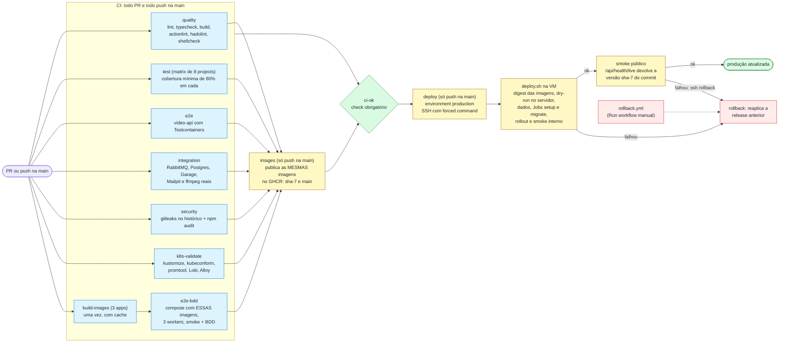

- **A imagem que vai para produção é a mesma que passou no BDD**: o `build-images` constrói uma
  vez (com `APP_VERSION=sha-<7>` gravado na imagem), o `e2e-bdd` sobe o compose com ela e o
  `images` só republica no GHCR. O deploy fixa as imagens por **digest**.
- **Deploy** ([ADR-0011](adr/0011-cd-ssh-forced-command-e-rollback.md)): o Actions entra por SSH
  com uma chave que só consegue rodar `deploy.sh` (forced command). Na VM: confere que o commit
  está na `main` e não é um downgrade, renderiza o Kustomize com os digests, `apply --dry-run` no
  servidor, camada de dados, Jobs de setup e migração, rollout e smoke interno. Qualquer falha
  **reaplica a release anterior**; depois, o Actions faz o smoke público e, se a versão servida
  não for a do commit, pede o rollback. Rollback manual: workflow `rollback.yml`.
- Evidência: o push na `main` publicou `sha-f0aa852` e o deploy automático no K3s terminou
  verde; em produção, 2 vídeos chegaram a `COMPLETED` (5 e 10 frames, zips baixados), o vídeo
  corrompido chegou a `FAILED P0001` e os e-mails foram aceitos pelo Resend.

Detalhes de cada job: README, seção "CI/CD"; do deploy: [`infra/vm/README.md`](../infra/vm/README.md), seção 6.6.

---

## 12. Matriz de requisitos do enunciado

| Requisito (enunciado) | Solução | Onde está no repositório | Como demonstrar |
|---|---|---|---|
| **Funcional:** processar mais de um vídeo ao mesmo tempo | fila + competing consumers (prefetch 1), KEDA 1..N no worker, uploads em paralelo no frontend | `apps/video-worker/src/modules/processing/interfaces/consumers/video-uploaded.consumer.ts`, `infra/k8s/base/apps/video-worker/scaledobject.yaml`, `apps/video-api/public/js/uploads.js` | enviar vários vídeos no frontend; `kubectl -n fiapx get hpa keda-hpa-video-worker -w`; BDD `04-pico.feature` |
| **Funcional:** em picos, não perder requisição | `202` + outbox + filas quorum com confirms + retry/DLQ + consumidores idempotentes + pausa (sem gastar tentativas) com dependência fora + limites explícitos com `Retry-After` (seções 8.1 e 8.3) | `apps/video-api/src/modules/videos/application/use-cases/upload-video.use-case.ts`, `apps/video-api/src/modules/outbox/`, `libs/messaging/src/` | rajada de uploads: fila cresce e esvazia, DLQs em 0; k6 (422 de 422) |
| **Funcional:** protegido por usuário e senha | cadastro + login, bcrypt, JWT de 1 h, guard global, throttling | `apps/video-api/src/modules/auth/` | login no frontend; `curl` sem token → `401 A0003` |
| **Funcional:** listagem de status dos vídeos do usuário | `GET /api/videos` paginado e filtrado pelo dono; `GET /api/videos/:id` com histórico; tabela com atualização a cada 3 s | `apps/video-api/src/modules/videos/application/use-cases/list-videos.use-case.ts`, `apps/video-api/public/js/videos.js` | tabela "Processamentos" mudando de Na fila → Processando → Concluído |
| **Funcional:** notificar o usuário em caso de erro (e-mail) | evento `video.failed` → `notification-service` → Resend (produção) ou Mailpit (local), com deduplicação, retry, pausa se o provedor cair e orçamento diário; em produção só a falha gera e-mail | `apps/notification-service/src/modules/notifications/` | enviar `examples/sample-corrupt.mp4` → `FAILED P0001` → e-mail na caixa de entrada |
| **Técnico:** persistir os dados | PostgreSQL (2 bancos), RabbitMQ quorum, Garage (S3), PVCs | `infra/db/`, migrações, `infra/k8s/base/data/` | diagrama ER (seção 7); `infra/db/schema/*.sql` |
| **Técnico:** arquitetura escalável | serviços stateless, HPA e KEDA, fila como buffer, outbox seguro com N réplicas, throttling compartilhado no Redis | `infra/k8s/base/apps/`, seções 2 e 8 | KEDA escalando o worker durante a rajada |
| **Técnico:** versionado no GitHub | monorepo público, PR + `ci-ok` obrigatório, Conventional Commits, Dependabot | <https://github.com/arthurfcs98/fiap-fase5-fiapx> | histórico de commits e PRs |
| **Técnico:** testes que garantam a qualidade | unitários, integração com dependências reais, E2E, BDD em pt-BR, carga (k6), validação de infra; cobertura mínima de 80% por project | `apps/*/src/**/*.spec.ts`, `**/test/*.int-spec.ts`, `tests/bdd/`, `tests/load/` | execução verde no Actions; tabela de cobertura; features BDD |
| **Técnico:** CI/CD | GitHub Actions: 10 jobs de verificação e publicação + deploy automático com rollback | `.github/workflows/ci.yml`, `.github/workflows/rollback.yml`, `infra/vm/deploy.sh` | run verde; `curl https://frames.asdevit.com/api/health/live` mostra a versão `sha-<7>` do commit |
| **Stack:** containers (Docker + Kubernetes ou Compose) | Dockerfile multi-stage único; Compose (dev e CI); K3s com Kustomize (produção) | `docker/node-service.Dockerfile`, `compose.yaml`, `infra/k8s/` | `kubectl -n fiapx get pods` |
| **Stack:** mensageria (RabbitMQ, Kafka...) | RabbitMQ 4.3 com filas quorum, retry por filas e DLQ | `libs/messaging/src/topology.ts` | UI do RabbitMQ (port-forward) |
| **Stack:** banco de dados (PostgreSQL + Redis como cache) | PostgreSQL 16; Redis 7 como cache de `Idempotency-Key` e armazenamento do throttling | `apps/video-api/src/modules/videos/infrastructure/idempotency/`, `apps/video-api/src/shared/infrastructure/throttling/` | [ADR-0012](adr/0012-redis-throttling-e-cache.md) |
| **Stack:** monitoramento (Prometheus + Grafana ou ELK) | Prometheus + Grafana + Loki + Grafana Alloy, 2 dashboards, 5 SLOs com orçamento de erro, 10 alertas | `infra/k8s/observability/` | dashboard "FIAP Frames — Pipeline de vídeos" no Grafana |
| **Stack:** CI/CD (GitHub Actions...) | GitHub Actions | `.github/workflows/` | aba Actions |
| **Entregável:** documentação da arquitetura | este documento + [ADRs](adr/README.md) + [contratos](arquitetura/contratos.md) + [LGPD](lgpd.md) + [observabilidade](observabilidade.md) | `docs/` | esta página no GitHub |
| **Entregável:** script de criação do banco de dados ou de outros recursos | criação de bancos/roles, migrações, SQL legível equivalente e os scripts de fila, storage, segredos e cluster | [`infra/db/README.md`](../infra/db/README.md), `infra/db/schema/` | `infra/db/README.md` |
| **Entregável:** link do GitHub | repositório público | <https://github.com/arthurfcs98/fiap-fase5-fiapx> | — |
| **Entregável:** vídeo de até 10 minutos | documentação, arquitetura e o sistema funcionando em produção | [`docs/apresentacao/roteiro-video.md`](apresentacao/roteiro-video.md) | o próprio vídeo |

---

## 13. Decisões (ADRs)

Formato: Contexto / Decisão / Consequências (+/−) / Alternativas rejeitadas. Índice:
[`docs/adr/README.md`](adr/README.md).

| ADR | Decisão |
|---|---|
| [0001](adr/0001-microsservicos-em-monorepo.md) | 3 microsserviços num monorepo NestJS com libs compartilhadas |
| [0002](adr/0002-typescript-nestjs-no-worker.md) | TypeScript/NestJS também no worker (em vez de manter Go) |
| [0003](adr/0003-rabbitmq-quorum-retry-dlq.md) | RabbitMQ com filas quorum, retry por filas com TTL e DLQ (em vez de Kafka ou BullMQ) |
| [0004](adr/0004-outbox-e-consumidores-idempotentes.md) | Transactional Outbox no `video-api` e consumidores idempotentes |
| [0005](adr/0005-storage-s3-garage-com-streaming.md) | Storage S3-compatível com Garage (MinIO arquivado) e streaming de ponta a ponta |
| [0006](adr/0006-k3s-na-vm-compartilhada.md) | K3s na VM compartilhada, atrás do Caddy, com proteção dos vizinhos (em vez de EKS ou Compose em produção) |
| [0007](adr/0007-autoescala-keda-e-hpa.md) | KEDA pelo tamanho da fila no worker e HPA por CPU no api |
| [0008](adr/0008-autenticacao-jwt-e-download-assinado.md) | Usuário e senha com JWT e download por URL assinada (HMAC) |
| [0009](adr/0009-observabilidade-e-slos.md) | Prometheus, Grafana, Loki e Alloy (Promtail descontinuado), com SLOs |
| [0010](adr/0010-lgpd-by-design.md) | LGPD desde o desenho: minimização, retenção, direitos do titular e logs sem dados pessoais |
| [0011](adr/0011-cd-ssh-forced-command-e-rollback.md) | CD por SSH com forced command, digest fixado e rollback automático |
| [0012](adr/0012-redis-throttling-e-cache.md) | Redis para throttling e cache de `Idempotency-Key` |
| [0013](adr/0013-migracoes-sql-e-one-shots.md) | Migrações TypeORM em SQL executadas por one-shots antes do deploy |

Decisões finas de infraestrutura (Ingress, firewall, reservas do kubelet, discos, IPv6...):
[`infra/vm/README.md`](../infra/vm/README.md), seção 2 (D1 a D23), e
[`infra/k8s/README.md`](../infra/k8s/README.md), seção 10.

---

## 14. Limitações conhecidas e evoluções

Escolhas conscientes para um hackathon rodando numa VM compartilhada, e o próximo passo de cada
uma:

| Limitação hoje | Impacto | Evolução |
|---|---|---|
| Nó único: K3s, Postgres, RabbitMQ e Garage com 1 réplica | a queda da VM derruba o serviço (os dados ficam nos volumes) | cluster multi-nó ou serviços gerenciados (Postgres gerenciado, RabbitMQ em cluster de 3 nós quorum, S3) |
| Worker limitado a 2 réplicas | vazão máxima de 2 vídeos simultâneos em produção (a fila segura o resto) | é limite da VM, não da arquitetura: subir `maxReplicaCount` num cluster dedicado |
| Sem backup automático do Postgres e dos buckets | perda de dados num desastre de disco | fase `backup` do `deploy.sh` (dump para um bucket) + restore testado |
| Sem Alertmanager | os alertas aparecem no Grafana/Prometheus, mas ninguém é avisado | Alertmanager com canal de e-mail/chat |
| SLOs de 7 dias com retenção de métricas de 3 dias | na prática o SLI cobre os últimos 3 dias | subir a retenção quando houver disco |
| Upload limitado a 95 MiB e passando pela API | vídeos maiores são recusados (`413`) | upload direto ao storage por URL pré-assinada multipart, retomável |
| Sem confirmação do e-mail no cadastro | alguém pode cadastrar o endereço de outra pessoa e fazê-la receber avisos (mitigado: só o e-mail de falha em produção, orçamento diário, texto sem links) | link de confirmação antes de habilitar notificações |
| Host técnico `fiapx.asdevit.com` fora da regra SSL Full (strict) (pendência P13 do `infra/vm`) | nesse host, não divulgado e usado pelo smoke do deploy, a Cloudflare fala HTTP com a VM | pôr o `fiapx` de volta na regra e então tirar o bloco `http://` dos sites do Caddy |
| Zip montado depois de todos os frames extraídos | o disco de trabalho precisa comportar todos os frames de um vídeo (`MAX_FRAMES_MB`) | zipar os frames enquanto o ffmpeg os gera |
| Rastreamento só pelo `correlationId` nos logs | sem spans nem tempos por etapa | OpenTelemetry + Tempo |
| NetworkPolicy desligada (decisão D7 do `infra/vm`) | o isolamento entre pods depende de credenciais por serviço | CNI com NetworkPolicy num cluster dedicado |
| `infra/db/schema/*.sql` conferido à mão contra as migrações | pode divergir se alguém mudar uma migração e esquecer o SQL | job no CI que compara `pg_dump` da migração com o script |
| Redrive das DLQs manual ("Move messages" do plugin shovel na UI do RabbitMQ) | depende de uma pessoa, antes do TTL de 7 dias | comando de redrive com auditoria |
