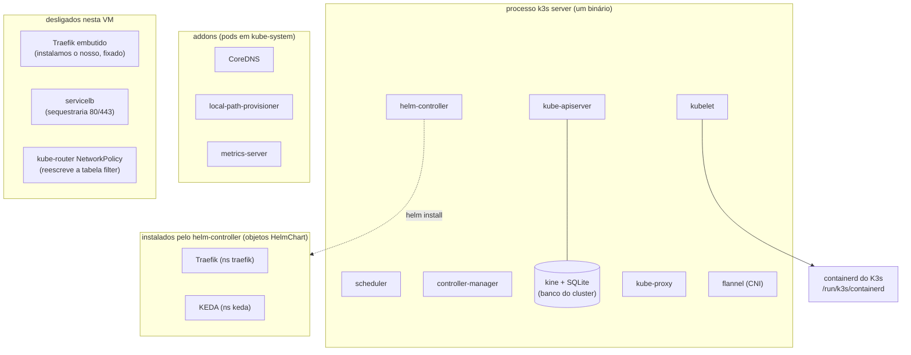
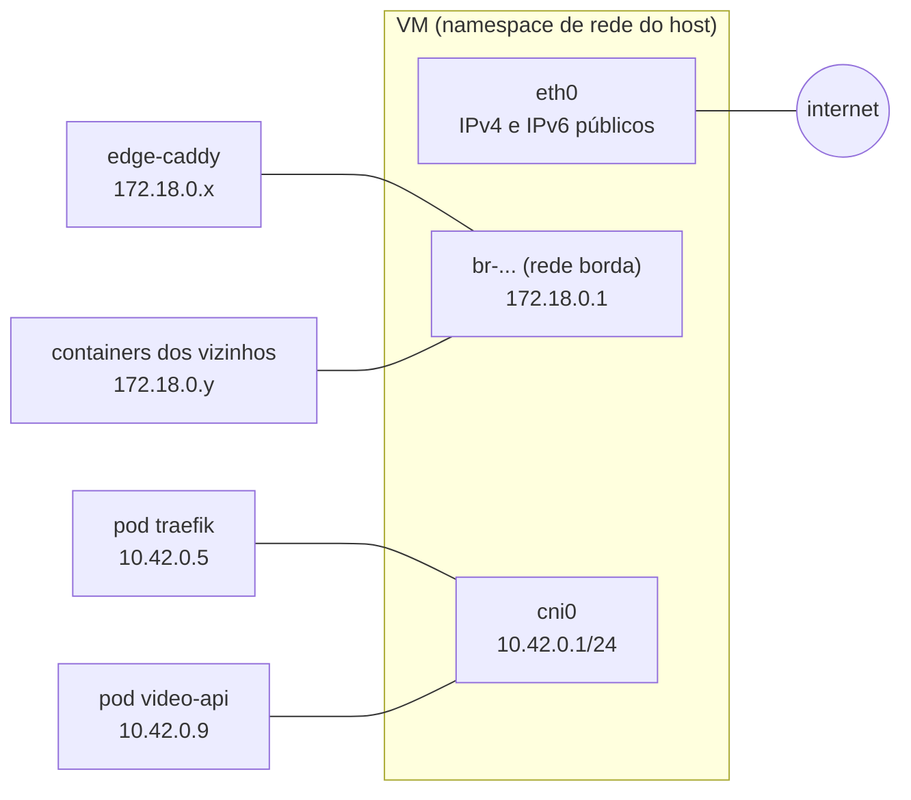
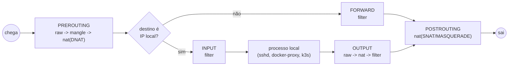
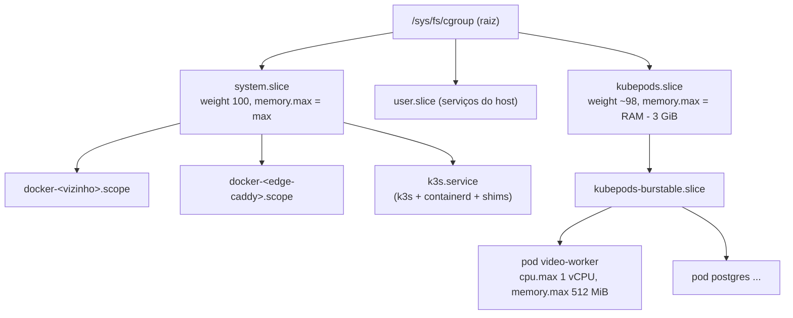
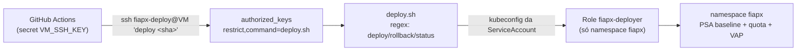
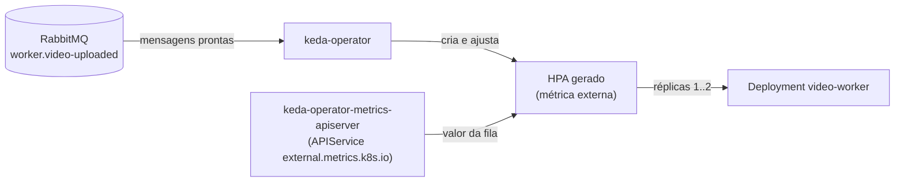

# Estudo: K3s numa VM que já roda produção em Docker

> Material didático da Fase 5. Explica **por que** cada decisão do `infra/vm/` existe.
> O runbook (o que rodar, em que ordem, e o registro da instalação) está em
> [`infra/vm/README.md`](../../infra/vm/README.md).
>
> Contexto: uma VM (4 vCPU, 7,6 GiB, sem swap, um disco de 75 GB) já roda outros projetos em
> produção, em Docker, e um **edge-caddy** que é dono das portas 80/443. Neste texto eles são
> "**os vizinhos**" (o repositório é público: nomes, hostnames e IPs deles não entram aqui). Vamos
> colocar um Kubernetes (K3s) **do lado**, sem que os vizinhos percebam.

## Sumário

1. [O que vem dentro do K3s](#1-o-que-vem-dentro-do-k3s)
2. [Rede do Kubernetes em 5 minutos](#2-rede-do-kubernetes-em-5-minutos)
3. [Services e o kube-proxy (e o IPv6 esquecido)](#3-services-e-o-kube-proxy-e-o-ipv6-esquecido)
4. [iptables: o "sistema nervoso" que Docker, UFW e K3s compartilham](#4-iptables-o-sistema-nervoso-que-docker-ufw-e-k3s-compartilham)
5. [O caminho de um pedido: Cloudflare até o pod](#5-o-caminho-de-um-pedido-cloudflare-até-o-pod)
6. [TLS entre a Cloudflare e a VM: Flexible, Full e Full (strict)](#6-tls-entre-a-cloudflare-e-a-vm-flexible-full-e-full-strict)
7. [UFW + K3s: o que liberar (e o que não)](#7-ufw--k3s-o-que-liberar-e-o-que-não)
8. [Recursos: requests, limits, cgroups e OOM](#8-recursos-requests-limits-cgroups-e-oom)
9. [ResourceQuota, LimitRange, PriorityClass e políticas](#9-resourcequota-limitrange-priorityclass-e-políticas)
10. [Pod Security e RBAC: o CD sem poder de root](#10-pod-security-e-rbac-o-cd-sem-poder-de-root)
11. [Disco: local-path, imagefs e os dois loops](#11-disco-local-path-imagefs-e-os-dois-loops)
12. [systemd: "depois de" não é "precisa de"](#12-systemd-depois-de-não-é-precisa-de)
13. [Autoscaling: HPA e KEDA](#13-autoscaling-hpa-e-keda)
14. [Parar e desinstalar sem derrubar os vizinhos](#14-parar-e-desinstalar-sem-derrubar-os-vizinhos)
15. [Como tudo se encaixa](#15-como-tudo-se-encaixa)
16. [Laboratório (comandos só de leitura)](#16-laboratório-comandos-só-de-leitura)
17. [Glossário](#17-glossário)

---

## 1. O que vem dentro do K3s

Um Kubernetes "de verdade" tem vários programas: apiserver, scheduler, controller-manager,
kubelet, kube-proxy, um runtime de containers, um plugin de rede (CNI), DNS interno. O **K3s**
junta tudo num binário de ~70 MB e troca o etcd por SQLite (via *kine*) quando há um nó só.



| Peça | O que faz | Nesta VM |
|---|---|---|
| kube-apiserver | A "porta" do cluster: tudo (kubectl, controllers, kubelet) conversa com ele | escuta 6443 (fechada pelo UFW e pela guarda raw) |
| scheduler | Escolhe em que nó cada pod roda (aqui só há um) | |
| controller-manager | Laços que fazem o estado real convergir para o desejado (ReplicaSet cria pods etc.) | |
| kubelet | O "agente" do nó: sobe/derruba containers, faz probes, despeja pods sob pressão | configurado com reservas e eviction |
| kube-proxy | Traduz Services em regras de iptables | NodePort só em `172.18.0.1`, nenhum em IPv6 |
| flannel | Dá IP aos pods e liga a bridge `cni0` | backend `host-gw` |
| containerd | Roda os containers | **o do K3s**, separado do Docker |
| CoreDNS | DNS interno (`postgres.fiapx.svc.cluster.local`) | upstream só IPv4 |
| local-path | Cria volumes (PVC) como pastas no disco do nó | num disco em loop próprio de 8 GiB |
| metrics-server | `kubectl top`, base do HPA | |
| helm-controller | Transforma um objeto `HelmChart` num `helm install/upgrade` (um Job) | instala Traefik e KEDA, com versão fixada |

**Dois containerd na mesma máquina.** O Docker usa o containerd dele
(`/run/containerd/containerd.sock`, imagens em `/var/lib/containerd`). O K3s usa outro
(`/run/k3s/containerd/containerd.sock`, imagens em `/var/lib/rancher/k3s/agent/containerd`).
Eles não se enxergam: `docker ps` não mostra pods, e `k3s crictl ps` não mostra os vizinhos. O
custo é ter imagens-base duplicadas; o ganho é não precisar reiniciar o containerd dos vizinhos.

## 2. Rede do Kubernetes em 5 minutos

Três faixas de IP convivem na VM:

| Faixa | De quem | Onde "mora" |
|---|---|---|
| `172.17-19.0.0/16` | redes do Docker (`docker0`, `borda`, redes dos vizinhos) | bridges `br-...` |
| `10.42.0.0/16` | **pods** (cada pod ganha um IP) | bridge `cni0` (`10.42.0.1/24` neste nó) |
| `10.43.0.0/16` | **Services** (ClusterIP) | em lugar nenhum: são IPs "virtuais" que só existem como regras de DNAT |

Cada pod tem sua própria interface de rede (um par `veth`), ligada na `cni0`. O flannel decide
como um pod fala com pods de **outros** nós:

- **VXLAN** (padrão): encapsula o pacote em UDP porta 8472. Serve para quando os nós não estão
  na mesma rede L2.
- **host-gw** (o nosso): só cria rotas. Com um nó só, não há "outros nós": o host-gw evita abrir
  a porta 8472 e o overhead do encapsulamento.



O host é o **roteador** entre essas bridges. É por isso que o firewall do host (iptables)
decide quem fala com quem.

## 3. Services e o kube-proxy (e o IPv6 esquecido)

Pods nascem e morrem, e o IP muda. Um **Service** dá um endereço estável para um grupo de pods
(escolhidos por *labels*).

| Tipo | Quem alcança | Como |
|---|---|---|
| `ClusterIP` | só de dentro do cluster | IP virtual em `10.43.x.x` |
| `NodePort` | qualquer um que chegue a um IP do nó numa porta 30000-32767 | ClusterIP + uma porta aberta **nos IPs do nó** |
| `LoadBalancer` | um IP externo fornecido por um "balanceador" | NodePort + um LB (na nuvem, ou o servicelb do K3s) |

O **kube-proxy** não é um proxy de verdade (no modo iptables): ele escreve regras de **DNAT**.
Para um Service `video-api` com 2 pods:

```
KUBE-SERVICES  -d 10.43.12.34/32 -p tcp --dport 3000      -> KUBE-SVC-XXXX
KUBE-SVC-XXXX  -m statistic --probability 0.5             -> KUBE-SEP-AAAA   (pod 1)
KUBE-SVC-XXXX                                             -> KUBE-SEP-BBBB   (pod 2)
KUBE-SEP-AAAA  -p tcp -j DNAT --to-destination 10.42.0.9:3000
```

O kernel troca o destino do pacote (de `10.43.12.34:3000` para `10.42.0.9:3000`) e guarda isso
na tabela de *conntrack*, para desfazer a troca na resposta.

### 3.1 `nodeport-addresses`: o NodePort só onde queremos

Por padrão, um NodePort vale para **todo IP local** do nó, inclusive o público. Com
`--nodeport-addresses=172.18.0.1/32`, o kube-proxy escreve a regra só para esse destino:

```
-A KUBE-SERVICES -d 172.18.0.1/32 ... -j KUBE-NODEPORTS                <- com a flag (o nosso)
-A KUBE-SERVICES -m addrtype --dst-type LOCAL ... -j KUBE-NODEPORTS    <- sem a flag
```

`172.18.0.1` é o gateway da rede docker `borda`: um IP do próprio host que só os containers
dessa rede (o edge-caddy e os vizinhos ligados a ela) alcançam. Um pacote da internet para
`<IP público>:30080` não casa a regra, cai no INPUT, e o firewall descarta.

### 3.2 E o IPv6?

O cluster é só IPv4, mas o kube-proxy programa **as duas famílias** (iptables e ip6tables). A
lista do `nodeport-addresses` vale **por família**: família sem nenhum CIDR na lista significa
"todos os endereços". Com só `172.18.0.1/32`, a revisão de segurança achou isto no ip6tables:

```
-A KUBE-SERVICES ! -d ::1/128 -m addrtype --dst-type LOCAL -j KUBE-NODEPORTS
```

Ou seja: NodePort em **todo IPv6** do nó, inclusive o público. Hoje não faz mal (não há Service
IPv6), mas é uma porta aberta esperando alguém. A correção é pôr na lista um CIDR IPv6 que não
existe em nenhuma interface (`2001:db8::1/128`, faixa reservada para documentação): a família
IPv6 passa a ter lista, e a lista não casa nada.

Do mesmo jeito, o apiserver (6443) e o kubelet (10250) escutam em `*`, que inclui o IPv6
público. Quem segura é o `INPUT DROP` do UFW em IPv6 **e** uma regra na tabela raw que descarta
SYN novo vindo da `eth0` nessas portas, nas duas famílias (seção 4.2). Duas camadas que não
dependem uma da outra.

### 3.3 Por que `externalTrafficPolicy: Cluster`

Com `Cluster`, o kube-proxy faz **SNAT** no tráfego que entra pelo NodePort: o pod vê o pedido
vindo de `10.42.0.1` (IP da `cni0`) e responde para ele; o conntrack desfaz tudo no caminho de
volta. Com `Local`, não há SNAT: o pod responderia direto para o IP do Caddy saindo pela `cni0`.
O Docker 29 tem uma regra de proteção na tabela raw:

```
-A PREROUTING -d <ip-do-caddy>/32 ! -i br-... -j DROP
```

("pacote para o IP de um container só pode chegar pela bridge dele"). A resposta vinda da
`cni0` seria descartada. Por isso `Cluster`, e o IP real do visitante segue por **header**.

## 4. iptables: o "sistema nervoso" que Docker, UFW e K3s compartilham

### 4.1 Tabelas e ganchos

O netfilter (dentro do kernel) oferece **ganchos** por onde todo pacote passa. Em cada gancho,
as **tabelas** são avaliadas numa ordem fixa:



| Tabela | Para quê | Quem usa nesta VM |
|---|---|---|
| `raw` | antes do conntrack; ideal para DROP barato e independente de ordem | Docker 29 (proteção dos IPs de container), **nossa guarda** |
| `nat` | trocar destino (DNAT) ou origem (SNAT/MASQUERADE) | Docker (portas publicadas, saída), kube-proxy (Services), flannel |
| `filter` | aceitar ou descartar | UFW, Docker, kube-proxy, flannel |

Cada tabela tem **cadeias** (listas de regras). As cadeias "de fábrica" (INPUT, FORWARD...) têm
uma **policy** (o que fazer se nenhuma regra decidir). Aqui: `INPUT DROP` e `FORWARD DROP`.

### 4.2 Quem escreve o quê

```
filter FORWARD (policy DROP), ordem depois de instalar:
  1. KUBE-*            (kube-proxy, inseridas no topo)
  2. restos de outros serviços do host (inertes)
  3. DOCKER-USER       (vazia) e DOCKER-FORWARD (-i br-* -j ACCEPT, estado ESTABLISHED)
  4. ufw-before-*, ufw-user-forward (nossas regras "route"), ufw-after-*, ufw-reject-*
  5. FLANNEL-FWD       (flannel, anexada no fim: aceita -s/-d 10.42.0.0/16)
```

A ordem **muda**: um restart do Docker põe `DOCKER-*` de novo no topo; o kube-proxy só confere
se as regras dele existem, não a posição. Por isso o desenho segue duas regras:

1. **Todo caminho legítimo é aceito por mais de uma cadeia.** O Caddy -> NodePort é aceito pelo
   `KUBE-FORWARD` (marca 0x4000), pelo `DOCKER-FORWARD -i br-...` e pelo `FLANNEL-FWD`.
   Qualquer que seja a ordem, passa.
2. **Todo isolamento fica na tabela `raw`**, avaliada antes de tudo. Um DROP na `DOCKER-USER`
   poderia nunca ser avaliado se uma cadeia do K3s aceitasse antes. A nossa guarda
   (`fiapx-netguard`):

   ```
   # IPv4
   -A PREROUTING -s 172.16.0.0/12 -d 10.42.0.0/15 -j DROP     # Docker -> pods e ClusterIPs
   -A PREROUTING -s 10.42.0.0/16 -d 169.254.169.254 -j DROP    # pods -> metadata do provedor
   -A PREROUTING -i eth0 -p tcp --syn -m multiport \
      --dports 6443,10250,10256,30000:30099 -j DROP            # internet -> portas do K3s
   # IPv6
   -A PREROUTING -i eth0 -p tcp --syn -m multiport \
      --dports 6443,10250,10256,30000:30099 -j DROP
   ```

   A primeira não pega o Caddy -> `172.18.0.1:30080` porque, na raw, o destino ainda é
   `172.18.0.1` (o DNAT acontece depois, na nat). A terceira só casa **SYN novo**: a resposta de
   uma conexão que a própria VM abriu (SYN-ACK, ACK) nunca casa, mesmo que o NAT tenha escolhido
   uma dessas portas como porta de origem.

### 4.3 Um backend só

O iptables da VM é o `iptables-nft` (v1.8.10): os comandos antigos escrevem em tabelas do
**nftables**. Docker, UFW e K3s precisam usar **o mesmo** backend e versões compatíveis. Por
isso: nada de `--prefer-bundled-bin` no K3s (traria outro iptables), nada de kube-proxy em modo
nftables nem de Docker com `firewall-backend: nftables` (no nftables, um "accept" numa tabela
não impede o "drop" de outra, e a convivência vira um quebra-cabeça).

### 4.4 Por que desligamos o controlador de NetworkPolicy

`NetworkPolicy` é o firewall **dentro** do Kubernetes ("só o video-api fala com o postgres").
No K3s quem aplica é um pedaço do **kube-router**. O jeito como ele escreve regras é:

```
iptables-save -t filter  ->  (edita em memória)  ->  iptables-restore -T filter   # sem --noflush
```

Sem `--noflush`, o restore **substitui a tabela filter inteira**, com o que ela tinha no
momento do save. Se o Docker criar uma regra entre o save e o restore (o edge-caddy reiniciou,
o docker-ce foi atualizado), a regra some. Numa VM dedicada isso não importa; aqui, a regra
perdida pode ser a que deixa a internet chegar no Caddy. O kube-proxy e o flannel não têm esse
problema (usam `--noflush` e regras avulsas). Trocamos a NetworkPolicy pela guarda raw (4.2),
pelo Pod Security (10) e por credenciais separadas por serviço (cada app tem seu usuário no
Postgres e no RabbitMQ).

## 5. O caminho de um pedido: Cloudflare até o pod

```mermaid
sequenceDiagram
  autonumber
  participant V as Visitante
  participant CF as Cloudflare
  participant C as edge-caddy
  participant K as kernel da VM
  participant T as pod Traefik (10.42.0.5:8000)
  participant A as pod video-api
  V->>CF: HTTPS fiapx.asdevit.com
  CF->>C: HTTPS :443 (Full strict; CF-Connecting-IP = visitante)
  Note over C: TLS termina aqui (Let's Encrypt).<br/>X-Real-IP e X-Forwarded-For = {client_ip}
  C->>K: HTTP para 172.18.0.1:30080
  Note over K: nat PREROUTING: KUBE-NODEPORTS<br/>DNAT -> 10.42.0.5:8000, marca 0x4000
  Note over K: FORWARD: aceito (KUBE-FORWARD / DOCKER-FORWARD / FLANNEL-FWD)
  Note over K: POSTROUTING: MASQUERADE -> origem 10.42.0.1
  K->>T: pedido chega "de" 10.42.0.1
  Note over T: confia em X-Forwarded-* porque veio de 10.42.0.1
  T->>A: Ingress fiapx.asdevit.com -> Service video-api
  A-->>T: resposta
  T-->>K: para 10.42.0.1
  Note over K: conntrack desfaz SNAT e DNAT
  K-->>C: resposta "de" 172.18.0.1:30080
  C-->>CF: HTTPS
  CF-->>V: HTTPS
```

O endereço público oficial do produto é `frames.asdevit.com` (contrato, seção 14). Ele entra pelo
mesmo caminho: o Caddy tem um segundo site (`frames.caddy`) que repassa ao mesmo NodePort com
`Host: fiapx.asdevit.com` e `X-Forwarded-Host: frames.asdevit.com`. O Ingress, o deploy e o smoke
continuam no host técnico `fiapx.asdevit.com`; trocar o endereço público não mexe no cluster.

O que o app vê (conferido com o `traefik/whoami` num K3s de teste):

```
RemoteAddr:      10.42.0.7:57378         <- o pod do Traefik
X-Real-Ip:       203.0.113.9             <- o visitante (posto pelo Caddy)
X-Forwarded-For: 203.0.113.9, 10.42.0.1  <- visitante, e o Traefik anexou o peer dele
```

No Express/Nest: `app.set('trust proxy', '10.42.0.0/16')`. O Express anda o `X-Forwarded-For`
da direita para a esquerda, pulando os IPs confiáveis, e chega no visitante. Isso importa para
o *throttling* de login/upload por IP.

## 6. TLS entre a Cloudflare e a VM: Flexible, Full e Full (strict)

Com o registro DNS "proxied" (nuvem laranja), o visitante fala com a **Cloudflare**, e a
Cloudflare abre **outra** conexão até a VM. O modo SSL da zona decide como é essa segunda perna:

| Modo | Visitante -> Cloudflare | Cloudflare -> VM | Confere o certificado da VM? |
|---|---|---|---|
| Off | HTTP | HTTP | — |
| **Flexible** | HTTPS | **HTTP** (porta 80) | — |
| Full | HTTPS | **o mesmo esquema do visitante** (HTTPS se ele usou HTTPS) | não (aceita autoassinado) |
| **Full (strict)** | HTTPS | o mesmo esquema do visitante (HTTPS se ele usou HTTPS) | **sim** (cadeia válida e nome certo) |

A zona inteira estava em Flexible (os vizinhos funcionam assim). Para o `fiapx` isso tinha dois
problemas:

1. **Loop de redirect.** O Caddy, por padrão, responde `308 -> https://` a qualquer pedido em
   HTTP. Em Flexible a Cloudflare **sempre** chega em HTTP, recebe o 308, repassa ao navegador,
   que pede de novo em HTTPS à Cloudflare, que chega de novo em HTTP... O site nunca abre.
2. **Texto puro no meio do caminho.** Mesmo sem loop, a perna Cloudflare -> VM iria sem cifra,
   com login e JWT dentro.

A primeira versão resolveu o loop declarando o site em `http://` **e** `https://` no Caddy. Só que
a revisão de segurança achou o efeito colateral: um visitante que digitasse `http://` era servido
em **texto puro de ponta a ponta** (achado 1). A correção tem duas partes:

- no Caddy, um *matcher* que redireciona para `https://` todo pedido em HTTP **cujo visitante
  também usou HTTP**:

  ```
  @texto_puro {
      protocol http
      not header X-Forwarded-Proto https       # a Cloudflare põe "https" se o visitante usou HTTPS
      not path /.well-known/acme-challenge/*   # o desafio do Let's Encrypt precisa passar
  }
  redir @texto_puro https://{host}{uri} 308
  ```

  Forjar o `X-Forwarded-Proto` falando direto com a VM só "engana" a própria conexão de quem forja.
- na Cloudflare, uma **Configuration Rule "SSL: Full (strict)" só para `fiapx.asdevit.com`** (os
  vizinhos continuam como estavam). Agora a Cloudflare fala HTTPS com a VM e confere o
  certificado Let's Encrypt que o Caddy já tinha.

Com o Full (strict) ativo, o bloco `http://` virou só redirect e desafio ACME: o redirect
automático do Caddy faria o mesmo, então ele é **removível**. Ficou por enquanto porque é
inofensivo e mantém o site no ar se alguém voltar o modo para Flexible por engano.

O `frames.asdevit.com` chegou depois e ainda está em Flexible: funciona pelo mesmo par "bloco
`http://` + `@texto_puro`", mas a perna Cloudflare -> VM desse host vai sem cifra até ele entrar na
mesma Configuration Rule. Só então o bloco `http://` dele pode sair (antes, sairia o loop de volta).

E o certificado? O Caddy o obtém pelo desafio **HTTP-01**: o Let's Encrypt pede
`http://fiapx.asdevit.com/.well-known/acme-challenge/<token>`. Em Full (strict), pedido HTTP do
visitante chega à VM em HTTP (o "mesmo esquema do visitante"), então a renovação continua
funcionando. O desafio TLS-ALPN-01 não passaria pela Cloudflare (ela termina o TLS antes).

## 7. UFW + K3s: o que liberar (e o que não)

O UFW é "só" um gerador de regras iptables com cadeias próprias (`ufw-user-input`,
`ufw-user-forward`...). Aqui: entrada negada por padrão, liberadas 22/80/443.

**Quem precisa passar pelo INPUT depois do K3s?** Só tráfego **de pods para o próprio host**:

- pod -> `kubernetes.default` (`10.43.0.1:443`) vira DNAT para `<IP do nó>:6443`: o destino
  é um IP local, então vai para o **INPUT**;
- metrics-server e Prometheus -> kubelet em `<IP do nó>:10250`: idem.

A documentação do K3s sugere `ufw allow from 10.42.0.0/16 to any` e `ufw allow 6443/tcp`. Aqui
isso seria ruim:

| Regra da doc | Problema | O que usamos |
|---|---|---|
| `ufw allow 6443/tcp` | API do cluster **pública** (a Fase 2 fez isso) | nada: o CD entra por SSH e usa `127.0.0.1:6443` |
| `allow from 10.42.0.0/16` sem interface | com `rp_filter=2` (modo *loose*), um pacote forjado com origem `10.42.x` **pela eth0** seria aceito, porque 10.42 é roteável (pela `cni0`) | `in on cni0`: só aceita se entrou pela bridge dos pods |
| `to any` sem porta | com `route_localnet=1` (sobra da Fase 2), um pod com `CAP_NET_RAW` manda pacote para `127.0.0.1` e alcança serviços do host que só escutam em loopback | `port 6443,10250` e `route_localnet=0` |
| `allow from 10.43.0.0/16` | nenhum pacote sai com origem num ClusterIP | nada |

As duas regras `ufw route allow ... in on cni0` (pods -> internet, pod <-> pod) não liberam nada
que o `FLANNEL-FWD` já não liberasse: elas só evitam que o UFW **logue** esse tráfego como
`[UFW BLOCK]` antes de o flannel aceitá-lo (falso positivo no `kern.log`).

## 8. Recursos: requests, limits, cgroups e OOM

### 8.1 Request x limit

| | Request | Limit |
|---|---|---|
| Para quem | o **scheduler** (o pod só entra no nó se a soma dos requests couber) | o **kernel** (cgroup) |
| CPU | peso na disputa (`cpu.weight`) | teto (`cpu.max`): acima disso, *throttling* |
| Memória | nada é reservado de fato | teto (`memory.max`): acima disso, **OOM kill** |

A **classe de QoS** sai da combinação:

| QoS | Regra | `oom_score_adj` |
|---|---|---|
| Guaranteed | request == limit em todos os containers | **-997** (quase imortal) |
| Burstable | tem request, mas menor que o limit | 2 a 999 (quanto menor o request, maior) |
| BestEffort | sem request nem limit | 1000 (primeiro a morrer) |

Aqui, **Guaranteed é proibido** (política da seção 9): um pod Guaranteed sobreviveria aos
vizinhos (adj 0) num OOM do host inteiro.

### 8.2 cgroups: onde cada um mora



O kubelet só mexe no `kubepods.slice`. Com `systemReserved` (2 GiB) e `kubeReserved` (1 GiB),
ele calcula:

```
memory.max do kubepods = capacidade - systemReserved - kubeReserved = 7751 - 2048 - 1024 = 4679 MiB
allocatable (scheduler) = 4679 - evictionHard(500)                               = 4179 MiB
```

As reservas são **contabilidade**: o `system.slice` (vizinhos) não ganha limite nenhum. Por
isso **não** usamos `enforceNodeAllocatable: [system-reserved]`: isso escreveria `memory.max=2Gi`
no `system.slice` e o kernel mataria um vizinho ou o sshd.

### 8.3 Quando falta memória: despejo x OOM

| Mecanismo | Quem age | Quando | O que faz |
|---|---|---|---|
| OOM no container | kernel | container passou do **próprio** limit | mata um processo dele (com `singleProcessOOMKill: true`, só o culpado, ex.: o ffmpeg) |
| OOM no kubepods | kernel | todos os pods juntos passaram de 4,57 GiB | mata o pior pod (maior `oom_score`); os vizinhos estão fora desse cgroup |
| Despejo (*eviction*) | kubelet | o **host** ficou com < 750 MiB livres por 90 s, ou < 500 MiB | encerra pods, começando por quem passou do request e tem menor prioridade |
| OOM global | kernel | o host inteiro sem memória, antes de o kubelet agir | mata pelo `oom_score`: ffmpeg (1000) -> pods (967-996) -> processos do host (0 a 100) |

Duas armadilhas que o plano original tinha:

- **O K3s, por padrão, não despeja por memória.** Ele só define limites de disco no
  `evictionHard`, e como o mapa não está vazio o kubelet não completa `memory.available`.
  Por isso o nosso `kubelet-fiapx.yaml` define todos os sinais.
- **`nice -n 10` no ffmpeg não protege os vizinhos.** No cgroup v2, o `nice` só ordena processos
  **dentro do mesmo cgroup** (o container do worker). Entre um vizinho e o worker quem decide é o
  `cpu.weight` dos slices e o `cpu.max` do container.

## 9. ResourceQuota, LimitRange, PriorityClass e políticas

Tudo em `infra/vm/k8s/namespace-guard.yaml`:

| Objeto | Pergunta que responde | Aqui |
|---|---|---|
| **ResourceQuota** `fiapx-teto` | "Quanto o namespace inteiro pode pedir?" | req 1600m/2304Mi, lim 7 CPU/4608Mi, 20 pods, 7 PVCs, 8Gi de volumes, **0 NodePort, 0 LoadBalancer** |
| **ResourceQuota** `fiapx-sem-prioridade-de-sistema` | "Quantos pods podem usar as classes do sistema?" | **0** |
| **LimitRange** | "E se um container não disser nada? E qual o máximo por container?" | padrão 25m/64Mi -> 250m/256Mi; máximo 1 CPU/768Mi; limit/request <= 4; PVC até 5Gi |
| **PriorityClass** | "Sob pressão, quem sai primeiro?" | worker e Jobs (100) < apps e observabilidade (500) < dados (1000); nenhuma preempta outro pod |
| **ValidatingAdmissionPolicy** | regra arbitrária em CEL, avaliada no apiserver | proíbe request de memória == limit (Guaranteed) e `priorityClassName` fora das 3 `fiapx-*` |

Quatro detalhes que pegam muita gente:

1. **Pod em terminação conta na quota** até o fim do *grace period*. O worker tem 720 s de
   grace (termina o vídeo em curso: ffprobe 30 s + ffmpeg 600 s + transferências 60 s). Num rolling update, o velho (terminando) e o novo
   somariam. Por isso o worker e o notification usam `strategy: Recreate`: o Deployment espera
   o velho sair antes de criar o novo, e a fila do RabbitMQ segura as mensagens nesse meio tempo.
2. **Com `Recreate`, o `progressDeadlineSeconds` precisa ser maior que o grace**; senão o
   Deployment se declara "travado" enquanto espera o velho sair, e o deploy faz rollback à toa.
3. **"2,5 vCPU no total" não se garante somando limits.** Limit é teto por container, não
   reserva; a soma dos limits pode passar da CPU da máquina sem problema. O teto que protege os
   vizinhos é o `cpu.max` dos workers (os únicos que usam CPU de verdade) e o `cpu.weight`.
4. **As PriorityClasses do sistema valem em qualquer namespace.** `system-node-critical` e
   `system-cluster-critical` existem em todo cluster e o Kubernetes deixa qualquer namespace
   usá-las (a restrição antiga a `kube-system` foi retirada). Um pod do fiapx com
   `system-node-critical` ganharia `oom_score_adj` -997 **qualquer que fosse a QoS**, seria o
   último despejado e poderia **preemptar** (derrubar para caber) o Traefik, o KEDA e o CoreDNS.
   É o mesmo buraco da regra anti-Guaranteed, pelo outro lado (achado 2). Duas travas
   independentes o fecham: a VAP só aceita `fiapx-*` e uma quota com
   `scopeSelector: PriorityClass In [system-node-critical, system-cluster-critical]` e `pods: 0`.

## 10. Pod Security e RBAC: o CD sem poder de root

### 10.1 Pod Security Admission

Três níveis, aplicados por namespace (rótulo) ou como padrão do cluster:

| Nível | Proíbe | Uso |
|---|---|---|
| `privileged` | nada | só `kube-system` (addons do K3s) |
| `baseline` | privileged, hostPath, hostNetwork/PID/IPC, hostPort, capabilities extras | **padrão do cluster**; `fiapx`, `traefik` e `keda` (enforce) |
| `restricted` | + exige não-root, `drop: [ALL]`, seccomp | `warn`/`audit` (meta para os manifestos) |

Sem isso, um Deployment com `hostPath: /` e `privileged: true` daria root na VM a quem pode
fazer deploy, e com root se alcançam os vizinhos. Detalhe do K3s 1.36: a configuração padrão do
cluster vai em `kube-apiserver-arg: admission-control-config-file=...` (a flag
`pod-security-admission-config-file` não existe nessa versão; o K3s só avisa e ignora).

Consequência prática: o coletor de logs (Grafana Alloy) **não** pode ler `/var/log/pods` por
hostPath, que é o jeito "de livro". Ele lê os logs **pela API do Kubernetes**
(`loki.source.kubernetes`, o mesmo caminho do `kubectl logs`). Custa um pouco mais de CPU no
apiserver e dispensa qualquer privilégio no nó.

### 10.2 A cadeia de confiança do deploy



Cada elo limita o seguinte: a chave só roda um comando; o comando só aceita três pedidos; o
usuário Linux não tem sudo nem Docker; a ServiceAccount só enxerga o namespace `fiapx` e não
lê Secrets; o namespace não aceita pods que escapem para o nó.

### 10.3 Por que o CD não cria RBAC (nem para a observabilidade)

O Prometheus precisa listar pods para achar os alvos, e o Alloy precisa ler logs. Isso é
**RBAC** (Role + RoleBinding). Seria cômodo o deploy aplicar esses objetos junto com o resto,
mas quem pode criar RoleBinding pode se dar qualquer permissão que caiba no namespace (e, com
ClusterRoleBinding, no cluster). Isso transformaria "fazer merge na `main`" em "ser admin do
cluster". Por isso o RBAC da observabilidade (`infra/vm/k8s/observability-rbac.yaml`) é aplicado
pelo **root**, uma vez, e só dá **leitura**: pods, services e endpoints do `fiapx`, logs dos pods
do `fiapx` e `nodes/metrics` (o cAdvisor do kubelet, para CPU/memória por pod). Fica de fora
`nodes/proxy`, que parece inofensivo mas abre a API inteira do kubelet (inclusive exec).

As ServiceAccounts (`prometheus`, `alloy`) o deploy **pode** criar: uma ServiceAccount sem
RoleBinding não tem permissão nenhuma. Os nomes delas são o contrato entre os dois lados.

## 11. Disco: local-path, imagefs e os dois loops

O `local-path-provisioner` cria cada volume (PVC) como uma **pasta** no disco do nó. Ele não
tem como limitar tamanho: um PVC de "2Gi" pode crescer até encher o disco. Aqui o disco é um
só, e é onde estão os bancos dos vizinhos.

Primeira solução: `/var/lib/rancher` (onde o K3s guarda imagens, volumes e o banco do cluster)
vira um **arquivo de 20 GiB formatado como ext4** e montado via *loop device*:

```
/var/lib/fiapx-k3s.img   (arquivo esparso: só ocupa o que for escrito)
      │  mount -o loop,discard
      ▼
/var/lib/rancher         (tudo do K3s; se encher, só o K3s sofre)
```

O `discard` devolve ao disco real os blocos apagados. O drop-in do systemd
(`RequiresMountsFor=/var/lib/rancher`) impede o K3s de subir se o loop não montar; assim ele
nunca escreve direto no `/`.

A revisão achou o problema que sobrava (achado 3). O kubelet enxerga dois "discos":

| Nome no kubelet | O que é aqui | O que ele faz quando enche |
|---|---|---|
| **nodefs** | o `/` (logs de pod, emptyDir) | acima de 85%/90% despeja pods (emptyDir e logs saem junto) |
| **imagefs** | `/var/lib/rancher` (imagens do containerd) | acima de 75% apaga imagens sem uso; acima de 85%/90% despeja pods |

Com os PVCs **dentro** do imagefs, um Postgres ou um Garage enchendo o volume empurra o imagefs
para cima, e **nem apagar imagens nem despejar pods libera dado de PVC**. A pressão fica presa:
pod novo não sobe (deploy e rollback falham) e o kubelet despeja pods do nó inteiro, inclusive
Traefik e CoreDNS.

Segunda solução: um **segundo loop, de 8 GiB, só para os volumes**, com o arquivo morando
dentro do primeiro (o teto no `/` continua 20 GiB):

```
/var/lib/fiapx-k3s.img  (20 GiB)  ->  /var/lib/rancher          imagens, banco do cluster
                                         └── fiapx-pv.img (8 GiB) ->  /var/lib/fiapx-pv   PVCs
```

O local-path passa a criar as pastas em `/var/lib/fiapx-pv` (`default-local-storage-path` do
K3s). Volume cheio agora só dá "sem espaço" para quem escreve nele; o imagefs vê no máximo 8 GiB
de volumes e continua com folga para imagens. A quota `requests.storage: 8Gi` impede declarar
mais do que o disco comporta, e cada app tem o próprio teto (quota de bucket no Garage,
`retention.size` no Prometheus, retenção de 72 h no Loki, limite de bytes nas filas).

## 12. systemd: "depois de" não é "precisa de"

A guarda raw (`fiapx-netguard.service`) precisa estar ativa **antes** de o K3s criar a primeira
rede de pod; senão, por alguns segundos (ou para sempre, se ela falhar), containers do Docker
alcançariam pods e ClusterIPs. A primeira versão tinha só:

```ini
[Unit]
After=docker.service fiapx-netguard.service
```

`After=` é só **ordem**: "se os dois forem subir, suba depois". Se a guarda **falhar** (o
`iptables` esperando o lock do xtables enquanto o dockerd recria as regras dele no boot, por
exemplo), o K3s sobe assim mesmo (achado 6). As opções:

| Diretiva | O que garante | Efeito colateral |
|---|---|---|
| `After=` | ordem | nenhuma exigência |
| `Wants=` | tenta subir a outra junto | falha dela não impede esta |
| `Requires=` | falha dela impede esta | **reiniciar** a outra reinicia esta; e se ela falhar no boot, esta fica parada até alguém agir |
| `ExecStartPre=` | um comando que precisa dar certo antes do start | falhou = start falhou (e o `Restart=` desta tenta de novo) |

O que usamos: `Wants=` + `After=` + `ExecStartPre=/usr/bin/systemctl is-active --quiet
fiapx-netguard.service` no drop-in do K3s, e `Restart=on-failure` na guarda. Se a guarda falha
no boot, ela tenta de novo a cada 5 s; o K3s (que já tem `Restart=always`) também tenta a cada
5 s e sobe **sozinho** quando a guarda ficar ativa. E um `systemctl restart fiapx-netguard` (o
`20-firewall.sh --yes` faz isso) não derruba o K3s junto, como o `Requires=` faria.

## 13. Autoscaling: HPA e KEDA

O **HPA** (Horizontal Pod Autoscaler) escala um Deployment olhando uma métrica e uma meta:
"mantenha a CPU média em 70%". Ele lê CPU e memória do metrics-server. Serve bem para o
`video-api` (mais pedidos -> mais CPU).

O `video-worker` é diferente: ele passa a maior parte do tempo esperando mensagem, e o sinal de
"estou atrasado" é a **fila crescer**, não a CPU. O **KEDA** (Kubernetes Event-Driven
Autoscaling) resolve isso:



O app declara um `ScaledObject` ("escale o `video-worker` entre 1 e 2 réplicas, uma para cada N
mensagens na fila") e um `TriggerAuthentication` (onde está a senha do RabbitMQ). O KEDA cria um
HPA por baixo e alimenta esse HPA pela **APIService** `external.metrics.k8s.io`. Se essa
APIService fica indisponível, o apiserver passa a devolver erro na descoberta de APIs, o que
atrapalha `kubectl` e deixa namespaces presos ao apagar; por isso o `--post` a confere.

Aqui o máximo é 2 workers: cada um tem teto de 1 vCPU, e 2 vCPU é o que dá para tirar da VM sem
apertar os vizinhos.

## 14. Parar e desinstalar sem derrubar os vizinhos

Os scripts de parada que o K3s instala (`k3s-killall.sh`, `k3s-uninstall.sh`) limpam as regras
de rede assim:

```sh
iptables-save | grep -v KUBE- | grep -v CNI- | grep -iv flannel | iptables-restore
```

É o mesmo problema da seção 4.4, agora em **todas** as tabelas: sem `--noflush`, o restore
substitui tudo pelo que havia no instante do save. Os vizinhos têm deploy automático (um timer
que roda a cada minuto e pode fazer `docker compose up`). Se um `compose up` criar ou trocar uma
regra do Docker (o DNAT da 443, por exemplo) nesse intervalo, a regra some e a borda cai (achado 5).

A saída é **exclusão mútua**: o deploy dos vizinhos já usa um arquivo de lock (`flock`) para não
rodar duas vezes ao mesmo tempo. Os nossos `90-stop-k3s.sh` e `99-uninstall.sh` pegam **o mesmo
lock** antes de rodar o killall/uninstall (o timer deles pula a rodada), guardam as regras do
Docker antes, e comparam depois:

```bash
exec 8>>"$LOCK" && flock -w 600 8          # espera até 10 min o deploy deles terminar
iptables-save | grep -E 'DOCKER|br-' ... > antes.txt
/usr/local/bin/k3s-killall.sh
diff antes.txt <(iptables-save | grep -E 'DOCKER|br-' ...)   # vazio = nada se perdeu
flock -u 8
```

Se algo sumir, `docker restart <container>` recria as regras daquele container, sem reiniciar o
dockerd (o que derrubaria todos os vizinhos de uma vez). O caminho do lock fica no
`infra/vm/.env` (fora do git), junto com os outros valores que identificam os vizinhos.

## 15. Como tudo se encaixa

| Camada | Proteção dos vizinhos |
|---|---|
| Portas 80/443 | continuam do edge-caddy; `servicelb` desligado; `hostPort` proibido; `externalIPs` negado |
| Rede | NodePort só em `172.18.0.1` e nenhum em IPv6; UFW sem abertura pública; guarda raw (Docker -> K3s e internet -> portas do K3s, IPv4 e IPv6); `route_localnet=0`; sem reescrita da tabela filter |
| TLS | Cloudflare em Full (strict) para o host; HTTP puro vira 308 |
| CPU | `cpu.weight` do kubepods ≈ do system.slice; worker com `cpu.max` 1 vCPU × máx. 2 |
| Memória | parede do kubepods (RAM − 3 GiB); eviction; pods sempre Burstable e sem classe do sistema; OOM de processo único |
| Disco | loop de 20 GiB; volumes num loop próprio de 8 GiB; eviction do nodefs; `sizeLimit` e rotação de logs |
| Boot | K3s depois do Docker, dos loops e **só com a guarda ativa** |
| Deploy | chave com forced command; ServiceAccount de um namespace, sem RBAC; PSA baseline |
| Parada e reversão | `90-stop-k3s.sh` e `99-uninstall.sh` com o lock do deploy dos vizinhos; volta ao snapshot de antes |

## 16. Laboratório (comandos só de leitura)

Rode na VM, como root, depois da instalação. Nenhum deles altera nada.

```bash
# Onde os pods vivem e quanto podem usar
cat /sys/fs/cgroup/kubepods.slice/memory.max        # parede dos pods
cat /sys/fs/cgroup/system.slice/memory.max          # "max": os vizinhos sem limite
cat /sys/fs/cgroup/kubepods.slice/cpu.pressure      # PSI: há espera por CPU?
k3s kubectl describe node | sed -n '/Allocatable/,/System Info/p'

# O NodePort visto pelo iptables (IPv4 e IPv6)
iptables -t nat -S KUBE-SERVICES | grep NODEPORTS   # só -d 172.18.0.1/32
ip6tables -t nat -S KUBE-SERVICES | grep NODEPORTS  # vazio
iptables -t nat -L KUBE-NODEPORTS -nv               # contadores sobem a cada pedido do Caddy

# A ordem das cadeias no FORWARD (compare antes e depois de um restart do Docker)
iptables -S FORWARD | head -20

# A guarda raw em ação (contador sobe se algum container tentar falar com um ClusterIP)
iptables -t raw -L PREROUTING -nv | grep fiapx-guard
ip6tables -t raw -L PREROUTING -nv | grep fiapx-guard

# Os dois discos em loop e para onde o local-path manda os volumes
findmnt /var/lib/rancher /var/lib/fiapx-pv
k3s kubectl -n kube-system get cm local-path-config -o jsonpath='{.data.config\.json}'

# oom_score de cada um (quem morre primeiro num OOM global)
for p in $(pgrep -f 'k3s server|node dist|caddy run|postgres:' | head -8); do
  printf '%-8s %-6s %s\n' "$p" "$(cat /proc/$p/oom_score_adj)" "$(tr '\0' ' ' </proc/$p/cmdline | cut -c1-60)"; done

# Quem o CD é, e o que ele pode (e o que a observabilidade pode)
runuser -u fiapx-deploy -- env KUBECONFIG=/var/lib/fiapx-deploy/kubeconfig kubectl auth can-i --list -n fiapx
k3s kubectl auth can-i --list -n fiapx --as=system:serviceaccount:fiapx:prometheus

# O KEDA e a APIService que ele registra
k3s kubectl get apiservice v1beta1.external.metrics.k8s.io
k3s kubectl -n fiapx get scaledobject,hpa
```

Perguntas para fixar:

1. Se o Docker reiniciar, o que acontece com a ordem do FORWARD? O site do fiapx cai? (seção 4.2)
2. Por que um pedido da internet para `<IP público>:30080` não chega ao Traefik? E para o IPv6
   público? (seções 3.1 e 3.2)
3. Por que o site entrava em loop 308 no modo Flexible, e por que o bloco `http://` do Caddy
   virou removível no Full (strict)? (seção 6)
4. O kubelet despeja um container de um vizinho se faltar memória? (seção 8.3)
5. Um pod com `priorityClassName: system-node-critical` no namespace fiapx: o que ganharia, e o
   que o impede? (seção 9, item 4)
6. Por que um PVC cheio no mesmo disco das imagens trava o deploy, e por que o loop próprio
   resolve? (seção 11)
7. Qual a diferença entre `After=`, `Wants=` e `Requires=`, e por que usamos `ExecStartPre`?
   (seção 12)
8. Por que o `video-worker` escala pela fila e não pela CPU? (seção 13)
9. Por que não chamar o `k3s-killall.sh` direto numa emergência? (seção 14)
10. Um PR de fork consegue fazer deploy? E quem faz merge na `main` consegue virar admin do
    cluster? (seções 10.2 e 10.3, e o environment `production`)

## 17. Glossário

| Termo | Significado |
|---|---|
| **allocatable** | o que sobra de CPU/memória para pods depois das reservas e do limiar de despejo |
| **APIService** | registro que pendura uma API extra (ex.: métricas externas do KEDA) no apiserver |
| **cgroup** | recurso do kernel que agrupa processos e limita/contabiliza CPU, memória e I/O |
| **ClusterIP** | IP virtual (10.43.x) de um Service; só existe como regra de DNAT |
| **CNI** | padrão de plugin de rede de pods (o flannel é um) |
| **Configuration Rule (Cloudflare)** | regra que muda uma configuração da zona (ex.: modo SSL) só para os pedidos que casam com ela |
| **conntrack** | tabela do kernel que lembra cada conexão e as traduções (NAT) feitas nela |
| **DNAT / SNAT / MASQUERADE** | trocar o destino / a origem de um pacote; MASQUERADE = SNAT para o IP da interface de saída |
| **drop-in (systemd)** | arquivo em `<unit>.d/` que complementa uma unit sem editá-la |
| **eviction** | o kubelet encerrando pods para proteger o nó |
| **flock** | trava de arquivo usada por scripts para não rodarem ao mesmo tempo |
| **forced command** | opção do `authorized_keys` que obriga uma chave SSH a rodar um único comando |
| **HelmChart (K3s)** | objeto que o helm-controller do K3s transforma num `helm install/upgrade` |
| **host-gw** | backend do flannel que usa rotas simples em vez de túnel |
| **HPA** | Horizontal Pod Autoscaler: ajusta o número de réplicas por uma métrica |
| **imagefs / nodefs** | os dois "discos" que o kubelet vigia: o das imagens e o do sistema (logs, emptyDir) |
| **Ingress / Ingress Controller** | regra de roteamento HTTP (host/caminho -> Service) / o programa que a executa (Traefik) |
| **KEDA** | autoscaler por eventos: escala pelo tamanho de uma fila, por exemplo |
| **kine** | camada que deixa o Kubernetes usar SQLite no lugar do etcd |
| **loop device** | faz um arquivo comum se comportar como um disco |
| **NodePort** | porta (30000-32767) aberta nos IPs do nó que leva a um Service |
| **OOM killer** | rotina do kernel que mata um processo quando a memória acaba |
| **preempção** | o scheduler derrubar pods de prioridade menor para caber um de prioridade maior |
| **PSA** | Pod Security Admission: níveis privileged/baseline/restricted |
| **PSI** | Pressure Stall Information: quanto tempo os processos esperaram por CPU/memória/IO |
| **QoS class** | Guaranteed/Burstable/BestEffort, derivada de requests e limits |
| **RBAC** | Role-Based Access Control: Roles (o que pode) + RoleBindings (quem pode) |
| **ServiceAccount** | identidade de um programa (não de uma pessoa) dentro do Kubernetes |
| **UFW** | "Uncomplicated Firewall": gera regras iptables a partir de comandos simples |
| **VAP** | ValidatingAdmissionPolicy: regra em CEL que o apiserver avalia antes de gravar um objeto |
