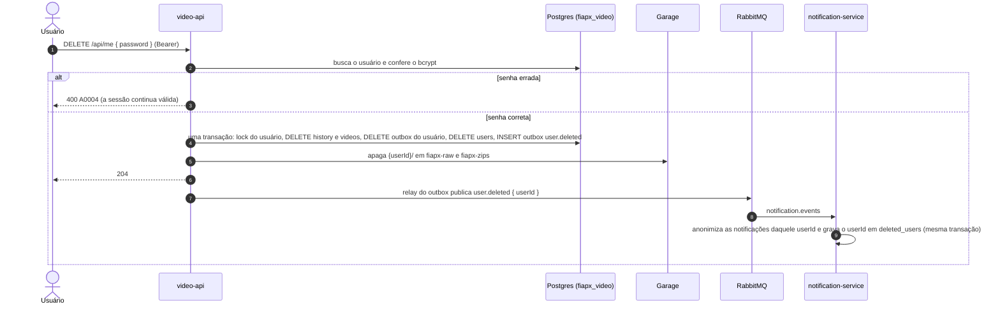

# LGPD no FIAP Frames (documento para a banca)

> Lei 13.709/2018 (LGPD). Regras obrigatórias da implementação:
> [`docs/arquitetura/contratos.md`](arquitetura/contratos.md), seção 12. Este documento mostra
> **o que** é tratado, **por quê**, **por quanto tempo**, **como o titular exerce os direitos** e
> **onde isso está no código**. Política pública para o usuário: `/privacidade.html` (frontend).

## Resumo em 30 segundos

| Pergunta | Resposta |
|---|---|
| Que dados pessoais? | Nome, e-mail, hash bcrypt da senha, o **conteúdo dos vídeos** (pode mostrar pessoas), o nome original do arquivo e o destinatário dos e-mails. Nada além disso (minimização, art. 6º III). |
| Base legal? | Execução do serviço pedido pelo usuário (art. 7º V), com **aceite explícito** da política no cadastro, gravado com data e versão (art. 9º). Logs e limites de tentativa: legítimo interesse (art. 7º IX), sem dado pessoal. |
| Por quanto tempo? | Vídeo original: **apagado quando o processamento termina** (com varredura horária de sobras). Zip: **7 dias**. Mensagens paradas nas filas mortas: **7 dias**. Notificações: anonimizadas após **30 dias**. Logs: **72 h**. Conta: até o usuário excluir. |
| Direitos? | `GET /api/me/data` (acesso e portabilidade, JSON) e `DELETE /api/me` (eliminação, com confirmação de senha). Correção e demais pedidos pelo contato da política. |
| Segurança? | TLS do navegador até a VM no endereço oficial (Cloudflare em SSL Full (strict) até o Caddy da VM) e, dentro da VM, HTTP que não sai do host; bcrypt custo 12, JWT de 1 h revogado na eliminação, isolamento por dono (404), buckets privados, link de download assinado de 5 min, logs mascarados, segredos fora do Git. |

## 1. Mapa de dados

| Dado | Onde fica | Quem grava / lê | Finalidade | Retenção |
|---|---|---|---|---|
| `users.name`, `users.email` | Postgres `fiapx_video` | video-api | Conta, login, e-mail de aviso | Até a eliminação da conta |
| `users.password_hash` | Postgres `fiapx_video` | video-api | Autenticação (bcrypt custo 12; a senha nunca é gravada) | Até a eliminação |
| `users.privacy_accepted_at`, `users.privacy_policy_version` | Postgres `fiapx_video` | video-api | Prova do aceite da política (art. 8º §2º) | Até a eliminação |
| Conteúdo do vídeo | Garage, bucket privado `fiapx-raw`, chave `{userId}/{videoId}.{ext}` | video-api grava; worker lê | Extrair os frames | **Apagado ao chegar em COMPLETED ou FAILED** |
| Frames (`.zip`) | Garage, bucket privado `fiapx-zips`, chave `{userId}/{videoId}.zip` | worker grava; video-api entrega | Download pelo usuário | **`ZIP_RETENTION_DAYS` (7 dias)** após a conclusão |
| `videos.original_name` + metadados (tamanho, status, erro, datas) e `video_status_history` | Postgres `fiapx_video` | video-api | Listagem, histórico, suporte | Até a eliminação da conta |
| Payload dos eventos `video.completed`/`video.failed` (e-mail, nome, nome do arquivo) | `outbox_events` (Postgres) e mensagem no RabbitMQ | video-api → notification-service | Enviar o e-mail de aviso | Linha publicada: 7 dias; apagada na eliminação da conta. Mensagem que falhou e parou numa DLQ (`*.dlq`): no máximo **7 dias** (operator policy `fiapx-dlq-limits`, `message-ttl`) |
| `notifications.recipient` e `payload` | Postgres `fiapx_notification` | notification-service | Histórico e idempotência do e-mail | Anonimizados após `NOTIFICATION_RETENTION_DAYS` (30) ou no `user.deleted` |
| `deleted_users.user_id` (só o UUID) | Postgres `fiapx_notification` | notification-service | Não mandar e-mail para quem já excluiu a conta (evento atrasado) | `NOTIFICATION_RETENTION_DAYS` (30) |
| IP do cliente | Redis (chave com hash SHA-256, TTL de 1 min a 1 h) | video-api (throttling) | Limitar tentativas de login/cadastro/upload | Expira sozinho (TTL) |
| Logs | stdout → Loki | todos os serviços | Operação e diagnóstico, só com IDs | 72 h no Loki. Os arquivos de log dos containers no nó (kubelet) giram por tamanho, não por tempo (3 × 10 MiB por container): em pouco uso duram mais, mas também só têm IDs |
| Métricas | Prometheus | todos os serviços | SLOs e alertas; **nenhum label com dado pessoal** | 3 dias |

O nome enviado pelo usuário **nunca vira caminho no storage** (as chaves só têm UUIDs); ele só
aparece, codificado (RFC 5987), no `Content-Disposition` do download.

## 2. Bases legais e transparência (art. 7º V, art. 9º)

- **Aceite obrigatório no cadastro.** `POST /api/auth/register` exige `acceptPrivacyPolicy: true`;
  sem ele a resposta é `400 X0001`. O aceite é gravado com `privacy_accepted_at` e
  `privacy_policy_version` (`PRIVACY_POLICY_VERSION`, atual `2026-09-28`).
  - Validação: `apps/video-api/src/modules/auth/interfaces/dto/auth.dto.ts` (`registerSchema`).
  - Gravação: `apps/video-api/src/modules/auth/application/use-cases/register-user.use-case.ts`.
  - Colunas: `apps/video-api/src/database/migrations/1790553600000-init.ts`.
- **Política pública** em `/privacidade.html`: dados coletados, finalidade, base legal, retenção,
  compartilhamento, direitos e contato. A versão exibida é a mesma gravada no aceite.
- **Operadores** (art. 39): Resend (e-mail), Cloudflare (proxy/TLS) e o provedor da VM. Recebem só
  o necessário para a própria função.

## 3. Retenção e minimização

| Regra | Como é aplicada | Código |
|---|---|---|
| Vídeo original apagado no fim do processamento | Os consumidores de `api.video-processing` e `api.video-deadletter` apagam o objeto de `fiapx-raw` **depois do commit** que leva o vídeo a COMPLETED/FAILED. Falha no storage vira `RetryableError`: a mensagem volta pela `.retry.N` e o DELETE (idempotente) roda de novo. | `modules/videos/application/raw-video.cleanup.ts`, `use-cases/apply-processing-event.use-case.ts`, `use-cases/handle-dead-letter.use-case.ts` |
| Sobras de upload (rede de segurança) | No job horário, com advisory lock: original de vídeo já COMPLETED/FAILED → apagado; original **sem linha no banco** há mais de 1 h (upload cuja transação não completou) → apagado; upload multipart interrompido há mais de 1 h (as partes não aparecem como objeto) → abortado, nos dois buckets. Vídeos ainda na fila ou processando ficam. | `modules/privacy/application/use-cases/purge-leftover-uploads.use-case.ts` |
| Mensagens nas filas mortas | Operator policy `fiapx-dlq-limits` no RabbitMQ (Job `rabbitmq-init`): `message-ttl` de 7 dias e 64 MiB por DLQ. O runbook manda purgar `worker.video-uploaded.dlq` (o vídeo já é FAILED) e re-enviar as outras. | `infra/k8s/base/data/rabbitmq/rabbitmq-init.mjs`, `docs/observabilidade.md` (`FiapxDlqNotEmpty`) |
| Zip por `ZIP_RETENTION_DAYS` (7) | Job **a cada hora** (`DATA_RETENTION_INTERVAL_S`, padrão 3600; registrado no `SchedulerRegistry` do `@nestjs/schedule`) dentro de uma transação com `pg_try_advisory_xact_lock` (uma réplica por vez): apaga o zip, grava `zip_key = NULL` e `expired_at = now()`. Download ou pedido de link depois disso → `410 V0006 ZIP_EXPIRED`. O BDD sobe o stack com `ZIP_RETENTION_DAYS=0.0005` (~43 s) e `DATA_RETENTION_INTERVAL_S=10` para provar a expiração de ponta a ponta. | `modules/videos/application/use-cases/expire-zips.use-case.ts`, `modules/privacy/interfaces/jobs/data-retention.job.ts` |
| Registros de entrega | No mesmo job: linhas publicadas do outbox com mais de 7 dias (os payloads têm e-mail e nome) e `processed_messages` com mais de 14 dias. | `modules/privacy/application/use-cases/purge-delivery-records.use-case.ts` |
| Objetos órfãos | No mesmo job, com advisory lock: prefixos `{userId}/` cujo usuário não existe mais são apagados nos dois buckets (rede de segurança da eliminação). | `modules/privacy/application/use-cases/purge-orphan-objects.use-case.ts` |
| Notificações | Job diário (03:00, `pg_try_advisory_xact_lock`) no notification-service: `recipient = 'removido'`, `payload = '{}'` após `NOTIFICATION_RETENTION_DAYS` (30); linhas de `deleted_users` com a mesma idade saem. | `apps/notification-service/src/modules/notifications/application/use-cases/apply-notification-retention.use-case.ts`, `interfaces/jobs/notification-retention.job.ts` |
| Logs | 72 h no Loki; sem dado pessoal (seção 6). | `infra/k8s/observability/` |

## 4. Direitos do titular (art. 18) e como cada um é atendido

| Direito | Como o usuário exerce | Implementação |
|---|---|---|
| Confirmação e **acesso** (II) | Tela "Meus dados" → "Baixar meus dados" | `GET /api/me/data` (JWT): JSON com o usuário (sem o hash), todos os vídeos e o histórico de cada um, baixado como `fiap-frames-meus-dados.json`. `Cache-Control: no-store`. `modules/privacy/application/use-cases/export-my-data.use-case.ts`. Os registros de envio de e-mail ficam no banco do notification-service e não entram no arquivo: a política explica o que guardam (destinatário, tipo, data, por 30 dias) e o pedido é pelo contato |
| **Portabilidade** (V) | O mesmo arquivo JSON (formato aberto, legível por máquina) | idem |
| **Eliminação** (VI) | "Excluir minha conta" + senha | `DELETE /api/me` com `{ "password": "..." }` → `204`. Ver fluxo abaixo. `modules/privacy/application/use-cases/delete-my-account.use-case.ts` |
| Correção (III) | Pedido pelo contato da política | Atendimento manual (fora do escopo da API) |
| Informação sobre compartilhamento (VII) | `/privacidade.html`, seção "Com quem compartilhamos" | frontend |

### Fluxo da eliminação (`DELETE /api/me`)

- **Uma transação só**: histórico, vídeos, usuário e o evento `user.deleted` saem juntos ou nada
  sai. As linhas do outbox daquele usuário (com e-mail e nome no payload) também são apagadas.
- **Tokens antigos deixam de valer na hora**: a estratégia JWT confere a cada requisição se o
  usuário ainda existe (`modules/auth/infrastructure/security/jwt.strategy.ts`) → `401 A0003`.
- **Senha errada é `400 A0004`, não 401**: o frontend trata 401 como sessão expirada e deslogaria o
  usuário por um erro de digitação.
- **Storage fora do ar depois do commit**: a resposta continua `204` (os dados relacionais já
  foram apagados); o erro é logado só com o `userId` e a varredura horária de órfãos termina a
  limpeza.
- **Limite de tentativas**: 5 por minuto por usuário (a rota pede a senha de novo).
- **Evento atrasado não ressuscita o e-mail**: um `video.failed`/`video.completed` do usuário que
  chegar ao notification-service **depois** do `user.deleted` (corrida com o prefetch, retry ou
  redrive de DLQ) encontra o `userId` em `deleted_users` e é descartado sem gravar nem enviar
  nada. Registro e anonimização são serializados por usuário (`pg_advisory_xact_lock`).
  Teste: `apps/notification-service/test/notification-service.int-spec.ts` ("LGPD race").

## 5. Segurança (art. 46)

| Medida | Onde |
|---|---|
| Transporte: TLS do navegador até a Cloudflare e da Cloudflare até o Caddy da VM (regra SSL Full (strict) no endereço oficial `frames.asdevit.com`: a Cloudflare confere o certificado da origem). Do Caddy ao Traefik e aos pods o tráfego é HTTP, mas não sai do host: passa pela bridge docker interna e pela rede dos pods, que a internet não alcança (UFW e a guarda `fiapx-netguard` na tabela raw do iptables). O host técnico `fiapx.asdevit.com` (não divulgado, usado pelo smoke do deploy) está fora da regra: nele a Cloudflare fala HTTP com a VM (`infra/vm/README.md`, pendência P13) | infra (`infra/vm/`, `infra/k8s/`) |
| bcrypt custo 12; senha de 8 caracteres a 72 bytes; comparação com hash "dummy" para e-mail inexistente (sem oráculo de tempo) | `modules/auth/infrastructure/security/bcrypt-password-hasher.ts`, `application/use-cases/login.use-case.ts` |
| JWT HS256 de 1 h (`iss`, `aud`, só o `sub`), guard global, rotas públicas explícitas (`@Public()`) | `modules/auth/` |
| Isolamento por dono: toda consulta filtra por `user_id`; vídeo alheio → `404 V0001` | `modules/videos/infrastructure/persistence/typeorm-video.repository.ts` |
| Buckets privados; download por link HMAC-SHA256 de 5 min, comparação em tempo constante, `Cache-Control: no-store`, `Referrer-Policy: no-referrer` | `modules/videos/infrastructure/signing/hmac-download.signer.ts`, `interfaces/controllers/downloads.controller.ts` |
| Upload: extensão + magic bytes, limite `MAX_UPLOAD_MB`, nome do arquivo nunca vira caminho | `modules/videos/domain/video-file.policy.ts`, `interfaces/http/multipart-file.reader.ts` |
| Throttling em Redis (cadastro 10/h por IP, login 5/min por IP + e-mail **e** 30/min por IP, upload 30/min e eliminação 5/min por usuário; IPv6 conta por prefixo `/64`), com fail-open se o Redis cair. Cadastro, login e upload ajustáveis por `THROTTLE_*_LIMIT` (o compose local folga cadastro e upload para o BDD e o k6) | `shared/infrastructure/throttling/` |
| E-mail não vira ferramenta de spam: o cadastro não verifica o e-mail (corte do escopo), então nome e nome de arquivo entram no e-mail sem virar link, o nome do cadastro recusa endereço de site (`://`, `www.`) e há orçamento de 10 e-mails por usuário e 80 no total por dia | `apps/notification-service/src/modules/notifications/application/templates/`, `auth.dto.ts`, `NOTIFICATION_DAILY_LIMIT*` |
| Readiness pública sem detalhe: `/api/health/ready` responde só `ok`/`unavailable` (hosts e usuário do banco ficam no log) | `modules/health/` |
| Cabeçalhos de segurança (CSP sem script inline, `frame-ancestors 'none'`, `nosniff`), CORS só para `CORS_ORIGIN` | `apps/video-api/src/app.setup.ts` |
| Segredos só por variável/arquivo (`<VAR>_FILE`), nenhum padrão de senha no código; Secrets do K8s criptografados em repouso; gitleaks no CI | `libs/common` (`loadConfig`), infra |
| `/metrics` interno com Bearer; nenhum label com dado pessoal | `libs/observability` |

## 6. Logs sem dados pessoais

- **Logs de negócio só com IDs** (`userId`, `videoId`, `eventId`, `outboxId`); nunca e-mail, nome
  ou nome de arquivo. Ex.: `{"msg":"Vídeo aceito","videoId":"…","userId":"…","sizeBytes":…}`.
- **Rede de segurança no pino** (`libs/observability/src/logging/redaction.ts`): `password`,
  `authorization`, `cookie`, `token`, `email`, `userEmail`, `recipient`, `name`, `userName` e
  `originalName` viram `[REDACTED]` na raiz e até dois níveis abaixo (corpo da requisição,
  payload de evento).
- **Log de acesso HTTP enxuto** (`serializeAccessRequest`/`serializeAccessResponse` em
  `libs/observability/src/logging/pino.config.ts`): só `id`, método, **caminho sem query string**,
  IP e status. A query do download carrega a assinatura HMAC (um link válido por 5 min) e os
  cabeçalhos da resposta carregam o nome do arquivo (`Content-Disposition`); nenhum dos dois vai
  para o log.
- **Postgres sem dados nos logs de erro**: `log_error_verbosity=terse` e
  `log_parameter_max_length=0` (compose e StatefulSet). Sem isso, uma corrida de dois cadastros
  com o mesmo e-mail gravava `DETAIL: Key (email)=(…) already exists` no log do banco (achado na
  integração e coberto pelo BDD).
- O `correlationId` (UUID ou id seguro enviado pelo cliente) liga HTTP → outbox → AMQP → worker →
  e-mail sem expor quem é o usuário.
- **Verificação automática**: o último cenário do BDD
  (`tests/bdd/features/99-logs-sem-dados-pessoais.feature`) lê os logs de **todos** os containers
  do stack (apps e infraestrutura) depois dos outros cenários e falha se aparecer um e-mail, um
  nome, um nome de arquivo enviado ou `sig=` de um link.
- Retenção de 72 h no Loki (seção 3).

## 7. Incidentes (art. 48)

Procedimento: [`docs/runbooks/incidente-dados.md`](runbooks/incidente-dados.md) (identificar,
conter, avaliar, comunicar à ANPD e aos titulares, registrar).

## 8. Como verificar (evidências)

| O quê | Como |
|---|---|
| Aceite obrigatório, eliminação, exportação, token revogado, raw apagado, zip vencido → 410 | `npm run test:e2e` (`apps/video-api/test/video-api.e2e-spec.ts`, containers reais) |
| Ponta a ponta no stack completo (3 serviços reais): aceite, cadastro concorrente, exportação, eliminação com linhas e objetos apagados e notificações anonimizadas, raw apagado após COMPLETED/FAILED, zip expirado → 410, logs sem dados pessoais | `make test-bdd` (`tests/bdd/features/05-privacidade.feature`, `06-retencao.feature`, `99-logs-sem-dados-pessoais.feature`) |
| Anonimização no `user.deleted`, evento atrasado descartado (`deleted_users`) e retenção de 30 dias das notificações | `npm run test:int` (`apps/notification-service/test/notification-service.int-spec.ts`) |
| Sobras de upload apagadas (original sem linha, multipart interrompido) | `npm run test:cov` (`purge-leftover-uploads.use-case.spec.ts`, `s3-user-object.store.spec.ts`) |
| Regras unitárias (máquina de estados, retenção, eliminação em transação) | `npm run test:cov -- apps/video-api` |
| Mascaramento dos logs | testes de `libs/observability/src/logging/` |
| Na demo | cadastrar sem aceitar a política; baixar "Meus dados"; excluir a conta e mostrar que o token antigo recebe 401 |
