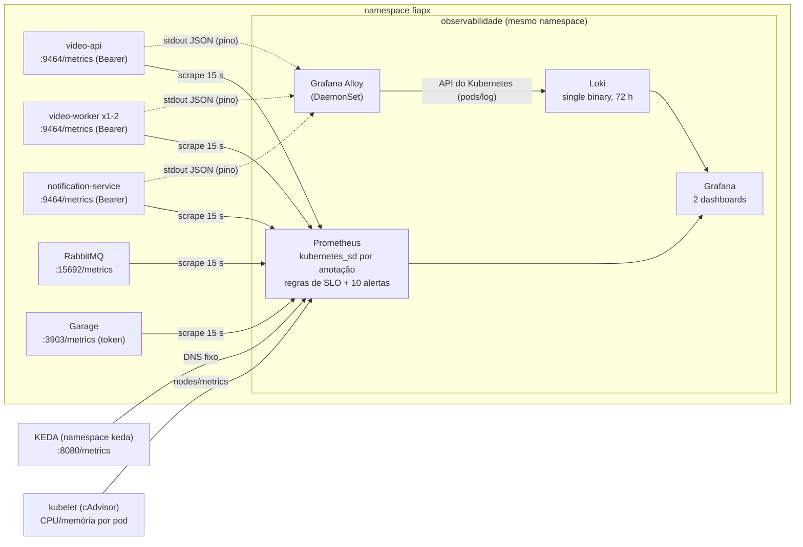

# Observabilidade do FIAP Frames

> Fonte da verdade dos nomes: [`docs/arquitetura/contratos.md`](arquitetura/contratos.md), seções
> 11 (métricas), 12 (LGPD) e 13 (observabilidade e SLOs). Manifestos:
> [`infra/k8s/observability/`](../infra/k8s/observability). Permissões (aplicadas pelo root):
> [`infra/vm/k8s/observability-rbac.yaml`](../infra/vm/k8s/observability-rbac.yaml).

## Resumo em 30 segundos

| Pergunta | Resposta |
|---|---|
| Quais sinais? | **Métricas** (Prometheus), **logs** (Grafana Alloy -> Loki) e **rastreamento pelo `correlationId`** (o mesmo id do HTTP até o e-mail). |
| Onde vejo? | **Grafana**, com 2 dashboards provisionados: `FIAP Frames — Pipeline de vídeos` e `FIAP Frames — SLOs`. Só por `kubectl port-forward` (nada público). |
| Tem Promtail? | Não. O Promtail foi descontinuado; o sucessor oficial é o **Grafana Alloy**, que faz o mesmo papel (lê os logs dos pods e envia ao Loki). |
| Tem SLA? | Não há SLA (acordo contratual com multa). Há **5 SLOs** (metas internas) com **orçamento de erro** numa janela de 7 dias, mais a meta "nenhuma requisição perdida", e **10 alertas** (sem Alertmanager: aparecem no Grafana/Prometheus, ninguém é notificado). |
| Quanto tempo guarda? | Métricas: 3 dias (ou 400 MB). Logs: 72 h (LGPD, contratos.md seção 12). |
| Custa quanto na VM? | Prometheus + Grafana + Loki + Alloy: 225m de CPU e 544Mi de memória pedidos; 1,5 GiB de disco. Tudo dentro da quota do namespace `fiapx`. |

## 1. Arquitetura dos três sinais



| Sinal | Como é produzido | Como é coletado | Onde fica |
|---|---|---|---|
| Métricas de negócio e HTTP | `@prometheus-io/client` em cada serviço (`:9464/metrics`, exige `Authorization: Bearer <METRICS_TOKEN>`) | Prometheus descobre os pods pela anotação `prometheus.io/scrape: "true"` (só no namespace `fiapx`) | TSDB do Prometheus (PVC 512Mi, 3 dias / 400 MB) |
| Métricas de infra | RabbitMQ (`rabbitmq_prometheus`, uma série por fila), Garage, KEDA, cAdvisor do kubelet, Loki, Grafana, Alloy e o próprio Prometheus | Mesmo Prometheus; KEDA por DNS fixo (sem permissão fora do `fiapx`) | Idem |
| Logs | pino JSON no stdout: `level` em texto, `time`, `service`, `version`, `correlationId`, `msg`. Dados pessoais mascarados na origem (`[REDACTED]`) | Grafana Alloy (DaemonSet) lê os logs **pela API do Kubernetes** (`loki.source.kubernetes`) | Loki (PVC 1Gi, retenção 72 h pelo compactor) |
| Rastreamento | `correlationId` atravessa HTTP -> outbox -> AMQP -> worker -> notification | Vai junto de cada linha de log | Loki (structured metadata) |

### Por que assim (decisões)

- **Tudo no namespace `fiapx`** (decisão D21 do [`infra/vm/README.md`](../infra/vm/README.md)): o CD
  (ServiceAccount `fiapx-deployer`) só enxerga esse namespace e não cria RBAC. Um namespace
  `observability` exigiria um passo manual de root a cada mudança de dashboard ou alerta.
- **Alloy sem hostPath**: o Pod Security `baseline` do namespace proíbe montar `/var/log/pods`
  do nó. O Alloy lê os logs pela API (a Role `fiapx-alloy` só dá `pods` e `pods/log`). Ele é um
  DaemonSet e cada pod lê só os pods do próprio nó (filtro `spec.nodeName`): na VM é 1 pod.
- **`correlationId` não é rótulo** do Loki: cada requisição criaria um stream novo (explosão de
  cardinalidade). Ele vai como *structured metadata*: não entra no índice, mas é filtrável.
  Rótulos (índice): só `namespace`, `app` e `level`.
- **Sem Alertmanager**: não há canal de envio definido e a VM é compartilhada (cada MiB conta).
  Os alertas aparecem no Grafana (Alerting -> Alert rules, seção "Data source-managed") e no
  Prometheus (`/alerts`).
- **Grafana sem volume e sem Ingress**: datasources e dashboards vêm do git (provisionamento);
  acesso só por port-forward.
- **Imagens fixadas por tag + digest**: Prometheus v3.13.3, Grafana 12.4.11, Loki 3.7.8,
  Alloy v1.19.2.

## 2. Métricas

Contrato (seção 11) + o histograma HTTP da seção 13. Nenhum rótulo carrega dado pessoal (LGPD).

| Métrica | Tipo | Quem expõe | Para quê |
|---|---|---|---|
| `fiapx_http_request_duration_seconds{method,route,status}` | histograma | video-api | SLO de disponibilidade e de latência do upload. `route` é o padrão do Nest (`/api/videos/:id`), `unmatched` para 404/estáticos; health e docs ficam fora |
| `fiapx_videos_uploaded_total`, `fiapx_videos_completed_total`, `fiapx_videos_failed_total{error_code}` | contador | video-api | vazão e SLO de sucesso do pipeline |
| `fiapx_outbox_pending` | gauge | video-api | eventos gravados e ainda não publicados |
| `fiapx_video_turnaround_seconds` | histograma | video-api | SLO de tempo até o resultado: do upload até COMPLETED, **com** a espera na fila (buckets de 10 s a 2 h, exato em 300 s) |
| `fiapx_zip_storage_bytes` | gauge | video-api | bytes dos zips ainda guardados (lido do banco no scrape); a quota do bucket `fiapx-zips` é 2,5 GiB |
| `fiapx_video_processing_duration_seconds{result}` | histograma | video-worker | SLO de tempo de processamento (buckets até 600 s, exato em 120 s) |
| `fiapx_worker_in_flight`, `fiapx_worker_jobs_total{result}` | gauge / contador | video-worker | vídeos em andamento e resultado de cada job (`result` = `completed`, `duplicate`, `failed`, `retry`, os mesmos do histograma de duração) |
| `fiapx_messages_consumed_total{queue,result}` | contador | os 3 (libs/messaging) | success, retry, dead_letter, permanent_failure, invalid, requeued, `deferred` (dependência fora: devolvida sem gastar retry, consumo pausado) e `aborted` (canal fechou no meio: o broker reentrega) |
| `fiapx_notifications_total{type,status}` | contador | notification-service | e-mails por tipo (`VIDEO_FAILED`, `VIDEO_COMPLETED`) e resultado (`SENT`, `FAILED`, `RETRY`, `SKIPPED`); todas as séries nascem em 0 |
| `rabbitmq_queue_messages{queue}`, `..._ready`, `..._unacked`, `rabbitmq_queue_consumers{queue}` | gauge | RabbitMQ | fila do worker, DLQs e filas sem consumidor |
| `keda_scaler_metrics_value{scaledObject}` | gauge | KEDA | tamanho da fila que o KEDA enxergou para escalar |
| `container_cpu_usage_seconds_total`, `container_memory_working_set_bytes` | contador / gauge | kubelet (cAdvisor) | CPU e memória por pod (só `namespace="fiapx"`) |

## 3. Logs

Formato (pino, uma linha JSON por evento):

```json
{"level":"info","time":"2026-09-28T19:40:12.345Z","service":"video-worker","version":"sha-abc1234",
 "correlationId":"7b0e...","videoId":"4f1c...","msg":"video processed","frameCount":42}
```

- **Rótulos no Loki**: `namespace`, `app` (rótulo `app.kubernetes.io/name` do pod), `level`.
- **Structured metadata**: `correlationId`, `service`, `pod`, `container`.
- **LGPD**: senha, `authorization`, `cookie`, tokens, e-mail, nomes e `originalName` saem como
  `[REDACTED]` já no processo (libs/observability). Logs de negócio usam só IDs. Retenção de 72 h.
- **Log de acesso HTTP enxuto**: `req` = `{id, method, url, remoteAddress}` com a URL **sem query
  string** (a do download tem a assinatura HMAC) e `res` = `{statusCode}` (sem cabeçalhos: o
  `Content-Disposition` tem o nome do arquivo). Health, métricas e docs não geram log de acesso.
- **Postgres**: `log_error_verbosity=terse` e `log_parameter_max_length=0`, para que erros de
  constraint (ex.: e-mail duplicado) e comandos lentos não levem valores para o Loki.

Consultas úteis (Grafana -> Explore -> Loki):

```logql
{namespace="fiapx"} | json | correlationId="<id>"          # o caminho inteiro de uma requisição
{namespace="fiapx"} | correlationId="<id>"                 # igual, mais rápido (structured metadata)
{namespace="fiapx", app="video-worker", level="error"}     # erros do worker
{namespace="fiapx", app="video-api"} | json | videoId="<videoId>"
sum by (app) (count_over_time({namespace="fiapx", level="error"}[5m]))   # erros por serviço
```

## 4. Como investigar um vídeo pelo `correlationId` (passo a passo)

1. **Pegue o id.** Toda resposta da API traz o header `x-correlation-id` (e o corpo de erro traz
   `correlationId`). Você também pode mandar o seu: `curl -H 'x-correlation-id: demo-123' ...`
   (até 100 caracteres, `[A-Za-z0-9._:-]`).
2. **Abra o Grafana** (seção 7) -> dashboard **FIAP Frames — Pipeline de vídeos** -> cole o id no campo
   `correlationId` do topo. O painel "Logs dos serviços" mostra só as linhas daquela requisição.
3. **Leia na ordem** (mais antigo embaixo, ou inverta a ordem no painel):
   - `video-api`: requisição `POST /api/videos` (202), `videoId` criado, evento `video.uploaded`
     gravado no outbox e depois publicado pelo relay;
   - `video-worker`: mensagem recebida, `video.processing.started`, ffprobe/ffmpeg, zip gravado,
     `video.processing.completed` (ou `failed` com o `errorCode`); se houve retry, aparece
     `x-retry-count` crescendo;
   - `video-api`: evento de processamento aplicado (status `PROCESSING` -> `COMPLETED`/`FAILED`) e
     `video.completed`/`video.failed` no outbox;
   - `notification-service`: notificação criada e e-mail enviado (ou erro do provedor).
4. **Achou o `videoId` mas não o id da requisição?** Use `{namespace="fiapx"} | json | videoId="<id>"`:
   as linhas trazem o `correlationId`, e daí volte ao passo 2.
5. **Cruze com as métricas**: no mesmo dashboard, "Falhas por error_code" diz se foi erro de
   entrada (`P0001`-`P0006`) ou do sistema (`P0007` bucket de zips cheio, `P0098` retries
   esgotados, `P0099` crash em loop); "DLQs" mostra se a mensagem ficou parada.

## 5. SLOs (janela de 7 dias)

SLO é uma meta interna de confiabilidade; o **orçamento de erro** é quanto se pode falhar sem
violá-la (ex.: 99,5% de disponibilidade = 0,5% de requisições com erro na janela). As regras de
gravação estão em [`rules/fiapx-slo.rules.yml`](../infra/k8s/observability/prometheus/rules/fiapx-slo.rules.yml).

| SLI | SLO | Série gravada (SLI / orçamento restante) | Como é calculado |
|---|---|---|---|
| Disponibilidade da API | >= 99,5% sem 5xx | `fiapx:slo_availability:sli_7d` / `..._error_budget_remaining_7d` | `fiapx_http_request_duration_seconds_count` com `status=~"5.."` / total |
| Aceite do upload | p95 de `POST /api/videos` < 5 s | `fiapx:slo_upload_latency:sli_7d` / `..._error_budget_remaining_7d` | fração em `le="5"` (p95 < 5 s equivale a >= 95% abaixo de 5 s) |
| Tempo de processamento | p95 < 120 s | `fiapx:slo_processing:sli_7d` / `..._error_budget_remaining_7d` | fração em `le="120"`, só `result="completed"` (o tempo DENTRO do worker) |
| Tempo até o resultado | p95 < 300 s do upload ao COMPLETED | `fiapx:slo_turnaround:sli_7d` / `..._error_budget_remaining_7d` | fração de `fiapx_video_turnaround_seconds` em `le="300"`: inclui a espera na fila, que o SLO anterior não enxerga (com 2 workers no teto, um pico aparece aqui) |
| Sucesso do pipeline | >= 99% dos vídeos válidos em COMPLETED | `fiapx:slo_pipeline:sli_7d` / `..._error_budget_remaining_7d` | `P0007`/`P0098`/`P0099` são erro do sistema; `P0001`-`P0006` (entrada inválida) ficam fora. Todas as séries de `error_code` nascem em 0 no boot, então a primeira falha já conta |
| Nenhuma requisição perdida | DLQs vazias e outbox < 100 por mais de 5 min | (alertas `FiapxDlqNotEmpty` e `FiapxOutboxBacklog`) | `rabbitmq_queue_messages{queue=~".*dlq"}`, `fiapx_outbox_pending` |

Orçamento restante: `1` = intacto, `0` = acabou, negativo = SLO violado na janela.

> **Janela efetiva.** As séries `_7d` usam `[7d]`, mas o Prometheus guarda 3 dias (contrato, seção
> 13; disco da VM, tabela 4.3 do `infra/vm/README.md`). Enquanto a retenção for 3 dias, os SLIs
> valem para os últimos 3 dias (numerador e denominador cobrem o mesmo período, então a razão
> continua correta). Para a janela cheia, subir `--storage.tsdb.retention.time` para `7d` (o
> `retention.size` de 400 MB continua segurando o disco).

## 6. Alertas

Regras em [`rules/fiapx-alerts.rules.yml`](../infra/k8s/observability/prometheus/rules/fiapx-alerts.rules.yml),
com testes unitários em [`tests/fiapx-rules.test.yml`](../infra/k8s/observability/prometheus/tests/fiapx-rules.test.yml)
(`promtool test rules`, rodado pelo `infra/k8s/scripts/validate.sh`).

| Alerta | Dispara quando | Por quanto tempo | Severidade |
|---|---|---|---|
| `FiapxApiErrorRateHigh` | 5xx queimando o orçamento de 0,5%: > 7,2% em 1 h **e** 5 min, ou > 3% em 6 h **e** 30 min | 2 min | critical |
| `FiapxUploadLatencyHigh` | p95 de `POST /api/videos` > 5 s (janela de 10 min) | 10 min | warning |
| `FiapxProcessingSlow` | p95 do processamento > 120 s (janela de 30 min) | 15 min | warning |
| `FiapxDlqNotEmpty` | alguma fila `.dlq` com mensagem | 1 min | critical |
| `FiapxOutboxBacklog` | `max(fiapx_outbox_pending) >= 100` | 5 min | critical |
| `FiapxQueueBacklogHigh` | mais de 10 mensagens prontas em `worker.video-uploaded` | 10 min | warning |
| `FiapxQueueWithoutConsumer` | `worker.video-uploaded`, `api.video-processing`, `api.video-deadletter` ou `notification.events` com 0 consumidores | 5 min | critical |
| `FiapxZipStorageHigh` | `fiapx_zip_storage_bytes` > 2 GiB (quota do bucket: 2,5 GiB) | 10 min | warning |
| `FiapxWorkerDown` | nenhuma réplica do video-worker respondendo à coleta | 5 min | critical |
| `FiapxTargetDown` | qualquer alvo com `up == 0` | 5 min | warning |

Por que "taxa de queima" e não "erro > X%": com duas janelas (longa para confirmar, curta para
parar logo que o problema some), o alerta dispara quando o ritmo de erro esgotaria o orçamento
cedo demais (14,4x: em ~12 h; 6x: em ~28 h), e não por um pico isolado.

### FiapxApiErrorRateHigh

1. Dashboard **SLOs** -> linha "Disponibilidade": qual janela está alta.
2. Explore -> Loki: `{namespace="fiapx", app="video-api", level=~"error|fatal"}` (5xx logam em
   `error` com stack; 503 em `warn`, sem stack).
3. `kubectl -n fiapx get pods` (reinícios?), readiness do api (`/api/health/ready` confere
   Postgres e storage).

### FiapxUploadLatencyHigh

1. Uploads grandes em rede lenta contam: veja "Uploads/min" e a CPU do api no dashboard Pipeline.
2. Garage lento? `{namespace="fiapx", app="garage"}` e a memória do pod do Garage.
3. HPA no teto (2 réplicas)? `kubectl -n fiapx get hpa video-api`.

### FiapxProcessingSlow

1. Workers no teto de CPU (1 core cada)? Painel "CPU por pod".
2. Vídeos maiores que o esperado (o SLO é para vídeos de até 60 s)? Logs do worker com `durationMs`.
3. KEDA escalou? Painel "Fila x workers" (máx. 2 réplicas na VM).

### FiapxDlqNotEmpty

1. Qual fila: rótulo `queue` do alerta (`worker.video-uploaded.dlq`, `api.video-processing.dlq`,
   `api.video-deadletter.dlq`, `notification.events.dlq`).
2. Motivo: logs `Retries esgotados` (com o `x-last-error` da última falha) ou `Envelope inválido`.
   Uma dependência fora (Postgres, storage, SMTP) **não** manda nada para a DLQ: o consumo pausa
   (seção 6.1).
3. Corrija a causa e trate a fila (UI de management do RabbitMQ: port-forward
   `svc/rabbitmq 15672`, usuário `fiapx`):
   - `worker.video-uploaded.dlq`: **purgue** (botão "Purge Messages"). O `api.video-deadletter`
     recebeu a mesma mensagem e já marcou o vídeo como `FAILED` (`P0098` retries esgotados,
     `P0099` crash em loop), e o original já foi apagado: reenviar ao worker não recupera nada.
   - `api.video-processing.dlq`, `api.video-deadletter.dlq`, `notification.events.dlq`:
     **redrive** pela página da fila -> "Move messages" -> destino = a fila sem o `.dlq`
     (plugin shovel, [`infra/rabbitmq/README.md`](../infra/rabbitmq/README.md)). A mensagem volta
     com um ciclo novo de 3 retries (o consumidor zera o `x-retry-count` de quem veio de
     dead-letter) e é idempotente (inbox `processed_messages`).
4. As DLQs guardam e-mail, nome e nome de arquivo (LGPD): a operator policy `fiapx-dlq-limits` as
   limita a 7 dias e 64 MiB (`overflow: reject-publish`). Não deixe mensagem parada lá.

### FiapxOutboxBacklog

1. RabbitMQ no ar? `kubectl -n fiapx get pods -l app.kubernetes.io/name=rabbitmq`; alarme de
   memória/disco do broker bloqueia publishers (`vm_memory_high_watermark` 300 MiB).
2. Logs do relay: `{namespace="fiapx", app="video-api"} |= "outbox"`.
3. Com o broker de volta, o relay drena sozinho (500 ms por ciclo, 50 por lote).

### FiapxQueueBacklogHigh

1. KEDA: `kubectl -n fiapx get scaledobject video-worker` (READY/ACTIVE) e
   `kubectl -n fiapx get hpa keda-hpa-video-worker`.
2. Workers consumindo? "Mensagens consumidas" e `fiapx_worker_in_flight`.
3. Na VM o teto é 2 workers (proteção dos vizinhos): uma fila longa num pico é esperada, e o
   tempo de espera aparece aqui, não como perda.

### FiapxQueueWithoutConsumer

1. Qual fila e de quem: `worker.video-uploaded` (video-worker), `api.video-processing` e
   `api.video-deadletter` (video-api), `notification.events` (notification-service).
2. Logs do dono: `Consumer cancelado pelo broker` (fila apagada/recriada, `consumer_timeout`)
   seguido de `re-assinado` é recuperação normal; `Falha ao re-assinar` repetido indica permissão
   errada ou **fila apagada**: no K8s os usuários por serviço não recriam fila (só o
   administrador, no Job `rabbitmq-init`): apague o Job e repita o deploy da release atual
   (seção 8.1 do [`infra/k8s/README.md`](../infra/k8s/README.md)).
3. `Dependência indisponível: consumo ... pausado` é a pausa proposital (seção 6.1): com o
   Postgres ou o SMTP fora por mais de 5 min, este alerta dispara junto com o da dependência.
   Resolva a dependência; o consumo volta sozinho em até 60 s.
4. Worker e notification-service se reiniciam sozinhos quando ficam 60 s sem consumer (o
   `/health` responde 503 com `failing: ["messaging-consumers"]`); no video-api só este alerta
   avisa: `kubectl -n fiapx rollout restart deploy/video-api` se não voltar.

### FiapxZipStorageHigh

1. Acima da quota de 2,5 GiB, cada vídeo novo termina em `FAILED P0007` (conta no SLO do
   pipeline). O upload continua aceitando (o bucket `fiapx-raw` tem quota própria, 1 GiB).
2. A retenção (`ZIP_RETENTION_DAYS`, 7 dias, job de hora em hora no video-api) libera espaço
   sozinha; confira no log `zips vencidos` se o job está rodando.
3. Se precisar de espaço já: reduza `ZIP_RETENTION_DAYS` no `config.env` do video-api e faça o
   deploy (o próximo ciclo apaga os zips mais antigos que o novo limite; os usuários recebem
   `410 V0006`). Aumentar a quota exige disco livre na VM (`infra/k8s/jobs/garage-init.yaml`).

### FiapxWorkerDown

1. `kubectl -n fiapx get pods -l app.kubernetes.io/name=video-worker` e `describe` (OOMKilled?
   Evicted? o worker tem a menor prioridade, `fiapx-lote`).
2. Quota do namespace: `kubectl -n fiapx describe resourcequota fiapx-teto`.

### FiapxTargetDown

1. Prometheus -> Status -> Targets (port-forward, seção 7): o `lastError` diz o motivo
   (401 = `METRICS_TOKEN` diferente entre app e Prometheus; conexão recusada = pod caído).
2. `kubelet-cadvisor` fora = RBAC do root não aplicado (`infra/vm/k8s/observability-rbac.yaml`).
   `keda` fora = KEDA não instalado (`infra/vm/35-keda.sh`).

### 6.1 Dependência fora: o consumo pausa (sem perder mensagem)

Quando o Postgres, o storage ou o provedor de e-mail cai, a falha não é da mensagem: o consumidor
devolve a mensagem para a fila (`nack` com requeue, que no RabbitMQ 4.3 não conta no
`x-delivery-limit`), **pausa** o consumo (5 s, dobrando até 60 s) e volta sozinho quando a
dependência responde. Resultado `deferred` em `fiapx_messages_consumed_total`; log
`Dependência indisponível: consumo de <fila> pausado`. Nenhuma mensagem vai para a DLQ por isso,
então uma queda longa do banco não vira uma pilha de vídeos `FAILED`. Na API HTTP, a mesma queda
responde `503 X0003` com `Retry-After` (inclusive na validação do JWT, que nunca vira 401).

## 7. Como acessar (sem nada público)

Grafana, Prometheus e Loki não têm Ingress. Na VM, só o root faz port-forward (a ServiceAccount
do CD não tem `pods/portforward`). Do Mac, com o túnel SSH (o `$VM_SSH` é o alias do
`~/.ssh/config`, fora do git):

```bash
# Grafana: http://localhost:3000 (usuário admin; senha no Secret fiapx-grafana)
ssh -t -L 3000:127.0.0.1:3000 "$VM_SSH" 'k3s kubectl -n fiapx port-forward svc/grafana 3000:3000'

# Prometheus (alvos, regras, alertas): http://localhost:9090
ssh -t -L 9090:127.0.0.1:9090 "$VM_SSH" 'k3s kubectl -n fiapx port-forward svc/prometheus 9090:9090'

# Senha do Grafana (na VM, como root; não cole em lugar nenhum)
k3s kubectl -n fiapx get secret fiapx-grafana -o jsonpath='{.data.admin-password}' | base64 -d; echo
```

No cluster local (k3d, `KEEP=1 infra/k8s/scripts/smoke-k3d.sh`): mesmo comando sem o `ssh`:
`kubectl -n fiapx port-forward svc/grafana 3000:3000`.

## 8. Dashboards

**FIAP Frames — Pipeline de vídeos** (`uid fiapx-pipeline`, página inicial do Grafana)

| Linha | Painéis |
|---|---|
| Agora | uploads/min, fila `worker.video-uploaded` (prontas e em processamento), workers ativos (KEDA), outbox pendente, mensagens nas DLQs |
| Fluxo de vídeos | vídeos por minuto (enviados, concluídos, falhos); fila x workers (+ o valor que o KEDA leu); duração p50/p95 com a linha de 120 s; falhas por `error_code`; jobs do worker por resultado; mensagens consumidas por fila/resultado; e-mails; outbox; DLQs; filas prontas |
| Recursos | CPU e memória por pod (cAdvisor) |
| Logs | logs dos 3 serviços filtrados pelo `correlationId` do topo |

**FIAP Frames — SLOs** (`uid fiapx-slos`): para cada SLO, o SLI de 7 dias (vermelho abaixo da meta),
o orçamento de erro restante e o comportamento recente com a linha da meta; no fim, a tabela de
alertas disparados agora.

Mudar um dashboard: edite no Grafana, exporte o JSON (Share -> Export), substitua o arquivo em
`infra/k8s/observability/grafana/dashboards/` e faça commit (a UI não salva: `allowUiUpdates: false`).

## 9. Como validar

```bash
infra/k8s/scripts/validate.sh          # promtool (config, regras, testes), loki -verify-config,
                                       # alloy validate/fmt, dashboards e nomes do contrato
KEEP=1 infra/k8s/scripts/smoke-k3d.sh  # sobe tudo num k3d e confere alvos, regras, logs no Loki
                                       # (com correlationId), dashboards e datasources
```

## 10. No stack local (docker compose)

O compose de desenvolvimento/CI não sobe Prometheus, Grafana nem Loki (eles vivem no K3s). Os
mesmos sinais podem ser vistos direto:

| Sinal | Como ver localmente |
|---|---|
| Métricas | `docker compose exec video-api sh -c 'wget -qO- --header "Authorization: Bearer $METRICS_TOKEN" http://127.0.0.1:9464/metrics'` (idem `video-worker`, `notification-service`) |
| Logs | `docker compose logs -f video-api video-worker notification-service` (JSON, um por linha) |
| Rastreamento | `docker compose logs --no-log-prefix video-api video-worker notification-service \| grep '"correlationId":"<id>"'` |
| Filas | RabbitMQ management em `http://127.0.0.1:15672` (`docs/exemplos.md`, seção 6) |

O BDD (`make test-bdd`) confere automaticamente, no stack completo:
`tests/bdd/features/07-observabilidade.feature` (`/metrics` exige token, o histograma
`fiapx_http_request_duration_seconds` tem a rota `/api/videos`, as métricas do contrato existem
nos 3 serviços e o mesmo `correlationId` aparece nos logs do video-api, do video-worker e do
notification-service e no cabeçalho `X-Correlation-Id` do e-mail) e
`tests/bdd/features/99-logs-sem-dados-pessoais.feature` (nenhum e-mail, nome, nome de arquivo ou
link assinado em nenhum log do stack).

## 11. Limitações conhecidas

- Janela dos SLOs (7 dias) maior que a retenção (3 dias, disco da VM): ver a nota da seção 5. É
  uma escolha de custo, não um defeito de cálculo.
- Sem Alertmanager: o alerta é visto no Grafana/Prometheus, ninguém é notificado (não há canal
  de envio definido e a VM é compartilhada).
- Os contadores de negócio nascem em 0 no boot (todos os `error_code`, resultados do worker e das
  notificações), mas `fiapx_messages_consumed_total{queue,result}` só ganha série no primeiro
  evento de cada par: num cluster recém-criado alguns painéis ficam "No data" até o primeiro
  upload.
- Um único Prometheus e um único Loki, sem réplica: na queda deles perde-se só a observação do
  período, nunca dado de negócio.
