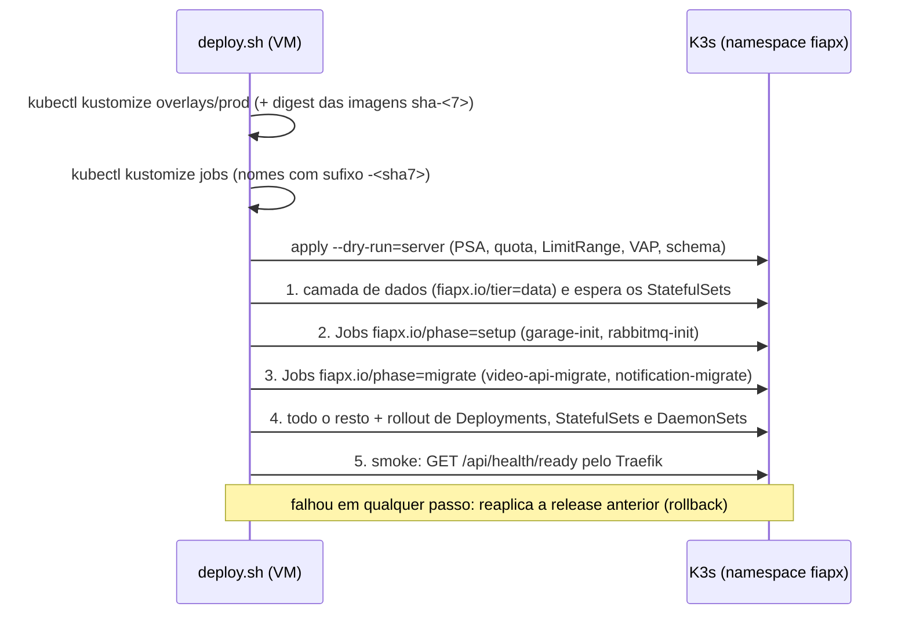

# infra/k8s — manifestos Kubernetes do FIAP X

Tudo que roda do FIAP X no K3s da VM compartilhada, descrito como código (Kustomize), mais os
scripts para criar os segredos, validar sem cluster e testar num K3s local (k3d).

> Leia junto: [`infra/vm/README.md`](../vm/README.md) (como o K3s foi instalado, o orçamento da
> VM e o `deploy.sh`), [`docs/arquitetura/contratos.md`](../../docs/arquitetura/contratos.md)
> (nomes de filas, variáveis, métricas) e [`docs/observabilidade.md`](../../docs/observabilidade.md).
> Regra de ouro: **`contratos.md` manda nos nomes dos apps; `infra/vm` manda no encanamento do
> cluster** (namespace, quota, ingress, RBAC, como o deploy aplica).

## Sumário

1. [Quem faz o quê](#1-quem-faz-o-quê)
2. [Pastas](#2-pastas)
3. [Como o deploy aplica estes arquivos](#3-como-o-deploy-aplica-estes-arquivos)
4. [Primeira vez na VM (root, uma vez)](#4-primeira-vez-na-vm-root-uma-vez)
5. [Rodar localmente](#5-rodar-localmente)
6. [Cada objeto e por quê](#6-cada-objeto-e-por-quê)
7. [Orçamento (quota do namespace)](#7-orçamento-quota-do-namespace)
8. [Segredos](#8-segredos)
9. [Jobs de setup e de migração](#9-jobs-de-setup-e-de-migração)
10. [Decisões e diferenças em relação ao plano](#10-decisões-e-diferenças-em-relação-ao-plano)
11. [O que foi testado](#11-o-que-foi-testado)
12. [Pendências](#12-pendências)

## 1. Quem faz o quê

| Quem | O quê | Onde |
|---|---|---|
| **root na VM** (uma vez, kubeconfig admin) | Namespace `fiapx`, ResourceQuota, LimitRange, PriorityClasses, política anti-Guaranteed | `infra/vm/k8s/namespace-guard.yaml` (pelo `40-deployer-access.sh`) |
| root na VM | RBAC de leitura da observabilidade (ServiceAccounts `prometheus` e `alloy`) | `infra/vm/k8s/observability-rbac.yaml` |
| root na VM | Traefik (Ingress Controller) e KEDA | `infra/vm/30-ingress.sh`, `infra/vm/35-keda.sh` |
| root na VM | **Secrets** (senhas, chaves, tokens) | [`scripts/bootstrap-secrets.sh`](scripts/bootstrap-secrets.sh) (este diretório) |
| **CD** (GitHub Actions -> `deploy.sh`, ServiceAccount `fiapx-deployer`) | todo o resto: apps, dados, observabilidade, Jobs | [`overlays/prod`](overlays/prod) e [`jobs`](jobs) |

O CD **não consegue** criar Namespace, quota, RBAC nem Secret, nem ler Secrets: é de propósito
(quem faz merge na `main` não ganha poder sobre o cluster). Por isso esses objetos ficam fora dos
overlays e são aplicados pelo root.

## 2. Pastas

```
infra/k8s/
├── base/                      # estado desejado SEM observabilidade (sem namespace fixo)
│   ├── apps/                  #   video-api, video-worker, notification-service (+ config.env de cada um)
│   └── data/                  #   postgres, rabbitmq, redis, garage (fiapx.io/tier=data) + scripts dos Jobs de setup
├── observability/             # Prometheus, Grafana, Loki, Alloy (contratos.md, seção 13)
├── jobs/                      # Jobs one-shot: garage-init, rabbitmq-init (setup), *-migrate (migrate)
├── overlays/
│   ├── prod/                  # O QUE O deploy.sh APLICA na VM (base + observability + Resend)
│   └── local/                 # o mesmo para o k3d (imagens :local, host fiapx.localhost, e-mail em log)
│       └── jobs/              #   Jobs com as imagens :local
├── scripts/
│   ├── bootstrap-secrets.sh   # root: cria os Secrets (dry-run por padrão)
│   ├── validate.sh            # valida tudo sem cluster (local e CI)
│   ├── check-manifests.mjs    # regras do deploy.sh + orçamento da quota (usado pelo validate.sh)
│   └── smoke-k3d.sh           # teste de ponta a ponta num K3s local
    (o CI roda o validate.sh no job `k8s-validate` do .github/workflows/ci.yml)
```

**Kustomize em uma frase:** em vez de copiar YAML por ambiente, existe uma *base* e cada
*overlay* diz só o que muda (tag da imagem, host, uma variável). `kubectl kustomize <pasta>`
imprime o YAML final; o `kubectl` já traz o kustomize embutido (a VM não tem o binário à parte).

## 3. Como o deploy aplica estes arquivos



Convenções que os manifestos seguem para o `deploy.sh` aceitar (conferidas pelo
`scripts/check-manifests.mjs`, que lê as regras direto dos arquivos do SRE):

| Regra | Como está aqui |
|---|---|
| Sem Namespace, Secret, RBAC, quota, CRD no overlay | só kinds que a Role `fiapx-deployer` pode criar |
| Todo objeto com `app.kubernetes.io/part-of: fiapx` | `labels` nos `kustomization.yaml` (fora dos selectors, que são imutáveis) |
| Camada de dados com `fiapx.io/tier: data` | `base/data` inteira + Loki (StatefulSet) e o ConfigMap dele |
| Imagens dos apps sem tag | `ghcr.io/arthurfcs98/fiapx-<app>`; o deploy injeta `@sha256:...` |
| Imagens de infra com tag + digest | as mesmas do `compose.yaml` (Postgres, RabbitMQ, Redis, Garage, Node) |
| Deployment com HPA/KEDA sem `replicas` | `video-api` (HPA) e `video-worker` (KEDA) |
| `progressDeadlineSeconds` 180 / 480 | api e notification 180; worker 480 (> grace de 330 s) |
| request de memória < limit, prioridade `fiapx-*` | todos os containers (QoS Burstable) |
| ConfigMaps por `configMapGenerator` | mudou a config -> hash novo -> rollout (e o rollback volta a antiga) |

## 4. Primeira vez na VM (root, uma vez)

Pré-requisito: o K3s, o Traefik, o KEDA e as grades do namespace já instalados pelos scripts de
`infra/vm` (seções 5 e 6 do README de lá).

```bash
# 1. (root) grades e RBAC da observabilidade — o 40-deployer-access.sh já aplica os dois
k3s kubectl apply -f infra/vm/k8s/namespace-guard.yaml -f infra/vm/k8s/observability-rbac.yaml

# 2. (Mac) levar o script para a VM, dono root (mesmo jeito da cópia do infra/vm; $VM_SSH fora do git)
COPYFILE_DISABLE=1 tar --no-xattrs -C infra/k8s -cf - scripts/bootstrap-secrets.sh \
  | ssh "$VM_SSH" 'mkdir -p -m 0700 /root/fiapx-infra-k8s && tar -C /root/fiapx-infra-k8s --no-same-owner -xf -'

# 3. (root) segredos: primeiro o plano, depois de verdade
cd /root/fiapx-infra-k8s
KUBECTL="k3s kubectl" ./scripts/bootstrap-secrets.sh
#   chave do Resend num arquivo 0600 (NUNCA na linha de comando), apagado depois:
KUBECTL="k3s kubectl" ./scripts/bootstrap-secrets.sh --yes --resend-key-file /root/resend.key
shred -u /root/resend.key

# 4. push na main: o CD aplica overlays/prod e os Jobs (seção 3).
```

Rodar o `bootstrap-secrets.sh` de novo é seguro: ele só cria o que falta e confere se os valores
repetidos entre Secrets batem (mostra `[ok]`/`[DIVERGE]`, nunca o valor).

## 5. Rodar localmente

```bash
infra/k8s/scripts/validate.sh            # ~20 s; precisa de Docker (ferramentas em containers)
make images                              # imagens ghcr.io/arthurfcs98/fiapx-*:local
infra/k8s/scripts/smoke-k3d.sh           # ~5 min; cria um k3d, testa tudo e apaga
KEEP=1 infra/k8s/scripts/smoke-k3d.sh    # idem, mas mantém o cluster para explorar
```

Com `KEEP=1`, o script imprime o `KUBECONFIG` no fim. A API responde em
`http://fiapx.localhost:8081` (o `*.localhost` resolve para 127.0.0.1) e o Grafana por
`kubectl -n fiapx port-forward svc/grafana 3000:3000`. Apagar: `k3d cluster delete fiapx-smoke`.

O smoke usa a MESMA versão do K3s da VM (`rancher/k3s:v1.36.4-k3s1`) e aplica os MESMOS arquivos
do SRE (`namespace-guard.yaml`, `observability-rbac.yaml`, `keda-helmchart.yaml`): se um
manifesto violar a quota, o Pod Security ou a política anti-Guaranteed, o smoke falha igual
falharia na VM. A diferença: o Traefik é o embutido do k3d (na VM é o do `30-ingress.sh`).

## 6. Cada objeto e por quê

### 6.1 Tipos de objeto usados

| Objeto | Para quê | Onde |
|---|---|---|
| **Deployment** | pods sem identidade (qualquer réplica serve); rollout controlado | apps, Redis, Prometheus, Grafana |
| **StatefulSet** | pod com nome fixo (`postgres-0`) e volume próprio que sobrevive a recriações | Postgres, RabbitMQ, Garage, Loki |
| **DaemonSet** | um pod por nó | Alloy (coletor de logs) |
| **Job** | tarefa que roda até terminar (setup, migração) | `jobs/` |
| **Service** (ClusterIP) | nome DNS estável (`postgres`, `rabbitmq`...) e balanceamento entre réplicas | um por componente com porta |
| **Ingress** | regra HTTP do Traefik: `fiapx.asdevit.com` `/` e `/api` -> `video-api:3000` | `base/apps/video-api/ingress.yaml` |
| **HorizontalPodAutoscaler** | 1 a 2 réplicas do api por CPU (70% do request) | `base/apps/video-api/hpa.yaml` |
| **ScaledObject** (KEDA) | 1 a 2 workers pelo tamanho da fila `worker.video-uploaded` | `base/apps/video-worker/scaledobject.yaml` |
| **TriggerAuthentication** (KEDA) | credencial do KEDA para ler a fila (usuário `fiapx-keda`, só monitoramento) | `base/apps/video-worker/triggerauthentication.yaml` |
| **ConfigMap** | configuração sem segredo (gerada de `config.env`/arquivos) | `configMapGenerator` |
| **PersistentVolumeClaim** | disco que sobrevive ao pod (provisionado pelo `local-path` do K3s) | STS (volumeClaimTemplates) e Prometheus |
| **ServiceAccount** | identidade de pod para falar com a API do Kubernetes | só `prometheus` e `alloy` |

### 6.2 Os componentes

| Componente | Tipo | Réplicas | CPU req/lim | Mem req/lim | Volume | Detalhes |
|---|---|---|---|---|---|---|
| video-api | Deployment + HPA | 1-2 | 150m/500m | 160Mi/320Mi | — | rolling (surge 1, indisponível 0); probes `/api/health/live` e `/ready`; `preStop sleep 5` |
| video-worker | Deployment + KEDA | 1-2 | 250m/1 | 256Mi/512Mi | `/work` emptyDir 2Gi | **Recreate**; grace **330 s**; `fsGroup 1000` (dono do `/work`); prioridade `fiapx-lote` |
| notification-service | Deployment | 1 | 25m/200m | 96Mi/192Mi | — | **Recreate**; probes `:9464/health` |
| postgres 16 | StatefulSet | 1 | 100m/500m | 192Mi/320Mi | 1Gi | `shared_buffers=64MB`, `max_connections=40`; init cria `fiapx_video` e `fiapx_notification` com usuários separados |
| rabbitmq 4.3 | StatefulSet | 1 | 100m/500m | 256Mi/512Mi | 1Gi | `vm_memory_high_watermark.absolute=300MiB`, métricas por fila na 15692, probes TCP |
| redis 7 | Deployment | 1 | 25m/100m | 32Mi/64Mi | — | senha (`requirepass` num tmpfs, fora do `ps`), `maxmemory 32mb`, sem persistência |
| garage v2 | StatefulSet | 1 | 50m/250m | 64Mi/192Mi | 4Gi | SQLite; quotas 1 GiB (raw) e 2,5 GiB (zips) pelo `garage-init` |
| prometheus v3 | Deployment | 1 | 100m/500m | 192Mi/384Mi | 512Mi | 3 dias / 400 MB; regras de SLO e alertas |
| grafana 12 | Deployment | 1 | 50m/**500m** | **128Mi/320Mi** | — | provisionado; sem Ingress (port-forward); `GOMEMLIMIT=256MiB`, SQLite em WAL (ver seção 10) |
| loki 3 | StatefulSet | 1 | 50m/250m | 128Mi/320Mi | 1Gi | single binary, 72 h |
| alloy | DaemonSet | 1/nó | 25m/200m | 96Mi/256Mi | — | lê logs pela API, sem hostPath |

Números: tabela 4.3 do [`infra/vm/README.md`](../vm/README.md) (o orçamento da VM), exceto o
Grafana, ajustado pelo que foi medido no smoke (seção 10).

### 6.3 Segurança de cada pod

Todo pod do FIAP X roda com o perfil **restricted** do Pod Security (o namespace exige
`baseline` e só avisa no `restricted`; aqui não sai nenhum aviso):

| Campo | Valor | Por quê |
|---|---|---|
| `runAsNonRoot` + `runAsUser` numérico | usuário da própria imagem (1000 apps, 70 postgres, 100 rabbitmq, 999 redis, 65534 prometheus, 472 grafana, 10001 loki, 473 alloy) | processo nunca é root no nó |
| `allowPrivilegeEscalation: false`, `capabilities.drop: [ALL]` | sempre | sem setuid, sem capacidades extras |
| `readOnlyRootFilesystem: true` | sempre | só os volumes declarados (`/tmp`, `/work`, dados) são graváveis |
| `seccompProfile: RuntimeDefault` | sempre | filtra syscalls perigosas |
| `automountServiceAccountToken: false` | todos menos Prometheus e Alloy | os apps não falam com a API do Kubernetes |
| `enableServiceLinks: false` | sempre | sem variáveis `RABBITMQ_PORT=tcp://...` injetadas (o RabbitMQ lê `RABBITMQ_*` do ambiente!) |
| request de memória < limit | sempre | QoS Burstable: num OOM global, os pods do FIAP X morrem antes dos vizinhos |
| Segredos por arquivo (`<VAR>_FILE`) | apps | não aparecem em `kubectl describe` nem no ambiente do processo |

### 6.4 Probes (como o Kubernetes sabe se o pod está bem)

- **startupProbe**: dá tempo de subir sem que a liveness mate o pod (api/worker/notification até
  60 s; RabbitMQ até 5 min por causa da recuperação das filas quorum).
- **livenessProbe**: falhou N vezes -> o kubelet reinicia o container.
- **readinessProbe**: falhou -> o pod sai do Service (não recebe tráfego), mas não reinicia. No
  api é o `/api/health/ready` (Postgres + storage; RabbitMQ não, porque o outbox segura os eventos).
- Garage com probe TCP de propósito: o `/health` dele responde 503 até existir layout, e o layout
  só é criado pelo `garage-init`, que roda **depois** que o StatefulSet fica pronto.

## 7. Orçamento (quota do namespace)

Saída do `scripts/check-manifests.mjs` (roda no `validate.sh`), com a quota lida do
`namespace-guard.yaml`:

| Cenário | CPU req | CPU lim | Mem req | Mem lim | Pods |
|---|---|---|---|---|---|
| regime (réplicas mínimas) | 925m | 4500m | 1600Mi | 3392Mi | 11 |
| escala máxima (api 2, worker 2) | 1325m | 6000m | 2016Mi | 4224Mi | 13 |
| escala máxima + surge do api no deploy | 1475m | 6500m | 2176Mi | 4544Mi | 14 |
| regime + 1 Job (durante o deploy) | 975m | 4750m | 1696Mi | 3584Mi | 12 |
| **quota `fiapx-teto`** | **1600m** | **7** | **2304Mi** | **4608Mi** | **20** |

Volumes: postgres 1Gi + rabbitmq 1Gi + garage 4Gi + prometheus 512Mi + loki 1Gi = **7,5Gi** de
8Gi, 5 PVCs de 7. Consumo real medido no smoke (k3d, poucos minutos no ar, sem carga): Grafana
120-245Mi (picos de CPU no teto em tarefas de fundo), Loki ~70-100Mi, Alloy ~50-100Mi,
RabbitMQ ~87Mi, Prometheus ~50-87Mi, cada app ~35-50Mi, Postgres ~15Mi, Redis ~5Mi.

A diferença para a tabela 4.3 do `infra/vm` é só o Grafana (+32Mi pedidos, +128Mi e +250m de
teto): continua dentro da quota em todos os cenários.

## 8. Segredos

Nenhum segredo no git: o `bootstrap-secrets.sh` gera tudo com `openssl` direto para arquivos
temporários (0700, apagados no fim) e cria os Secrets com `--from-file`.

| Secret | Chaves | Usado por |
|---|---|---|
| `fiapx-postgres` | `POSTGRES_PASSWORD`, `VIDEO_DB_PASSWORD`, `NOTIF_DB_PASSWORD` | postgres (init dos bancos) |
| `fiapx-rabbitmq` | `RABBITMQ_DEFAULT_PASS` (usuário `fiapx`) | rabbitmq, Job rabbitmq-init |
| `fiapx-redis` | `REDIS_PASSWORD` | redis |
| `fiapx-garage` | `GARAGE_RPC_SECRET`, `GARAGE_ADMIN_TOKEN`, `GARAGE_METRICS_TOKEN`, `API_ACCESS_KEY_ID`/`API_SECRET_ACCESS_KEY`, `WORKER_ACCESS_KEY_ID`/`WORKER_SECRET_ACCESS_KEY` | garage, Job garage-init, Prometheus (só o metrics token) |
| `fiapx-metrics` | `METRICS_TOKEN` | Prometheus (Bearer do `/metrics` dos apps) |
| `fiapx-keda-rabbitmq` | `KEDA_PASSWORD`, `host` | TriggerAuthentication, Job rabbitmq-init |
| `fiapx-grafana` | `admin-user`, `admin-password` | grafana |
| `fiapx-video-api` | `DB_PASSWORD`, `RABBITMQ_URL`, `REDIS_URL`, `S3_ACCESS_KEY_ID`, `S3_SECRET_ACCESS_KEY`, `JWT_SECRET`, `DOWNLOAD_URL_SECRET`, `METRICS_TOKEN` | video-api, Job video-api-migrate |
| `fiapx-video-worker` | `RABBITMQ_URL`, `S3_ACCESS_KEY_ID`, `S3_SECRET_ACCESS_KEY`, `METRICS_TOKEN` | video-worker |
| `fiapx-notification-service` | `DB_PASSWORD`, `RABBITMQ_URL`, `METRICS_TOKEN`, `RESEND_API_KEY` | notification-service, Job notification-migrate |

Menor privilégio no storage: o api usa a chave `svc-api` (leitura e escrita nos dois buckets: a
retenção LGPD e a eliminação de conta apagam objetos) e o worker a `svc-worker` (só leitura no
`fiapx-raw`, leitura e escrita no `fiapx-zips`). O KEDA usa o usuário `fiapx-keda` (tag
`monitoring`, permissões `^$`: lê tamanho de fila, não lê nem publica mensagem).

**Rotação** (ex.: vazou uma senha). Os valores de base "moram" num Secret só; os compostos
(URLs, `DB_PASSWORD` dos apps) são refeitos a partir dele:

1. Postgres: `ALTER ROLE fiapx_video PASSWORD '...'` (via `k3s kubectl exec -it postgres-0 -- psql -U fiapx`)
   com o valor novo gravado antes no Secret; RabbitMQ: `rabbitmqctl change_password fiapx ...`;
   Garage: `garage key delete` da chave antiga (o `garage-init` importa a nova no próximo deploy);
   tokens/JWT: basta o Secret novo.
2. `k3s kubectl -n fiapx delete secret <base> <os que usam o valor>` e
   `./scripts/bootstrap-secrets.sh --yes` (recria com valores novos e coerentes).
3. `k3s kubectl -n fiapx rollout restart deploy,sts` para os pods lerem os arquivos novos.

## 9. Jobs de setup e de migração

| Job | Fase | O que faz | Imagem |
|---|---|---|---|
| `garage-init` | setup | layout do nó, importa `svc-api`/`svc-worker`, cria `fiapx-raw`/`fiapx-zips`, permissões por chave (Allow + Deny) e quotas | Node 22 fixado (mesma do compose) + script `base/data/garage/garage-init.mjs` |
| `rabbitmq-init` | setup | usuário `fiapx-keda` (monitoring), operator policy `fiapx-limits` (`max-length-bytes` 64 MiB por fila) | Node 22 + `base/data/rabbitmq/rabbitmq-init.mjs` |
| `video-api-migrate` | migrate | `node dist/migrate.js` no banco `fiapx_video` | imagem do video-api (digest da release) |
| `notification-migrate` | migrate | `node dist/migrate.js` no banco `fiapx_notification` | imagem do notification-service |

- Todos com `backoffLimit: 0`, `activeDeadlineSeconds: 240` e `ttlSecondsAfterFinished: 6 h`,
  idempotentes (rodam a cada deploy).
- **Contrato com os apps**: cada imagem de app com banco precisa de um entry `dist/migrate.js`
  (webpack multi-entry, PROPOSTA ADR-011) que rode `runMigrations(createDataSource(...))` lendo só
  as variáveis de banco (`DB_*`, `DB_PASSWORD_FILE`). As duas imagens já trazem o entry
  (`apps/<app>/webpack.config.js` + `webpackConfigPath` no `nest-cli.json`); o compose usa o mesmo
  comando nos one-shots `video-api-migrate` e `notification-migrate`.
- **Topologia do RabbitMQ**: não é declarada pelo `rabbitmq-init`. Ela vive em
  `libs/messaging/src/topology.ts` e cada serviço a declara a cada conexão (padrão da lib).

## 10. Decisões e diferenças em relação ao plano

| Tema | Plano/pedido | Aqui | Por quê |
|---|---|---|---|
| Ingress | ingress-nginx, anotações de body-size/timeout | **Traefik** (`ingressClassName: traefik`), sem anotações | decisão D1 do `infra/vm` (ingress-nginx aposentado); o Traefik não limita o corpo e o `readTimeout` de 600 s é do entrypoint |
| Réplicas | api 1-3 (HPA), worker 1-3 (KEDA) | **1-2** e **1-2** | D6 do `infra/vm`: 2 x 1 vCPU protege os vizinhos; a quota foi feita com esses máximos |
| Volume do Postgres | 5Gi | **1Gi** | todos os PVCs somam no máximo 8 GiB (disco em loop próprio, D11) |
| Prometheus | PVC 2Gi, 2-3 dias | **512Mi, 3 dias / 400 MB** | tabela 4.3 do `infra/vm` e contrato §13 |
| Observabilidade | namespace próprio ou fiapx | **fiapx** | D21 do `infra/vm` |
| Alloy | DaemonSet lendo pods | DaemonSet **sem hostPath**, pela API | PSA `baseline` proíbe hostPath |
| Grafana | admin por Secret, port-forward | igual, **sem PVC** | dashboards/datasources provisionados; o PVC de 256Mi é opcional na tabela 4.3 |
| Recursos do Grafana | 50m/250m, 96Mi/192Mi, `GOMEMLIMIT=150MiB` (tabela 4.3) | **50m/500m, 128Mi/320Mi, `GOMEMLIMIT=256MiB`**, SQLite em WAL | medido no k3d (3 de 4 execuções): o heap vivo do Grafana 12 (~150 MiB) encosta no GOMEMLIMIT de 150MiB, o GC roda sem parar, a CPU prende em 250m, o `/api/health` estoura e a liveness reinicia o pod em loop. Com 250m de CPU, abrir um dashboard levava 6-15 s. Cabe na quota (seção 7); pedido de ajuste da tabela 4.3 ao SRE |
| KEDA | `pollingInterval`/`cooldownPeriod` | sem os dois | com mínimo 1 não têm efeito (o KEDA 2.21 avisa) |
| Topologia no `rabbitmq-init` | Job declara tudo | serviços declaram (lib); o Job cria usuário do KEDA e limites | não há entry `cli.js` nos apps; duplicar a topologia fora de `topology.ts` quebraria a fonte única |

## 11. O que foi testado

| Teste | Resultado |
|---|---|
| `validate.sh`: kustomize (prod, local, jobs) | 41 objetos + 4 Jobs |
| regras do `deploy.sh` e quota (`check-manifests.mjs`) | OK, números batem com a tabela 4.3 do `infra/vm` |
| kubeconform estrito (schemas 1.33 + CRDs do KEDA) | 41/41 e 4/4 válidos |
| `promtool check config/rules` + **13 testes unitários** das regras (`promtool test rules`) | OK (os 8 alertas disparam e não disparam onde devem; SLIs calculados certo, inclusive `le="5.0"` do Prometheus 3) |
| `loki -verify-config`, `alloy validate` e `alloy fmt` | OK |
| **smoke no k3d** (K3s v1.36.4 + grades do SRE + KEDA 2.21) | todos os pods prontos sob PSA/quota/VAP reais; Jobs de setup OK (buckets, chaves, quotas, usuário do KEDA, operator policy); Jobs de migração OK (`video-api-migrate` e `notification-migrate` aplicam `Init1790553600000`); `/api/health/ready` 200 pelo Traefik; Prometheus com todos os alvos `up` (apps com Bearer, Garage com token, RabbitMQ, KEDA, cAdvisor) e 26 regras; Loki recebendo logs dos 10 componentes com rótulos só `namespace/app/level` e `correlationId` filtrável; Grafana com os 2 dashboards e os 2 datasources OK; KEDA escalando o worker de 1 para 2 com 3 mensagens na fila |

## 12. Pendências

- **Backup do Postgres** (fase `backup` do `deploy.sh`): não implementado; não há volume sobrando
  na quota para os dumps. Opção: dump para um bucket do Garage.
- **Janela dos SLOs** (7 dias) maior que a retenção do Prometheus (3 dias): ver
  `docs/observabilidade.md`, seção 5.
- **Cópias**: `base/data/postgres/init/00-create-databases.sh` e `base/data/garage/garage.toml` são
  cópias dos arquivos do compose (o kustomize não lê fora da própria pasta); o `validate.sh` falha
  se divergirem.
