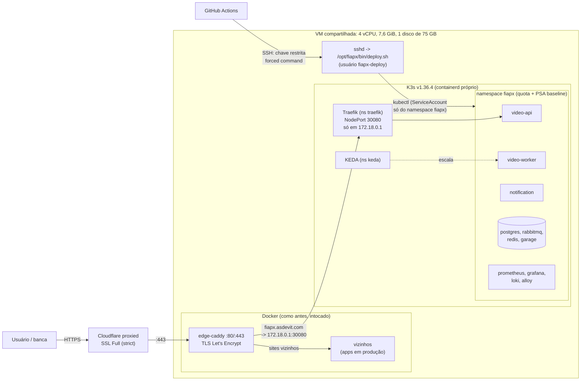

# K3s na VM compartilhada: runbook de instalação, deploy e reversão

Este diretório coloca o FIAP Frames num **K3s de nó único** dentro de uma VM que já roda outros
projetos em produção, em Docker, atrás de um **edge-caddy** dono das portas 80/443. Nesta
documentação eles são "**os vizinhos**". O objetivo nº 1 é **não atrapalhar os vizinhos**; o nº 2 é
ter **CI/CD de ponta a ponta** (push na `main` -> testes -> imagem -> deploy no K3s -> smoke ->
rollback automático).

Dois hostnames chegam ao mesmo cluster: **`frames.asdevit.com`**, o endereço público oficial do
produto (FIAP Frames, `contratos.md` seção 14), e **`fiapx.asdevit.com`**, o host técnico que o
Ingress atende e que o smoke do deploy usa. O Caddy repassa os dois ao Traefik com
`Host: fiapx.asdevit.com`.

> Estudo de fundo (NodePort, kube-proxy, flannel, como UFW/Docker/iptables se cruzam,
> ResourceQuota, QoS e OOM, TLS da Cloudflare): [`docs/estudos/k3s-na-vm-compartilhada.md`](../../docs/estudos/k3s-na-vm-compartilhada.md).
> Leia antes de rodar qualquer passo com `--yes`.

**Regras de ouro destes scripts**

- Todo script é **dry-run por padrão**: mostra cada arquivo (com diff), cada comando e cada
  regra. Nada muda sem `--yes`.
- Todo script é **idempotente**: rodar de novo só confere e completa o que falta (`[já feito]`).
- Todo passo tem **reversão** (`--revert` ou o `99-uninstall.sh`), e o `20-firewall.sh`
  tira um **snapshot** do estado de antes (`/root/fiapx-k3s/snapshot-antes/`).
- Nenhum passo reinicia o Docker, o edge-caddy ou o sshd. A borda só recebe um arquivo novo e
  um `caddy reload`, validado **antes** num container descartável; se algo falhar depois, o arquivo
  **anterior** volta.
- **Nada da VM que identifique os vizinhos entra no git** (o repositório é público; regra do
  `CLAUDE.md`). Os hostnames e containers dos vizinhos, o lock do deploy deles e os IPs públicos
  da VM ficam em `infra/vm/.env` (ignorado pelo git; modelo em [`.env.example`](.env.example)). A cópia
  por `tar` para a VM leva o `.env` junto.

> **O K3s já está instalado na VM** desde 2026-09-28 19:15 UTC, com a versão destes scripts
> ANTERIOR à revisão de segurança. A [seção 0](#0-estado-atual-e-correções-pós-instalação) diz o
> que está lá e a ordem exata para aplicar as correções.

---

## Sumário

0. [Estado atual e correções pós-instalação](#0-estado-atual-e-correções-pós-instalação)
1. [Visão geral](#1-visão-geral)
2. [Decisões](#2-decisões) (onde as análises e o plano divergiam)
3. [Arquivos](#3-arquivos)
4. [Orçamento de recursos](#4-orçamento-de-recursos) (inclui a observabilidade)
5. [Ordem de execução (instalação do zero)](#5-ordem-de-execução-instalação-do-zero)
6. [Passo a passo](#6-passo-a-passo) (o que cada script faz e por quê; convenções dos manifestos)
7. [Verificação pós-instalação](#7-verificação-pós-instalação)
8. [Primeiro deploy (GitHub Actions)](#8-primeiro-deploy-github-actions)
9. [Operação do dia 2](#9-operação-do-dia-2)
10. [Emergência, rollback e desinstalação](#10-emergência-rollback-e-desinstalação)
11. [Riscos para os vizinhos e mitigações](#11-riscos-para-os-vizinhos-e-mitigações)
12. [Pendências (decisão do Arthur)](#12-pendências-decisão-do-arthur)
13. [O que foi testado](#13-o-que-foi-testado)
14. [Revisão de segurança](#14-revisão-de-segurança) (os 12 achados do red-team e o que foi feito)

---

## 0. Estado atual e correções pós-instalação

### 0.1 Registro da instalação (2026-09-28, horários em UTC)

A instalação foi feita pelo lead com a versão destes scripts **anterior** à revisão de segurança.
Horários conferidos na VM pela revisão (só leituras, entre 19:35 e 20:15).

| Quando | Passo executado | Resultado |
|---|---|---|
| antes | `./00-preflight.sh` | 0 falhas, 1 aviso (`route_localnet=1`, sobra da Fase 2) |
| antes de 19:15 | `./20-firewall.sh --yes` | snapshot em `/root/fiapx-k3s/snapshot-antes/`; 3 regras UFW na `cni0`; `fiapx-netguard` com **2** regras raw (só IPv4); `route_localnet=0` |
| 19:15:32 | `./10-install-k3s.sh --yes` | K3s `v1.36.4+k3s1` ativo; `/var/lib/rancher` no loop de 20 GiB (`/var/lib/fiapx-k3s.img`) |
| depois de 19:15 | `./30-ingress.sh --yes` | Traefik 41.6.0 (v3.7.13) via HelmChart, NodePort 30080 só no gateway da rede `borda` |
| até 19:18 | `./30-ingress.sh --caddy --yes` (pelo menos 2 vezes) | `/opt/edge/sites/fiapx.caddy` no ar, com o bloco `http://` mas **sem** o `@texto_puro`. Backup de uma versão anterior (sem o bloco `http://`) em `/root/fiapx-k3s/fiapx.caddy.bak.20260928191804`. A cópia da VM **sai com código 1** no fim de um `--caddy --yes` que deu certo (bug já corrigido no repo) |
| depois | `./40-deployer-access.sh --pubkey /root/fiapx_deploy.pub --yes` | usuário `fiapx-deploy`, `authorized_keys` com forced command, `/opt/fiapx/bin/deploy.sh`, kubeconfig da ServiceAccount; namespace `fiapx` com quota (`requests.storage` 14Gi), LimitRange, VAP (só a regra anti-Guaranteed) e PriorityClasses |
| 19:19 | `k3s kubectl apply -f k8s/keda-helmchart.yaml` (à mão) | KEDA 2.21.0 via HelmChart no namespace `keda` |
| depois | Cloudflare: **Configuration Rule "SSL: Full (strict)"** para `fiapx.asdevit.com` | a Cloudflare fala HTTPS com a origem e confere o certificado (P1 resolvida) |
| — | GitHub | repo `arthurfcs98/fiap-fase5-fiapx` público; os 3 pacotes `fiapx-*` do GHCR aceitam pull anônimo (P2 resolvida) |
| depois (lead) | `infra/vm/frames.caddy` no repo + DNS `frames` proxied (contrato seção 14) | o site `frames.asdevit.com` ainda **não** está na Configuration Rule Full (strict) (P13). Se já foi posto na borda à mão, está **sem** o `@texto_puro` (mesmo defeito do achado 1); o passo 2 da 0.2 instala/converge |

**O que a VM tem hoje e esta revisão muda** (nada disto foi aplicado ainda):

| Achado (seção 14) | Arquivo | Muda na VM | Aplicado por (passo da 0.2) |
|---|---|---|---|
| cópia velha | `/root/fiapx-infra-vm/` | cópia desatualizada, dono uid 501 (veio de `rsync -a` do Mac); o `30-ingress.sh` de lá sai com 1 | 1 |
| 1, 7 | `fiapx.caddy`, `frames.caddy`, `30-ingress.sh` | `http://` sem `X-Forwarded-Proto: https` vira 308 nos dois hosts (hoje o `fiapx` **é servido em texto puro**); os dois sites instalados juntos, com validação offline e restauração dos arquivos anteriores | 2 |
| 4, 6 | `20-firewall.sh` | guarda raw ganha DROP de SYN na `eth0` para 6443/10250/10256/30000-30099 (IPv4 **e** IPv6); `iptables -w 30` com 3 tentativas; `Restart=on-failure` | 3 |
| 3, 4, 6, 12 | `10-install-k3s.sh` | loop de 8 GiB só para os volumes em `/var/lib/fiapx-pv`; `config.yaml` com `nodeport-addresses` IPv6 e `default-local-storage-path`; drop-in com `Wants=` + `ExecStartPre` (o K3s só sobe com a guarda ativa) | 4 e 5 |
| 2, 3, 8, 9 e observabilidade | `k8s/*.yaml`, `deploy.sh`, `40-deployer-access.sh` | VAP barra `priorityClassName` fora das `fiapx-*`; quota de 0 pods com classes do sistema; quota com a observabilidade (seção 4.3) e `requests.storage` 14Gi -> 8Gi; PVC máx. 6Gi -> 5Gi; RBAC de leitura para `prometheus`/`alloy`; deployer ganha `daemonsets`; `deploy.sh` novo (listagem que falha não passa; SHA ruim recusado com 5; espera DaemonSets) | 6 |
| KEDA | `35-keda.sh` (novo) | nada, se o arquivo da VM for igual ao do repo: só confere operator e APIService | 7 |
| 5, 10 | `90-stop-k3s.sh` (novo), `99-uninstall.sh` | parada de emergência com o lock do deploy dos vizinhos; limpeza de logs de pod, backups e pontos de montagem | só quando usados |

### 0.2 Aplicar correções pós-instalação

Numa janela combinada (~15 min; os vizinhos não param em nenhum passo). Cada passo tem dry-run:
rode sem `--yes`, leia o diff, depois repita com `--yes`.

Antes, no Mac, na raiz do repo:

```bash
export VM_SSH=<alias ssh da VM>            # o Host do seu ~/.ssh/config
test -f infra/vm/.env || cp infra/vm/.env.example infra/vm/.env   # e preencha (seção 3)
```

| # | Onde | Comando exato | Esperado |
|---|---|---|---|
| 1 | Mac | `COPYFILE_DISABLE=1 tar --no-xattrs -C infra/vm -cf - . \| ssh "$VM_SSH" 'rm -rf /root/fiapx-infra-vm && mkdir -m 0700 /root/fiapx-infra-vm && tar -C /root/fiapx-infra-vm --no-same-owner -xf -'` | cópia atual **com o `.env`**, dono root, sem arquivos velhos (o `openrsync` do macOS não tem `--chown`). Nada de `rsync -a` |
| 2 | VM | `cd /root/fiapx-infra-vm && ./30-ingress.sh --caddy` e depois `./30-ingress.sh --caddy --yes` | diff dos dois sites; "Valid configuration" duas vezes (container descartável e edge-caddy); vizinhos OK antes e depois; "em HTTP puro na borda local: 308" para `fiapx` e `frames`. **Fecha o achado mais urgente (1) sozinho** |
| 3 | VM | `./20-firewall.sh` e depois `./20-firewall.sh --yes` | conferência com 3 regras `fiapx-guard` IPv4 e 1 IPv6; `fiapx-netguard: active` (o restart deixa ~1 s sem a guarda; o K3s não reinicia) |
| 4 | VM | `./10-install-k3s.sh` e depois `./10-install-k3s.sh --yes` | `/var/lib/fiapx-pv` montado; aviso "o K3s está no ar e este run alterou: config.yaml, drop-in" |
| 5 | VM | `systemctl restart k3s && ./00-preflight.sh --post` | ~30 s sem apiserver (os pods seguem rodando). Falhas só nos itens dos passos 6 e 7 (RBAC, quota, KEDA se for o caso) |
| 6 | VM | `./40-deployer-access.sh` e depois `./40-deployer-access.sh --yes` | sem `--pubkey`: mantém a chave. Conformidade: `can-i` como esperado, 4 pods de teste (classes do sistema e Guaranteed negados, `fiapx-app` aceito), RBAC de `prometheus`/`alloy`, `id` recusado com rc=2 |
| 7 | VM | `./35-keda.sh` e depois `./35-keda.sh --yes` | diff vazio (ou só o que mudou no repo); os 3 Deployments do `keda` prontos; APIService `v1beta1.external.metrics.k8s.io` disponível |
| 8 | VM | `./30-ingress.sh` (dry-run do Traefik) | diff vazio |
| 9 | VM | `./00-preflight.sh --post` | `0 falha(s)` |
| 10 | Mac | `infra/vm/00-preflight.sh --outside` | portas 6443/10250/10256/30080/30000/30099 fechadas; vizinhos OK; `https://` de `fiapx` e `frames` 404 (Traefik sem rota) ou 200; `http://` dos dois 30x; IPv6 "não verificado" se o Mac não tiver IPv6 (P10) |
| 11 | VM | (opcional, mesma janela) `reboot` e repetir 9 e 10 | prova `After=docker.service`, o `ExecStartPre` da guarda e os dois loops no fstab |

Se algo sair do esperado no meio: `./30-ingress.sh --revert --caddy --yes` tira o fiapx da borda,
e `./90-stop-k3s.sh --yes` para o K3s sem arriscar as regras do Docker (seção 10).

Depois do passo 6, **todo deploy precisa do `deploy.sh` novo e do RBAC novo juntos** (o `40 --yes`
instala os dois). O `deploy.sh` novo lista DaemonSets; com o RBAC antigo ele falharia e reverteria.

Opcional (quando quiser): tirar o bloco `http://` do `fiapx.caddy`, que virou só redirect com o
Full (strict) (D16). Edite a linha do endereço para `https://fiapx.asdevit.com {`, apague o
`@texto_puro` e o `redir`, e rode o passo 2 de novo. No `frames.caddy`, só **depois** de pôr
`frames.asdevit.com` na Configuration Rule (P13); antes disso o bloco `http://` é o que evita o loop.

---

## 1. Visão geral



Como tudo se encaixa, em uma frase por peça:

- **K3s**: um Kubernetes completo num binário só; usa o **containerd dele** (não o do Docker).
- **Traefik**: o Ingress Controller (recebe HTTP e roteia para os Services). Exposto como
  **NodePort 30080**, e o kube-proxy só cria esse NodePort no IP `172.18.0.1` (gateway da rede
  docker `borda`), e em nenhum IPv6. O Caddy alcança esse IP; a internet não (o UFW descarta, e
  a guarda raw descarta de novo, sem depender do UFW).
- **KEDA**: escala o `video-worker` pelo tamanho da fila `worker.video-uploaded` (o HPA comum só
  vê CPU/memória). Instalado como `HelmChart`, igual ao Traefik.
- **edge-caddy**: continua sendo a única porta 80/443 da VM. Ganha o arquivo `fiapx.caddy`.
- **deploy.sh**: o único comando que a chave do GitHub consegue rodar na VM.

## 2. Decisões

As três análises (rede, recursos, CD) e o `PLANO-EXECUCAO.md` divergiam em alguns pontos. Aqui
está o que foi escolhido, contra o quê e por quê. O que foi **verificado em teste** está marcado.

| # | Tema | Plano / análises | Escolhido | Por quê |
|---|---|---|---|---|
| D1 | **Ingress** | Plano: ingress-nginx. As 3 análises: não usar (aposentado em mar/2026). Rede/CD: Traefik embutido do K3s via HelmChartConfig | **Traefik v3.7.13, chart `41.6.0` fixado**, instalado pelo *helm-controller* do K3s (objeto `HelmChart`) no namespace `traefik`. O Traefik embutido fica **desligado** (`disable: traefik`) | O ingress-nginx não recebe mais correções de segurança e ficaria exposto à internet. Com o chart fixado à parte, a versão é explícita e independente do K3s, o passo 30 roda **depois** do start, o Traefik fica num namespace com PSA baseline (o `kube-system` é isento) e não precisa do binário `helm` na VM. **Testado** e **em produção** |
| D2 | **UFW** | Plano (doc do K3s): liberar `10.42.0.0/16` e `10.43.0.0/16`. Rede: regra só na `cni0` e só nas portas 6443/10250 | `allow in on cni0 from 10.42.0.0/16 to any port 6443,10250 proto tcp` + 2 regras `route` na cni0 (só silenciam falsos `[UFW BLOCK]`) | Sem `in on cni0`, alguém forja origem `10.42.x` pela eth0 e o UFW aceita. "to any" sem porta, somado ao `route_localnet=1` que sobrou da Fase 2, deixa um pod alcançar serviços do host que só escutam em 127.0.0.1. `10.43.0.0/16` nunca é origem de pacote. **Nunca** `ufw allow 6443/tcp` (a Fase 2 fez isso). **Testado** |
| D3 | **Reservas do kubelet** | Plano: `system-reserved`/`kube-reserved` sem números. Rede: 250m/512Mi + 250m/384Mi. Recursos: 1000m/2Gi + 500m/1Gi + eviction explícita | **Recursos**, num `KubeletConfiguration` (`kubelet-fiapx.yaml`) | Números medidos: soma dos picos dos vizinhos ~1,75 GiB. O padrão do K3s **não** despeja pod por falta de memória (só define imagefs/nodefs). **Conferido na VM**: `kubepods.slice memory.max` = 4679 MiB, `system.slice` = `max` |
| D4 | **Quota do namespace** | Plano: ~3,5 GiB / ~2,5 vCPU. Recursos: req 1500m/2Gi, lim 6/3840Mi. CD: req 2500m/3584Mi, `services.nodeports: 0` | Números da seção 4.3 (com a observabilidade): req **1600m/2304Mi**, lim **7/4608Mi**, 20 pods, 7 PVCs, 8Gi de volumes; `services.nodeports/loadbalancers = 0` | "2,5 vCPU no total" não é aplicável por soma de limits sem sufocar postgres/rabbit (limit é teto, não reserva); o teto real de CPU é o `cpu.max` dos workers. **Testado** (NodePort barrado pela quota) |
| D5 | **Estratégia do worker/notification** | Recursos: `maxSurge 0, maxUnavailable 1` | **`Recreate`** | Pod em terminação **conta na quota** até o fim do grace (720 s no worker: o shutdown espera o vídeo em curso inteiro, 30 + 600 + 60 = 690 s). Com rolling, velho + novo somariam. `Recreate` espera o velho sair antes de criar o novo (a fila segura as mensagens). Consequência: `progressDeadlineSeconds` do worker > 720 s (900) e `ROLLOUT_TIMEOUT` do deploy = 900 s |
| D6 | **Réplicas máximas** | Plano: api 1-3, worker 1-3. Recursos: 1-2 | **api 1-2 (HPA), worker 1-2 (KEDA)** | Só o worker é CPU-bound; 2 × 1 vCPU é o teto que protege os vizinhos, e mais de 2 não aumenta a vazão nesta VM. A quota foi calculada com esses máximos |
| D7 | **NetworkPolicy** | Rede: manter o controlador (kube-router) | **`disable-network-policy: true`** | Conferido no código do kube-router: a cada sync ele faz `iptables-save -t filter` e `iptables-restore -T filter` **sem `--noflush`**, reescrevendo a tabela filter inteira (inclusive as regras do Docker). Se o Docker criar uma regra nesse intervalo, ela se perde e a borda dos vizinhos pode cair. O isolamento fica na **guarda raw** (D9), no PSA e nas credenciais por serviço |
| D8 | **Pod Security** | Rede: padrão do cluster via arquivo de admissão. CD: rótulo no namespace | **Os dois** | Padrão `baseline` no cluster (só `kube-system` isento) + rótulos em `fiapx`/`traefik`/`keda`. **Achado no teste**: o K3s 1.36 **não tem** a flag `pod-security-admission-config-file` (avisa "Unknown flag... skipping"). Usamos `kube-apiserver-arg: admission-control-config-file=...`. **Testado** |
| D9 | **Isolamento Docker -> K3s** | Rede: guarda na tabela `raw` | Adotado (`fiapx-netguard.service`) | Na `raw` o pacote ainda não passou por NAT/FORWARD, então a regra vale qualquer que seja a ordem das cadeias (que muda a cada restart do Docker). Sem ela, um container vizinho alcançaria o Postgres do fiapx pelo ClusterIP. **Testado** |
| D10 | **Flannel** | Padrão (VXLAN) | **`host-gw`** | Nó único: sem UDP 8472 escutando, sem encapsulamento, MTU 1500 |
| D11 | **Disco** | Recursos: loop ext4 de 20 GiB em `/var/lib/rancher` | Adotado (**em produção**), **mais** um loop de 8 GiB só para os volumes (`/var/lib/fiapx-pv`, `--pv-size`), com o arquivo **dentro** do primeiro | O local-path não limita tamanho de PVC; sem teto, o fiapx poderia encher o `/` onde estão os bancos dos vizinhos. Volumes num disco próprio: PVC cheio não trava o imagefs do kubelet (achado 3). O teto no `/` segue 20 GiB |
| D12 | **Rollback do deploy** | Plano: `kubectl rollout undo`. CD: reaplicar o manifesto da release anterior | **CD** | O `undo` volta uma revisão de cada Deployment (inclusive os que não mudaram) e não desfaz ConfigMap/HPA/Ingress/ScaledObject. **Testado** |
| D13 | **Imagem no deploy** | Plano: tag `sha-<7>` + `kustomize edit set image`. CD: digest + `kubectl kustomize` | **CD** | Tag sobrescrita não muda o que roda; o binário `kustomize` não existe na VM (o `kubectl kustomize` é embutido) |
| D14 | **Secrets do GitHub** | Plano: `VM_HOST`, `VM_USER`, `SSH_DEPLOY_KEY` (repo). CD: `VM_HOST`, `VM_SSH_KEY`, `VM_KNOWN_HOSTS` (environment) | **CD** | Secrets de *environment* só chegam a jobs da `main`; `VM_KNOWN_HOSTS` fixa o host key (sem TOFU); o usuário é fixo e não é segredo |
| D15 | **Smoke público** | CD: comparar com a label `revision` | `version == sha-<7>` | O CI grava `APP_VERSION=sha-<7>` em cada imagem e o `/api/health/live` devolve esse valor |
| D16 | **TLS Cloudflare -> origem** | Rede: o host dava 308 em loop (modo Flexible). CD: registro DNS novo | **Configuration Rule "SSL: Full (strict)"** só para `fiapx.asdevit.com` (**ativa**). O `fiapx.caddy` ainda declara `http://` **e** `https://`, com `http://` sem `X-Forwarded-Proto: https` virando 308 | No Flexible a Cloudflare falava HTTP com a origem: o trecho por onde passam login e JWT ia sem cifra, e sem o bloco `http://` o redirect do Caddy virava loop. Com o Full (strict) ela fala HTTPS e confere o certificado Let's Encrypt do Caddy. O bloco `http://` virou só redirect + desafio ACME: é **removível** (seção 0.2, "Opcional"); fica por ora porque é inofensivo e mantém o site no ar se alguém voltar o modo para Flexible. O `@texto_puro` fecha o achado 1 (HTTP puro era servido de ponta a ponta). O `frames.asdevit.com` ainda está em Flexible: funciona pelo mesmo bloco `http://` + `@texto_puro`, mas o trecho Cloudflare -> VM vai sem cifra até entrar na regra (P13) |
| D17 | **Ordem 20 antes de 10** | Rede: UFW antes do primeiro start | O `10` **recusa** aplicar sem o `20` (versão atual) aplicado e o `fiapx-netguard` ativo | As regras precisam existir quando CoreDNS/metrics-server sobem; e o drop-in novo não deixa o K3s subir sem a guarda |
| D18 | **IPv6** | Nenhuma análise tratava | `nodeport-addresses` com um CIDR IPv6 que não existe (`2001:db8::1/128`) + DROP de SYN na `eth0` (IPv4 e IPv6) nas portas do K3s, na tabela raw | O cluster é só IPv4, mas o kube-proxy programa o ip6tables também: sem CIDR IPv6 na lista, ele publica NodePort em **todos** os IPv6 do nó (a revisão viu `! -d ::1/128 ... --dst-type LOCAL` na VM). 6443/10250 escutam em `*` (inclui o IPv6 público). Hoje só o UFW protege; a guarda raw não depende dele (achado 4). **Testado** no K3s local |
| D19 | **Guarda obrigatória** | Achado 6: `Requires=fiapx-netguard.service` | `Wants=` + `ExecStartPre=systemctl is-active fiapx-netguard` no drop-in; `Restart=on-failure` no netguard | Barra a subida do K3s sem a guarda, como o `Requires=`, e **se recupera sozinho**: o `Restart=always` do k3s.service tenta de novo a cada 5 s. Com `Requires=`, uma falha no boot deixaria o K3s parado até alguém agir, e todo `systemctl restart fiapx-netguard` (o `20 --yes` faz isso) reiniciaria o K3s junto |
| D20 | **KEDA** | Plano: KEDA via Helm | **KEDA 2.21.0 via `HelmChart`** (`k8s/keda-helmchart.yaml`, aplicado pelo `35-keda.sh`) no namespace `keda`, 1 réplica de cada peça | Mesmo mecanismo do Traefik: versão fixada, sem binário `helm`, sem CRD de terceiros para gerenciar à mão. **Em produção** (60m/112Mi pedidos) |
| D21 | **Onde fica a observabilidade** | Contrato §13: Prometheus, Grafana, Loki, Alloy em `infra/k8s/observability/` | **Dentro do namespace `fiapx`**, na mesma quota (seção 4.3). RBAC de leitura aplicado pelo **root** (`k8s/observability-rbac.yaml`). Alloy lê logs **pela API** (sem hostPath). Grafana **sem Ingress** (port-forward pelo root) | O CD só enxerga o `fiapx` e não cria Namespace, quota nem RBAC (se criasse, quem faz merge na `main` teria qualquer permissão do cluster). Um namespace `observability` exigiria passo manual de root a cada mudança. O PSA baseline proíbe hostPath, por isso o Alloy usa `loki.source.kubernetes` |
| D23 | **Endereço público `frames.asdevit.com`** | Contrato seção 14 (decisão do Arthur, marca "FIAP Frames") | Site próprio no Caddy (`frames.caddy`) que repassa ao Traefik com `Host: fiapx.asdevit.com` e `X-Forwarded-Host: frames.asdevit.com`; instalado e revertido **junto** com o `fiapx.caddy` pelo `30-ingress.sh --caddy` | O Ingress, o `deploy.sh` e o smoke continuam no host técnico: trocar o endereço público não mexe no cluster. Um reload só para os dois sites; falha em qualquer um volta os dois arquivos anteriores |
| D22 | **Valores da VM fora do git** | Versões anteriores tinham IPs, hostnames e nomes dos vizinhos nos scripts | `infra/vm/.env` (gitignored) lido por `site-env.sh`; modelo em `.env.example` | O repo é público e o `CLAUDE.md` proíbe IP, hostname ou nome dos outros projetos da VM no git. O `site-env.sh` não executa o arquivo: lê só as 5 chaves conhecidas e confere o formato. Sem o `.env`, as checagens de vizinhos viram aviso, e os passos que dependem delas (`30 --caddy --yes`, `90`, `99`) se recusam a rodar |

## 3. Arquivos

| Arquivo | Onde age | O que faz |
|---|---|---|
| `.env.example` | Mac/VM | Modelo do `.env` (gitignored): `NEIGHBOR_SITES`, `NEIGHBOR_CONTAINERS`, `NEIGHBOR_DEPLOY_LOCK`, `VM_PUBLIC_IP`, `VM_PUBLIC_IP6` |
| `site-env.sh` | (biblioteca) | Lê o `.env` sem executá-lo; confere os vizinhos pela borda local; segura/solta o lock do deploy deles |
| `00-preflight.sh` | leitura | Checagens **somente leitura**: antes (`sem args`), depois (`--post`) e de fora (`--outside`, no Mac) |
| `20-firewall.sh` | host | `route_localnet=0`, 3 regras UFW na `cni0`, guarda raw `fiapx-netguard` (IPv4 e IPv6); snapshot de antes; `--revert` |
| `10-install-k3s.sh` | host | Loops de 20 GiB (K3s) e 8 GiB (volumes), sysctl, `config.yaml`, `kubelet-fiapx.yaml`, `psa.yaml`, `resolv.conf`, drop-in systemd, instalador fixado, start |
| `30-ingress.sh` | cluster + borda | Traefik (HelmChart fixado, NodePort 30080); com `--caddy`, publica `fiapx.caddy` e `frames.caddy` no edge-caddy |
| `fiapx.caddy` | borda | Site `fiapx.asdevit.com -> 172.18.0.1:30080` (host técnico) |
| `frames.caddy` | borda | Site `frames.asdevit.com -> 172.18.0.1:30080` com `Host: fiapx.asdevit.com` (endereço público oficial) |
| `35-keda.sh` | cluster | KEDA (aplica `k8s/keda-helmchart.yaml`, espera os Deployments e a APIService) |
| `40-deployer-access.sh` | host + cluster | Namespace e guardas, RBAC do CD e da observabilidade, usuário `fiapx-deploy`, `authorized_keys` com forced command, kubeconfig da ServiceAccount, conformidade |
| `deploy.sh` | host | O forced command (`deploy <sha40>`, `rollback`, `status`) instalado em `/opt/fiapx/bin/deploy.sh` |
| `k8s/namespace-guard.yaml` | cluster | Namespace `fiapx` (PSA), 2 ResourceQuotas (teto + 0 pods com classe do sistema), LimitRange, PriorityClasses, política (anti-Guaranteed e só classes `fiapx-*`) |
| `k8s/deployer-rbac.yaml` | cluster | ServiceAccount, token, Role e RoleBinding do CD |
| `k8s/observability-rbac.yaml` | cluster | Leitura para as ServiceAccounts `fiapx/prometheus` (pods/services/endpoints do `fiapx` + `nodes/metrics`) e `fiapx/alloy` (pods e logs do `fiapx`) |
| `k8s/keda-helmchart.yaml` | cluster | KEDA 2.21 via helm-controller (60m/112Mi pedidos, 500m/320Mi de teto) |
| `90-stop-k3s.sh` | host | Parada de emergência: `k3s-killall.sh` **segurando o lock do deploy dos vizinhos** e comparando as regras do Docker antes/depois |
| `99-uninstall.sh` | tudo | Desfaz tudo na ordem certa (inclusive logs de pod e backups) e confere contra o snapshot |
| `.github/workflows/ci.yml` (job `deploy`) e `.github/workflows/rollback.yml` | GitHub | O job `deploy` (push na `main`, depois do `ci-ok` e das imagens) chama o forced command desta pasta; o `rollback.yml` é o rollback manual (*Run workflow*). Ambos usam o environment `production` e o grupo de concorrência `deploy-production` |

Arquivos que os scripts criam na VM (e o `99` remove):

```
/var/lib/fiapx-k3s.img                    loop ext4 (esparso) montado em /var/lib/rancher   [10]
/var/lib/rancher/fiapx-pv.img              loop ext4 (esparso) montado em /var/lib/fiapx-pv  [10]
/etc/fstab                                 +2 linhas "# fiapx-k3s" (backup ao lado)          [10]
/etc/rancher/k3s/{config.yaml,kubelet-fiapx.yaml,psa.yaml,resolv.conf}                     [10]
/etc/systemd/system/k3s.service.d/10-fiapx.conf                                             [10]
/etc/sysctl.d/90-fiapx-k3s.conf  (inotify)                                                  [10]
/etc/sysctl.d/90-fiapx-net.conf  (route_localnet=0)                                         [20]
/usr/local/sbin/fiapx-netguard.sh + /etc/systemd/system/fiapx-netguard.service              [20]
/opt/edge/sites/{fiapx,frames}.caddy                                                        [30 --caddy]
/opt/fiapx/bin/deploy.sh, /var/lib/fiapx-deploy/{.ssh,kubeconfig,state}, usuário fiapx-deploy [40]
/root/fiapx-k3s/  (snapshot de antes, instalador baixado, backups)                          [20/10/30]
+ o que o instalador do K3s cria: /usr/local/bin/{k3s,kubectl,crictl,k3s-killall.sh,k3s-uninstall.sh},
  /etc/systemd/system/k3s.service
+ o que o kubelet cria e o k3s-uninstall.sh NÃO apaga: /var/log/pods/<ns>_*, /var/log/containers/*
  (o 99 apaga os dos namespaces fiapx/traefik/keda/kube-system criados depois do snapshot)
Ficam de propósito: /root/fiapx-k3s/ e os certificados de fiapx/frames.asdevit.com no volume de dados do edge-caddy.
```

## 4. Orçamento de recursos

### 4.1 Memória (RAM 7751 MiB, sem swap)

```
7751 MiB  capacidade (MemTotal)
├── systemReserved 2048 Mi  contabilidade (NÃO vira limite): vizinhos em Docker + edge-caddy
│                           (picos ~690), serviços do host fora do Docker (~500),
│                           Docker/containerd (~220), kernel/SO (~550)
├── kubeReserved   1024 Mi  k3s-server + containerd do K3s + shims
└── kubepods.slice memory.max = 4679 MiB   <- PAREDE DURA do kernel para TODOS os pods
      └── allocatable = 4679 - 500 (evictionHard) = 4179 MiB  <- teto da soma de requests
```

- O `system.slice` (onde estão os containers dos vizinhos, dockerd e sshd) **não ganha limite
  nenhum**. As reservas só servem para o kubelet calcular a parede dos pods.
- Se os pods somados encostarem em 4,57 GiB, o kernel faz OOM **dentro** do `kubepods.slice`:
  os vizinhos nem entram na conta.
- Se o **host inteiro** apertar (um vizinho cresceu), o kubelet despeja pods a partir de 750 MiB
  livres (por 90 s) ou 500 MiB (na hora). Num OOM global, todos os pods do fiapx (adj 967-1000)
  morrem antes dos processos do host (adj 0 a 100).

### 4.2 CPU (4000m)

| Camada | Valor | Observação |
|---|---|---|
| systemReserved | 1000m | host inteiro antes do K3s: média 1,3%, pico de 10 min 3% (`sar`, 9 dias) |
| kubeReserved | 500m | K3s em regime ~0,1-0,25 vCPU |
| allocatable (pods) | 2500m | `kubepods.slice cpu.weight` ≈ 98 contra 100 do `system.slice`: sob disputa, o lado dos vizinhos fica com pelo menos metade da CPU |
| teto real do ffmpeg | 2 × 1000m | `cpu.max` de cada worker × KEDA máx. 2 |

### 4.3 Por workload (meta para os manifestos de `infra/k8s/`)

`oom_score_adj` ≈ 1000 − 1000 × request/7751Mi (QoS Burstable). Todos no namespace `fiapx`.

| Workload | Réplicas | CPU req/lim | Mem req/lim | Volume (PVC) | Estratégia | Observação |
|---|---|---|---|---|---|---|
| video-api | 1-2 (HPA) | 150m / 500m | 160Mi / 320Mi | — | Rolling, surge 1, unavailable 0 | `--max-old-space-size=192`; `trust proxy` = `10.42.0.0/16` |
| video-worker | 1-2 (KEDA) | 250m / 1000m | 256Mi / 512Mi | — | **Recreate**, grace 720 s | ffmpeg com `-threads` ≤ limit; `/work` emptyDir `sizeLimit: 2Gi`; ephemeral 1Gi/2560Mi |
| notification-service | 1 | 25m / 200m | 96Mi / 192Mi | — | **Recreate** | |
| postgres 16 | 1 (STS) | 100m / 500m | 192Mi / 320Mi | 1Gi | STS | `shared_buffers=64MB`, `max_connections=40` |
| rabbitmq 4.x | 1 (STS) | 100m / 500m | 256Mi / 512Mi | 1Gi | STS | `vm_memory_high_watermark.absolute=300MiB` |
| redis 7 | 1 | 25m / 100m | 32Mi / 64Mi | — | Recreate | `maxmemory 32mb`, sem persistência |
| garage | 1 (STS) | 50m / 250m | 64Mi / 192Mi | 4Gi | STS | `db_engine="sqlite"`; quotas de bucket 1 GiB (raw) + 2,5 GiB (zips) |
| prometheus v3 | 1 | 100m / 500m | 192Mi / 384Mi | 512Mi | Recreate | `retention.time=3d` (contrato §13), `retention.size=400MB` |
| grafana | 1 | 50m / 500m | 128Mi / 320Mi | — | Recreate | `GOMEMLIMIT=256MiB` (medido no k3d: com 150MiB/192Mi o Grafana 12 reiniciava em loop; com 250m os dashboards levavam 6-15 s); datasources e dashboards provisionados (sem PVC) |
| loki (single binary) | 1 (STS) | 50m / 250m | 128Mi / 320Mi | 1Gi | STS | filesystem, `retention_period: 72h` (contrato §12/§13), compactor ligado |
| alloy | 1 (DaemonSet) | 25m / 200m | 96Mi / 256Mi | — | DaemonSet | `loki.source.kubernetes` (logs pela API), **sem hostPath**; `GOMEMLIMIT=200MiB` |
| Job migrate/setup | 0-1 | 50m / 250m | 96Mi / 192Mi | — | Job | roda antes do rollout; concluído não conta na quota |

| Cenário (namespace fiapx) | CPU req | CPU lim | Mem req | Mem lim | Pods |
|---|---|---|---|---|---|
| Regime (réplicas mínimas) | 925m | 4500m | 1600Mi | 3392Mi | 11 |
| Escala máxima (api 2, worker 2) | 1325m | 6000m | 2016Mi | 4224Mi | 13 |
| Escala máxima + surge do api no deploy | 1475m | 6500m | 2176Mi | 4544Mi | 14 |
| **ResourceQuota `fiapx-teto`** | **1600m** | **7** | **2304Mi** | **4608Mi** | **20** |

Volumes: postgres 1 + rabbitmq 1 + garage 4 + prometheus 0,5 + loki 1 = **7,5Gi** de 8Gi
(`requests.storage`); 7 PVCs no máximo; nenhum acima de 5Gi (LimitRange). Os manifestos de
`infra/k8s/` (renderizados em 2026-09-28) batem com esta tabela: 925m/4500m e 1600Mi/3392Mi no
regime, Alloy como DaemonSet, Loki como StatefulSet (conferido pelo `infra/k8s/scripts/check-manifests.mjs`
no `validate.sh` e no job `k8s-validate` do CI).

A soma dos tetos de memória do fiapx (4544Mi) mais os de fora (Traefik 192Mi, KEDA 320Mi, CoreDNS
170Mi) passa da parede de 4679 MiB. É de propósito: limit é teto, não reserva, e quem segura é a
parede do `kubepods.slice`. Se todos encostassem no teto juntos, o OOM seria **dentro** do
`kubepods.slice`, longe dos vizinhos.

Fora do `fiapx`: Traefik 50m/500m e 64Mi/192Mi; KEDA 60m/500m e 112Mi/320Mi (operator
25m/48Mi, metrics-apiserver 25m/40Mi, webhooks 10m/24Mi; conferido nos pods da VM); coredns 100m
e 70Mi/170Mi; metrics-server 100m e 70Mi. Soma dos requests do nó na escala máxima + surge:
~1,8 vCPU de 2,5 e ~2,4 GiB de 4,1 GiB.

Regra do namespace: `priorityClassName` só pode ser `fiapx-dados`, `fiapx-app` ou `fiapx-lote`
(ou nenhuma). As classes do sistema (`system-node-critical`, `system-cluster-critical`) valem em
qualquer namespace por padrão no Kubernetes; aqui a VAP e uma quota de 0 pods as barram (achado 2).
Sugestão: dados (postgres, rabbitmq, garage, loki) em `fiapx-dados`; api, notification,
prometheus, grafana, alloy em `fiapx-app`; worker e Jobs em `fiapx-lote`.

### 4.4 Disco (um ext4 de 74,8 GiB; 37,7 GiB usados fora do fiapx antes da instalação)

| Item | Onde | Máximo |
|---|---|---|
| Imagens do K3s, containerd, banco do cluster | loop `/var/lib/rancher` | GC de imagens a 75% (14,6 GiB); despejo a 85%/90% |
| Volumes (PVCs, tabela 4.3) | loop `/var/lib/fiapx-pv` (**8 GiB**, arquivo dentro do loop acima) | 8 GiB (teto duro); quota `requests.storage` 8Gi; PVC máx. 5Gi |
| Os dois loops juntos | arquivo `/var/lib/fiapx-k3s.img` no `/` | **20 GiB** (teto duro; 1,7 GiB usados na revisão) |
| emptyDir `/work` (2 workers) | `/` | 2 × 2 GiB (`sizeLimit`) |
| Logs de pod | `/` | 10 MiB × 3 por container (~0,5 GiB) |
| Swap (opcional, P3) | `/` | 2 GiB |

Por que dois loops (achado 3): o kubelet trata `/var/lib/rancher` como **imagefs**. Acima de
75% ele apaga imagens sem uso; acima de 85%/90% despeja pods. Nenhum dos dois libera dado de
PVC. Com os volumes no mesmo disco, a pressão ficaria **presa**: nenhum pod novo sobe (deploy e
rollback falham) e o kubelet despeja pods do nó inteiro (Traefik, KEDA, CoreDNS). Com os volumes
num loop próprio de 8 GiB, eles ocupam no máximo 8 GiB do imagefs; mesmo cheios, sobram 6,6 GiB
para imagens antes do GC e 8,6 GiB antes do despejo (as imagens em uso devem ficar em 5-7 GiB).
Volume cheio só dá "sem espaço" para quem escreve nele (Postgres, Garage, Loki, Prometheus), e
aparece no alerta de disco da observabilidade.

**Pior caso no `/`** (números de `df` na VM; capacidade 74,8 GiB, 3,1 GiB reservados ao root):

```
37,7  fora do fiapx (vizinhos, Docker, journald 3,9, /root/.cache 6,1 ...)
+20,0 loop do K3s cheio (inclui o loop dos volumes)
+ 4,0 emptyDir /work de 2 workers
+ 0,5 logs de pod
= 62,2 GiB (83%)   | com swap de 2 GiB (P3): 64,2 GiB (86%)
```

O kubelet começa o despejo **suave** do `/` com menos de 15% disponível (acima de ~60,5 GiB
usados) e o **duro** com menos de 10% (acima de ~64,2 GiB). Ou seja: o pior caso passa do
limiar suave, e com swap encosta no duro. Despejo libera emptyDir e logs, **não** o loop. Os
bancos dos vizinhos (processos não-root) ainda teriam ~7,5 GiB livres nesse pior caso.

Por isso: a swap (P3) só depois de liberar espaço fora do FIAP Frames (P8: `journalctl --vacuum-size=1G`
devolve ~3 GiB e `/root/.cache` tem 6,1 GiB). Com a P8 feita, o pior caso cai para ~53-55 GiB
(~72%), abaixo dos dois limiares.

## 5. Ordem de execução (instalação do zero)

Para uma VM nova (ou depois do `99-uninstall.sh`). Na VM atual, esta tabela **já foi executada**
(seção 0.1); o que falta está na seção 0.2.

| # | Onde | Comando | O que esperar |
|---|---|---|---|
| 0 | Mac | `.env` preenchido e cópia por `tar` (seção 0.2, passo 1) para `/root/fiapx-infra-vm/` | dono root, modo 0700. **Não** use `rsync -a` do Mac: ele leva o dono uid 501 para a VM |
| 1 | VM | `cd /root/fiapx-infra-vm && ./00-preflight.sh` | `0 falha(s)` |
| 2 | Mac | `infra/vm/00-preflight.sh --outside` | baseline: portas do K3s fechadas, vizinhos OK |
| 3 | VM | `./20-firewall.sh` e depois `--yes` | snapshot + 3 regras UFW + guarda raw (IPv4 e IPv6) |
| 4 | VM | `./10-install-k3s.sh` e depois `--yes` | K3s `Ready`, coredns/local-path/metrics-server prontos, dois loops montados |
| 5 | VM | `./00-preflight.sh --post` | só OK (Traefik/Caddy/CD/KEDA ainda aparecem como `info`) |
| 6 | VM | `./30-ingress.sh` e depois `--yes` | Traefik em `traefik`, NodePort 30080, `404` vindo do edge-caddy |
| 7 | VM | `./35-keda.sh` e depois `--yes` | KEDA pronto, APIService disponível |
| 8 | Mac | `ssh-keygen -t ed25519 -N '' -C fiapx-deploy@github-actions -f fiapx_deploy` e `scp fiapx_deploy.pub "$VM_SSH":/root/` | só a **pública** vai para a VM |
| 9 | VM | `./40-deployer-access.sh --pubkey /root/fiapx_deploy.pub` e depois `--yes` | conformidade toda `ok`; `id` recusado com rc=2 |
| 10 | Cloudflare | DNS `fiapx` proxied + Configuration Rule **SSL Full (strict)** para `fiapx.asdevit.com` | (feito em 2026-09-28) |
| 11 | VM | `./30-ingress.sh --caddy` e depois `--caddy --yes` | vizinhos seguem OK; `fiapx` responde 404 (sem app); HTTP puro 308 |
| 12 | VM + Mac | `./00-preflight.sh --post` e `./00-preflight.sh --outside` | tudo OK; portas seguem fechadas de fora |
| 13 | VM | Secrets do namespace `fiapx` (root; script de bootstrap de `infra/k8s/`) | seção 6.6, item 12 |
| 14 | GitHub | seção 8 | primeiro deploy verde |

> A numeração dos arquivos agrupa por assunto; a ordem de execução é a desta tabela
> (**20 antes de 10**, D17). O `10` se recusa a iniciar o K3s sem o `20`.

## 6. Passo a passo

### 6.1 `00-preflight.sh`: pode instalar?

Só lê. Antes da instalação ele falha (sai com 1) se: não for cgroup v2; houver menos de
4 GiB de RAM ou 25 GiB de disco livres; o Docker estiver com backend de firewall `nftables`;
faltar o edge-caddy, o import `sites/*.caddy` ou a montagem de `/opt/edge/sites`; algum vizinho
não responder pela borda local; existir K3s ativo, regras `KUBE-`/`CNI-`/`FLANNEL`, `cni0`,
tabelas iptables-legacy, portas 6443/10250/30080 ocupadas, rotas ou redes docker em
10.42/10.43, regra UFW pública para 6443/10250, `INPUT` do IPv6 sem `DROP`, ou
`/var/lib/fiapx-pv` ocupado.

Por que cada item importa: o K3s e o Docker vão escrever no **mesmo** conjunto de tabelas do
iptables (backend nf_tables). Misturar backends, ou sobrar regra de outra instalação, é a
receita para uma falha difícil de achar. Os detalhes estão no estudo, seção 4.

Com `--post`, confere o resultado de todos os passos (seção 7). Com `--outside` (no Mac), sonda
de fora: portas do K3s em IPv4 e IPv6, vizinhos e fiapx pela Cloudflare, `http://` redirecionando.

### 6.2 `20-firewall.sh`: preparar a rede do host

1. **Snapshot** (`/root/fiapx-k3s/snapshot-antes/`): `iptables-save`, `ip6tables-save`, portas,
   rotas, UFW, containers, sysctl, fstab e quais diretórios do K3s já existiam. É a base do diff
   pós-instalação e da reversão.
2. **`route_localnet=0`**: com 1 (sobra da Fase 2), um pod com `CAP_NET_RAW` consegue mandar
   pacote para `127.0.0.1` do host (CVE-2020-8558). Nada na VM depende do 1.
3. **UFW** (D2): pods precisam falar com o apiserver (`kubernetes.default` -> `10.43.0.1:443`
   -> DNAT para `<ip-do-nó>:6443`) e o metrics-server/Prometheus com o kubelet (`:10250`). Esses
   pacotes chegam pelo **INPUT** vindo da `cni0`, e o INPUT do UFW é `DROP`.
4. **Guarda raw** (D9, D18), no serviço `fiapx-netguard`:
   - IPv4 `DROP 172.16.0.0/12 -> 10.42.0.0/15` (containers do Docker não alcançam pods/ClusterIPs);
   - IPv4 `DROP 10.42.0.0/16 -> 169.254.169.254` (pods não leem o metadata do provedor);
   - IPv4 **e** IPv6: `-i eth0 -p tcp --syn --dports 6443,10250,10256,30000:30099 DROP`. Só SYN
     novo: resposta de conexão que a VM abriu (SYN-ACK/ACK) nunca casa, mesmo que o NAT tenha
     escolhido uma dessas portas. Não depende do UFW.

   `iptables -w 30` com 3 tentativas e `Restart=on-failure`: se o dockerd estiver segurando o
   lock no boot, o serviço tenta de novo. O K3s só sobe com ele ativo (D19).

Reverter: `./20-firewall.sh --revert --yes`. Com o K3s instalado, reverter **só** o 20 faz o K3s
não subir no próximo restart (de propósito: sem a guarda ele não deve rodar).

### 6.3 `10-install-k3s.sh`: instalar o K3s

1. **Loop de 20 GiB** em `/var/lib/rancher` (`truncate` esparso + `mkfs.ext4 -m 0` + fstab com
   `loop,noatime,discard,nofail`). Tudo do K3s (imagens, banco do cluster e o loop dos volumes) fica dentro.
2. **Loop de 8 GiB** para os volumes: `/var/lib/rancher/fiapx-pv.img` montado em
   `/var/lib/fiapx-pv` (fstab com `x-systemd.requires-mounts-for=/var/lib/rancher`, para montar
   depois do primeiro). É o `default-local-storage-path` do local-path (D11, achado 3).
3. **sysctl**: só aumenta limites de inotify (o padrão 128 é pouco para kubelet + containerd).
4. **Configs** (cada linha do `config.yaml` é uma flag de `k3s server`):

   ```yaml
   write-kubeconfig-mode: "0600"            # kubeconfig admin só para root
   node-ip: "<IPv4 público da VM>"           # descoberto pela rota default
   flannel-backend: "host-gw"                # D10
   disable: [servicelb, traefik]             # servicelb criaria hostPort 80/443 (sequestro da borda); traefik: D1
   disable-network-policy: true              # D7
   service-node-port-range: "30000-30099"
   kube-proxy-arg: ["nodeport-addresses=172.18.0.1/32,2001:db8::1/128"]  # NodePort só no gateway; nenhum em IPv6 (D18)
   default-local-storage-path: "/var/lib/fiapx-pv"   # PVCs no loop próprio (D11)
   kube-apiserver-arg:
     - "enable-admission-plugins=NodeRestriction,DenyServiceExternalIPs"   # externalIPs sequestrariam 80/443
     - "admission-control-config-file=/etc/rancher/k3s/psa.yaml"            # PSA baseline no cluster (D8)
   resolv-conf: "/etc/rancher/k3s/resolv.conf"   # só IPv4 (o do systemd lista IPv6 primeiro)
   secrets-encryption: true                  # Secrets cifrados no banco do cluster (contrato §12)
   kubelet-arg: ["config=/etc/rancher/k3s/kubelet-fiapx.yaml"]   # reservas, eviction, OOM (D3)
   ```

   O drop-in `k3s.service.d/10-fiapx.conf` faz o K3s subir **depois do Docker** (a bridge
   `172.18.0.1` precisa existir quando o kube-proxy cria o NodePort), **só se os dois loops
   montarem** e **só com o `fiapx-netguard` ativo** (`ExecStartPre`, D19).

   Com o K3s já no ar, o script **não** reinicia nada: ele lista os arquivos que mudaram e pede
   `systemctl restart k3s` (pods seguem rodando; ~30 s sem apiserver).
5. **Instalador** baixado da *tag* `v1.36.4+k3s1` (não do `get.k3s.io`, que muda), com
   `INSTALL_K3S_SKIP_START=true`. Ele confere o sha256 do binário e **não** sobrescreve o
   `/usr/bin/ctr` do Docker.
6. **Start** e espera: apiserver `/readyz`, nó `Ready`, coredns, local-path, metrics-server.

### 6.4 `30-ingress.sh`: Traefik e o site no Caddy

Sem `--caddy`, aplica o Namespace `traefik` e o `HelmChart` (o helm-controller do K3s roda o
`helm install` num Job). Valores que importam:

| Valor | Por quê |
|---|---|
| `service.spec.type: NodePort`, `ports.web.nodePort: 30080` | o edge-caddy conecta em `172.18.0.1:30080` |
| `externalTrafficPolicy: Cluster` | com `Local`, a resposta do pod para o Caddy seria descartada pela regra raw do Docker 29 |
| `ports.web.forwardedHeaders.trustedIPs: [10.42.0.1/32]` | depois do SNAT do NodePort todo pedido chega de `10.42.0.1`; só dele o Traefik aceita `X-Forwarded-*` |
| `transport.respondingTimeouts.readTimeout: 600s` | o padrão de 60 s cortaria upload de ~100 MB |
| `websecure.expose.default: false` | TLS termina no Caddy |
| `resources` 50m/500m, 64Mi/192Mi | teto conhecido |

**Testado**: o app recebe `X-Real-Ip: <visitante>` e `X-Forwarded-For: <visitante>, 10.42.0.1`,
com o peer sendo o pod do Traefik. No NestJS/Express: `app.set('trust proxy', '10.42.0.0/16')`.
O Traefik **não** tem limite de corpo por padrão (anotações `nginx.ingress.kubernetes.io/*` não
valem aqui): o teto de 100 MB é do Caddy (`request_body max_size`) e o do app é `MAX_UPLOAD_MB`.

Os dois sites (`fiapx.caddy` e `frames.caddy`, D23) declaram `http://<host>, https://<host>` (D16);
o `frames` ainda reescreve o `Host` para `fiapx.asdevit.com` ao repassar:

| Pedido que chega no Caddy | Resposta |
|---|---|
| HTTPS (Cloudflare em Full strict: o caso normal do `fiapx`) | proxy para o Traefik |
| HTTP com `X-Forwarded-Proto: https` (Cloudflare em Flexible: o `frames` até a P13) | proxy para o Traefik (sem o loop 308) |
| HTTP sem esse header (visitante em `http://`, ou direto na origem) | **308 para `https://`** (achado 1) |
| HTTP em `/.well-known/acme-challenge/*` | desafio do Let's Encrypt (sem redirect) |
| `/metrics` em qualquer esquema | 404 (o Prometheus raspa por dentro do cluster) |

Forjar `X-Forwarded-Proto` direto na origem só afeta a própria conexão de quem forja. Pedidos
direto na origem também não conseguem forjar o IP: o bloco global usa `trusted_proxies_strict`
só com as faixas da Cloudflare.

Com `--caddy`, na ordem:

1. exige `NEIGHBOR_SITES` no `.env`, confere os vizinhos **antes** e mostra o diff de cada site
   (se os dois já são iguais aos do repo, para aqui: nada a recarregar);
2. valida a config **completa** (Caddyfile + sites atuais + os dois candidatos) num container
   descartável com a **mesma imagem**, as **mesmas montagens** (só leitura) e as **mesmas
   variáveis de ambiente** do edge-caddy (`--pull=never --network none`). Inválida: para sem tocar
   em `/opt/edge/sites`;
3. guarda cada arquivo que vai mudar em `/root/fiapx-k3s/<site>.caddy.bak.<data>` e troca de
   forma **atômica** (grava `.<site>.caddy.tmp`, que o `import sites/*.caddy` não lê, e faz `mv`);
4. `caddy validate` no edge-caddy, `caddy reload` e confere os vizinhos. Qualquer falha **volta
   os arquivos anteriores** (ou remove os que não existiam) e recarrega;
5. confere, para cada host, `http://` (308) e `https://` pela borda local e pela Cloudflare.

### 6.5 `40-deployer-access.sh`: acesso do GitHub Actions

| Camada | Controle |
|---|---|
| SSH | `authorized_keys` (dono root) com `restrict,command="/opt/fiapx/bin/deploy.sh"`: sem shell, PTY, port forwarding, agent, X11 ou sftp. O `sshd_config` **não** muda |
| Linux | usuário `fiapx-deploy` sem senha, sem sudo, **fora do grupo docker**; não consegue alterar a própria chave, o kubeconfig nem o `deploy.sh` |
| deploy.sh | aceita só `deploy <sha40>`, `rollback`, `status` (regex no texto inteiro, 64 bytes); exige commit da `main`, recusa downgrade e SHA que já falhou |
| Kubernetes | ServiceAccount só no namespace `fiapx`: sem Secrets, sem exec, sem criar Pod direto, sem RBAC/quota/namespace |
| Namespace | PSA baseline, quota sem NodePort/LoadBalancer, `DenyServiceExternalIPs`, só PriorityClasses `fiapx-*`, sem pod Guaranteed |

Também aplica `k8s/observability-rbac.yaml` (D21): leitura para as ServiceAccounts
`fiapx/prometheus` e `fiapx/alloy`, que o deploy cria a partir de `infra/k8s/`.

A conferência do `--yes` inclui: `can-i` do deployer (inclusive `create pods --subresource=exec`
e `create rolebindings` negados); `can-i` das ServiceAccounts da observabilidade; 4 pods de teste
em `--dry-run=server` (passam por toda a admissão e não são gravados): `system-node-critical` e
`system-cluster-critical` negados, pod Guaranteed negado, `fiapx-app` com request < limit aceito;
e o forced command recusando `id; cat /etc/shadow` com rc=2.

Limite honesto: quem cria Deployment no namespace consegue montar um Secret **do namespace**
num pod. O CD lê indiretamente os segredos do fiapx, nunca os do host ou dos vizinhos.

### 6.6 `deploy.sh`: o que acontece num deploy

```mermaid
sequenceDiagram
  participant GH as GitHub Actions
  participant SSH as sshd (forced command)
  participant D as deploy.sh (worker destacado)
  participant K as K3s (ServiceAccount fiapx-deployer)
  GH->>SSH: ssh fiapx-vm "deploy <sha40>"
  SSH->>D: valida o pedido (regex), setsid + flock
  D->>D: SHA na lista "bad"? recusa (5)
  D->>D: git fetch da main, confere SHA e downgrade
  D->>D: GHCR anônimo: digest de sha-<7> dos 3 apps
  D->>D: kubectl kustomize (overlay + digests; jobs com sufixo -<sha7>)
  D->>K: apply --dry-run=server (RBAC, PSA, quota, schema)
  D->>K: camada de dados, Jobs (backup/setup/migrate)
  D->>K: apply de tudo + rollout status (Deploy, STS, DaemonSet)
  D->>K: smoke interno 172.18.0.1:30080/api/health/ready
  alt falhou
    D->>K: reaplica releases/<anterior>/rendered.yaml
    D->>D: SHA vai para state/bad
    D-->>GH: exit 1 (revertido)
  else ok
    D-->>GH: exit 0
    GH->>GH: smoke público (version == sha-<7>); se falhar: ssh fiapx-vm rollback
  end
```

O worker roda **destacado** (`setsid nohup`): se o runner cair no meio, o deploy (ou o
rollback) termina sozinho. O log sai ao vivo no Actions e fica em
`/var/lib/fiapx-deploy/state/logs/`.

Códigos de saída: 0 ok · 1 falhou (revertido, ou nada aplicado) · 2 pedido inválido · 3 rollback
falhou · 4 downgrade recusado · **5 SHA marcado como ruim** · 75 lock ocupado.

- **SHA ruim** (achado 9): todo SHA que falhou no apply (e foi revertido) ou saiu por `rollback`
  vai para `state/bad`, e um novo `deploy` dele é recusado com 5, sem aplicar nada. É o que
  impede a repetição do Actions depois de um `ssh` 255 de refazer um deploy que acabou de
  falhar (e o downtime). Para liberar de propósito: seção 9.
- **Listagem que falha não é "nada a fazer"** (achado 8): se o `kubectl get`/`kubectl create
  --dry-run=client` falhar (API fora, RBAC), o passo falha e o deploy reverte, em vez de dar o
  rollout como conferido ou pular a migração.

**Convenções que os manifestos de `infra/k8s/` precisam seguir** (senão o `deploy.sh` recusa):

1. `infra/k8s/overlays/prod/kustomization.yaml` = estado desejado do namespace `fiapx`, **só com
   objetos do namespace `fiapx`** (sem `metadata.namespace` diferente) e **sem** Namespace,
   Secret, Role/RoleBinding, ClusterRole/ClusterRoleBinding, ResourceQuota, LimitRange,
   PriorityClass, CRD ou qualquer objeto de cluster. O CD não tem permissão para eles: o
   `apply --dry-run=server` recusa e nada é aplicado.
2. Todo objeto com `app.kubernetes.io/part-of: fiapx`; a camada de dados (STS **e** seus
   Services/ConfigMaps/PVCs) com `fiapx.io/tier: data`.
3. Apps como `ghcr.io/arthurfcs98/fiapx-<app>` (`video-api`, `video-worker`,
   `notification-service`) **sem tag** (o deploy injeta o digest de `sha-<7>`); imagens de infra
   fixadas por digest no git.
4. Deployments com HPA/KEDA **sem** `replicas`.
5. `progressDeadlineSeconds`: api/notification 180, worker 900 (maior que o grace de 720 s).
6. Jobs em `infra/k8s/jobs/` (kustomization própria, **só Jobs**) com
   `fiapx.io/phase: backup|setup|migrate`, `backoffLimit: 0`, `activeDeadlineSeconds` < 300,
   `ttlSecondsAfterFinished` e comandos idempotentes. O deploy acrescenta `-<sha7>` ao nome.
   Diretório opcional: sem ele, o deploy pula a fase. Cuidado: essa kustomization não enxerga o
   hash dos ConfigMaps gerados no overlay; o Job usa `env`/`secretKeyRef` direto, ou gera o
   próprio ConfigMap dentro de `jobs/`.
7. Todo container com request de memória **menor** que o limit (senão a política
   `fiapx-sem-guaranteed` recusa o pod), e `priorityClassName` só `fiapx-dados`/`fiapx-app`/`fiapx-lote`.
   A regra vale no pod: um Deployment que a quebre é aceito, mas o rollout falha e o deploy reverte.
8. ConfigMaps via `configMapGenerator` (mudar config faz rollout; rollback volta o antigo).
9. Não existe prune: remover um recurso do git não o apaga do cluster (remoção manual, root).
10. PVCs somando no máximo 8Gi (cada um até 5Gi; tabela 4.3) e cada app com o próprio teto de
    disco: quotas de bucket no Garage, `retention.size` no Prometheus, retenção no Loki,
    `max-length-bytes` nas filas do RabbitMQ. O local-path não impõe o tamanho do PVC; o loop de
    8 GiB é o teto real (seção 4.4).
11. **Observabilidade** (D21): tudo no namespace `fiapx`. ServiceAccounts com os nomes
    **`prometheus`** e **`alloy`** (o RBAC delas é aplicado pelo root, `k8s/observability-rbac.yaml`;
    mudou o nome, muda lá também). Alloy como DaemonSet **sem hostPath**, lendo logs pela API
    (`loki.source.kubernetes` + `discovery.kubernetes` restrito ao namespace `fiapx`). Prometheus
    com `kubernetes_sd_configs` restrito ao namespace `fiapx`; cAdvisor em
    `https://<ip-do-nó>:10250/metrics/cadvisor` com o token da ServiceAccount; métricas do KEDA
    por DNS fixo (`keda-operator.keda.svc:8080`), sem descoberta fora do `fiapx`. Grafana **sem
    Ingress** (seção 9, port-forward).
12. **Secrets** (senhas do Postgres/RabbitMQ/Redis, chaves do Garage, `JWT_SECRET`,
    `DOWNLOAD_URL_SECRET`, `RESEND_API_KEY`, senha do Grafana, `TriggerAuthentication` do KEDA):
    criados **uma vez pelo root na VM** (script de bootstrap de `infra/k8s/`, rodado com o
    kubeconfig admin), nunca pelo deploy e nunca no git. Os manifestos só os referenciam por nome.
13. Ingress com `ingressClassName: traefik` e host `fiapx.asdevit.com`. Nada de anotações
    `nginx.ingress.kubernetes.io/*` (não há ingress-nginx). Grafana e `/metrics` não saem por ele.

### 6.7 `35-keda.sh`: KEDA

Aplica `k8s/keda-helmchart.yaml` (Namespace `keda` com PSA baseline + `HelmChart` do chart
`kedacore/keda` 2.21.0), espera `keda-operator`, `keda-operator-metrics-apiserver` e
`keda-admission-webhooks`, e confere a APIService `v1beta1.external.metrics.k8s.io` (é por ela que
o HPA gerado pelo KEDA lê a métrica da fila). APIService indisponível atrapalha a descoberta de
APIs do cluster inteiro, por isso o `--post` também a confere. Usa `kubectl apply` client-side,
igual à aplicação manual de 2026-09-28, para não disputar dono de campo com ela.

Os `ScaledObject`/`TriggerAuthentication` do worker são do app (`infra/k8s/`), aplicados pelo
`deploy.sh`. O `TriggerAuthentication` referencia um Secret criado pelo root (item 12 da seção 6.6).

## 7. Verificação pós-instalação

`./00-preflight.sh --post` (na VM) automatiza o essencial. O que cada grupo prova:

| Prova | Como | Esperado |
|---|---|---|
| K3s saudável | `k3s kubectl get nodes -o wide`; `get --raw /readyz` | `Ready`; `ok` |
| Parede dos pods | `cat /sys/fs/cgroup/kubepods.slice/memory.max` | ≈ 4906 MB (RAM − 3 GiB) |
| Vizinhos sem limite novo | `cat /sys/fs/cgroup/system.slice/memory.max` | `max` |
| NodePort só na borda | `iptables -t nat -S KUBE-SERVICES \| grep NODEPORTS` | `-d 172.18.0.1/32 ... -j KUBE-NODEPORTS`, **sem** `--dst-type LOCAL` |
| Nenhum NodePort em IPv6 | `ip6tables -t nat -S KUBE-SERVICES \| grep NODEPORTS` | vazio (antes da correção: `! -d ::1/128 ... --dst-type LOCAL`) |
| IPv6 fechado | `ip6tables -S INPUT \| head -1`; `ip6tables -t raw -S PREROUTING \| grep fiapx` | `-P INPUT DROP`; 1 regra `fiapx-guard-k8s-ports` |
| Nada novo exposto | `ss -Hlntup` fora de loopback | só `*:6443` e `*:10250` (k3s), atrás do UFW e da guarda raw; **sem** 8472 |
| Backends não misturados | `cat /proc/net/ip_tables_names` | vazio |
| Guarda raw | `iptables -t raw -S PREROUTING \| grep fiapx-guard`; `systemctl is-active fiapx-netguard` | 3 regras; `active`; drop-in com `ExecStartPre` |
| Volumes no loop próprio | `findmnt /var/lib/fiapx-pv`; `kubectl -n kube-system get cm local-path-config -o yaml` | `/dev/loopN`; `paths: ["/var/lib/fiapx-pv"]` |
| Política do namespace | `kubectl get vap fiapx-sem-guaranteed -o yaml`; `kubectl -n fiapx get quota` | 2 regras (Guaranteed e priorityClassName); quotas `fiapx-teto` (8Gi de volumes) e `fiapx-sem-prioridade-de-sistema` |
| RBAC da observabilidade | `kubectl auth can-i list pods -n fiapx --as=system:serviceaccount:fiapx:prometheus` | `yes` (e `no` para secrets e para outros namespaces) |
| KEDA | `kubectl -n keda get deploy`; `kubectl get apiservice v1beta1.external.metrics.k8s.io` | 3 prontos; `Available=True` |
| Caminho real do Caddy | `docker exec edge-caddy wget -S -O- --header 'Host: fiapx.asdevit.com' http://172.18.0.1:30080/` | `404` do Traefik (ou 200 com app) |
| Sem texto puro | `curl -sI -H 'Host: fiapx.asdevit.com' http://127.0.0.1/` (e o mesmo com `frames.asdevit.com`) | `308` com `Location: https://...` |
| Docker intacto | diff das linhas `DOCKER\|br-` contra o snapshot | igual (ou só IPs de containers recriados por deploys dos vizinhos) |
| De fora (Mac) | `./00-preflight.sh --outside` | 6443/10250/10256/30080 fechadas; vizinhos OK; `http://fiapx` 30x; sem 308 em loop nem 52x |
| De fora, IPv6 | `./00-preflight.sh --outside` de um host **com IPv6** (P10) | `tcp6/22` alcançável (controle) e 6443/10250/10256/30080 fechadas |
| Reboot (janela de manutenção) | reiniciar a VM e repetir `--post` | igual: prova o `After=docker.service`, o `ExecStartPre` da guarda e os dois loops no fstab |

## 8. Primeiro deploy (GitHub Actions)

1. **Repo público** `arthurfcs98/fiap-fase5-fiapx` e os 3 pacotes GHCR públicos (P2, feito). O
   `deploy.sh` baixa os manifestos por HTTPS e resolve os digests sem credencial.
2. **Environment `production`**: *Deployment branches* = `main`, sem revisores.
   **Secrets de environment**:
   - `VM_HOST` = IPv4 público da VM (o `40 --yes` imprime);
   - `VM_SSH_KEY` = conteúdo do `fiapx_deploy` (privada). Depois apague a cópia do Mac;
   - `VM_KNOWN_HOSTS` = linha impressa pelo `40 --yes` (`<ip> ssh-ed25519 AAAA...`). Confira o
     fingerprint impresso junto com o do seu `~/.ssh/known_hosts`.
3. **Repo**: ruleset na `main` (PR obrigatório, check `ci-ok`, sem force-push);
   *Workflow permissions* = read; aprovação para workflows de PRs de fork.
4. **Workflow**: já está no repo: o job `deploy` do `.github/workflows/ci.yml` (depende de
   `ci-ok` e de `images`, só no push na `main`) e o rollback manual
   `.github/workflows/rollback.yml`.
5. **Secrets do namespace** criados pelo root (seção 6.6, item 12) e **manifestos** em
   `infra/k8s/overlays/prod/` seguindo a seção 6.6. O script de Secrets é de `infra/k8s/` e não
   vai na cópia do `infra/vm/`; leve-o à parte (do Mac, na raiz do repo) e rode como root:

   ```bash
   COPYFILE_DISABLE=1 tar --no-xattrs -C infra/k8s/scripts -cf - bootstrap-secrets.sh \
     | ssh "$VM_SSH" 'install -d -m 0700 /root/fiapx-k8s-scripts && tar -C /root/fiapx-k8s-scripts --no-same-owner -xf -'
   # na VM (dry-run, depois --yes; a chave do Resend vai por arquivo, nunca na linha de comando):
   KUBECTL="k3s kubectl" /root/fiapx-k8s-scripts/bootstrap-secrets.sh
   KUBECTL="k3s kubectl" /root/fiapx-k8s-scripts/bootstrap-secrets.sh --yes --resend-key-file /root/resend.key
   ```
6. **Push na `main`**: o CI publica `ghcr.io/arthurfcs98/fiapx-*:sha-<7>` e o job `deploy` roda.
7. **Conferir**: `curl -s https://fiapx.asdevit.com/api/health/live` mostra
   `"version":"sha-<7>"` do commit.

Teste manual do portão, do Mac: `ssh -i fiapx_deploy fiapx-deploy@<VM_HOST> status`
(funciona) e `... id` (recusado, rc=2).

## 9. Operação do dia 2

| Tarefa | Como |
|---|---|
| Estado do deploy | `ssh -i fiapx_deploy fiapx-deploy@<VM_HOST> status`, ou na VM `runuser -u fiapx-deploy -- /opt/fiapx/bin/deploy.sh status` |
| Logs do deploy | `/var/lib/fiapx-deploy/state/logs/*.log`; resumo em `journalctl -t fiapx-deploy`; manifestos aplicados em `state/releases/<sha>/` |
| Pods, eventos | `k3s kubectl -n fiapx get pods -o wide`; `... get events --sort-by=.lastTimestamp` |
| Grafana (sem Ingress) | do Mac: `ssh -t -L 3000:127.0.0.1:3000 "$VM_SSH" 'k3s kubectl -n fiapx port-forward svc/grafana 3000:3000'` e abrir `http://localhost:3000` (nome do Service conforme `infra/k8s/`). O port-forward escuta só no 127.0.0.1 da VM; o CD não tem `pods/portforward` |
| Prometheus / Loki | igual ao Grafana, com `svc/prometheus 9090:9090`; o Loki se consulta pelo Grafana (Explore) |
| Rollback | workflow `rollback` (manual) ou `ssh ... rollback` (volta um passo; o schema do banco nunca volta) |
| Recursos | `k3s kubectl top pods -A`; `cat /sys/fs/cgroup/{system,kubepods}.slice/cpu.pressure`; `free -m` |
| Disco | `df -h / /var/lib/rancher /var/lib/fiapx-pv`; imagens velhas: `k3s crictl rmi --prune` |
| Logs do K3s | `journalctl -u k3s -n 200` |
| Trocar a chave de deploy | nova chave no Mac -> `./40-deployer-access.sh --pubkey nova.pub --yes` (substitui a linha) -> atualizar `VM_SSH_KEY` |
| Trocar o token da ServiceAccount | `k3s kubectl -n fiapx delete secret fiapx-deployer-token && ./40-deployer-access.sh --yes` |
| Atualizar os scripts na VM | cópia por `tar` da seção 0.2 (passo 1): substitui a pasta inteira, dono root, com o `.env` |
| Atualizar o `deploy.sh` ou o RBAC | atualizar a cópia (linha acima) -> `./40-deployer-access.sh --yes` (reinstala o que mudou; os dois andam juntos) |
| Liberar um SHA marcado como ruim | só se a falha foi passageira (ex.: pull lento): `sed -i '/^<sha40>$/d' /var/lib/fiapx-deploy/state/bad` e *Re-run* do job. O normal é corrigir com um commit novo |
| Atualizar o Traefik | trocar `TRAEFIK_CHART_VERSION` no `30-ingress.sh` -> `./30-ingress.sh` (diff) -> `--yes` |
| Atualizar o KEDA | trocar `version` em `k8s/keda-helmchart.yaml` (ler as notas de upgrade das CRDs) -> `./35-keda.sh` (diff) -> `--yes` |
| Upgrade do K3s | ler as release notes; trocar `K3S_VERSION` em `10-install-k3s.sh` e `00-preflight.sh`; baixar o `install.sh` da nova tag e rodar com `INSTALL_K3S_VERSION=<nova> INSTALL_K3S_SKIP_START=true`; `systemctl restart k3s` (os pods continuam rodando durante o restart); `./00-preflight.sh --post` |
| Mudar uma flag do K3s | editar o heredoc no `10-install-k3s.sh` -> `./10-install-k3s.sh` (mostra o diff) -> `--yes` -> `systemctl restart k3s` |

## 10. Emergência, rollback e desinstalação

**Parada de emergência** (algum vizinho afetado; do mais leve ao mais forte):

```bash
# 1. tira os sites fiapx e frames da borda (o tráfego para de entrar; os vizinhos seguem)
./30-ingress.sh --revert --caddy --yes
# 2. para TODOS os pods e remove as regras KUBE-/CNI-/flannel e a cni0; os dados ficam.
#    Segura o lock do deploy dos vizinhos e compara as regras do Docker antes/depois (achado 5).
./90-stop-k3s.sh --yes
#    (para voltar: systemctl start k3s && ./00-preflight.sh --post)
```

Por que não chamar o `/usr/local/bin/k3s-killall.sh` direto: ele termina com
`iptables-save | grep -v KUBE-/CNI-/flannel | iptables-restore`, **sem `--noflush`**, em todas as
tabelas. Se o deploy automático de um vizinho fizer um `compose up` nesse intervalo, a regra nova
do Docker (por exemplo o DNAT da 443) se perde. Sem os scripts, o equivalente é (com
`LOCK` = o valor de `NEIGHBOR_DEPLOY_LOCK` do `.env`):

```bash
dr() { iptables-save | grep -E 'DOCKER|br-' | grep -vE 'KUBE-|CNI-|FLANNEL|fiapx-guard' | sed 's/\[[0-9:]*\]//' | sort; }
exec 8>>"$LOCK" && flock -w 600 8 \
  && dr > /root/docker-antes.txt && /usr/local/bin/k3s-killall.sh \
  && diff /root/docker-antes.txt <(dr) && echo "regras do Docker intactas"; flock -u 8; exec 8>&-
```

Não use só `systemctl stop k3s`: ele deixa os pods e as regras de rede no lugar. Depois de um
reboot o K3s volta sozinho (continua habilitado); para mantê-lo parado: `systemctl disable k3s`.

**Desinstalação completa** (volta ao estado de antes, apaga os dados do fiapx):

```bash
./99-uninstall.sh          # dry-run: lista tudo
./99-uninstall.sh --yes    # pede para digitar "desinstalar"
```

Ordem: site do Caddy -> acesso do CD -> `k3s-uninstall.sh` (segurando o lock do deploy dos
vizinhos, para nenhum `compose up` mexer no iptables enquanto o uninstall reescreve as tabelas;
Traefik e KEDA vão junto) -> logs de pod que o `k3s-uninstall.sh` deixa (`/var/log/pods/<ns>_*` e
os links de `/var/log/containers`, só dos namespaces fiapx/traefik/keda/kube-system e criados
depois do snapshot) -> drop-in, loop dos volumes, loop do K3s (umount, detach do `/dev/loopN`,
fstab, arquivo), swap e sysctl -> pontos de montagem vazios e backups `*.fiapx-bak.*` (vão para
`/root/fiapx-k3s/backups/`) -> `20-firewall.sh --revert` (IPv4 e IPv6) -> conferência contra o
snapshot. Depois, no Mac: `./00-preflight.sh --outside`.

Se algo não estiver disponível (scripts apagados), o equivalente manual é:

```bash
rm -f /opt/edge/sites/fiapx.caddy /opt/edge/sites/frames.caddy && docker exec edge-caddy caddy reload --config /etc/caddy/Caddyfile --adapter caddyfile
userdel fiapx-deploy; rm -rf /var/lib/fiapx-deploy /opt/fiapx
# o uninstall reescreve TODAS as tabelas do iptables: sempre com o lock do deploy dos vizinhos
flock -w 600 "$LOCK" /usr/local/bin/k3s-uninstall.sh
rm -rf /var/log/pods/{fiapx,traefik,keda,kube-system}_* ; find /var/log/containers -xtype l -delete
rm -rf /etc/systemd/system/k3s.service.d
umount /var/lib/fiapx-pv; umount /var/lib/rancher; losetup -a | grep fiapx   # vazio; senão: losetup -d /dev/loopN
sed -i '/# fiapx-k3s/d' /etc/fstab; rm -f /var/lib/fiapx-k3s.img /etc/sysctl.d/90-fiapx-*.conf
rmdir /var/lib/fiapx-pv /var/lib/rancher
ufw delete allow in on cni0 from 10.42.0.0/16 to any port 6443,10250 proto tcp
ufw route delete allow in on cni0 out on eth0 from 10.42.0.0/16
ufw route delete allow in on cni0 out on cni0 from 10.42.0.0/16 to 10.42.0.0/16
systemctl disable --now fiapx-netguard.service; rm -f /etc/systemd/system/fiapx-netguard.service /usr/local/sbin/fiapx-netguard.sh
systemctl daemon-reload
```

Se alguma regra do Docker sumir (diff na conferência): `docker restart <container>` recria as
regras dele. Evite reiniciar o dockerd.

Fica de propósito:

- `route_localnet=0` e os snapshots/backups em `/root/fiapx-k3s/`;
- o **certificado** de `fiapx.asdevit.com` no volume de dados do edge-caddy (expira sozinho em até
  90 dias). A **conta ACME** é a mesma dos vizinhos: nunca apague `/data/caddy/acme`. Para tirar
  só o certificado: `docker exec edge-caddy sh -c 'rm -rf /data/caddy/certificates/*/fiapx.asdevit.com'`;
- os valores de sysctl em memória (inotify; os de conntrack, forwarding e bridge-nf já eram
  iguais antes da instalação) voltam no próximo reboot;
- o que já existia antes: `/etc/rancher/node` (sobra da Fase 2) e regras de outros serviços do host;
- `/root/fiapx-infra-vm` e `/root/fiapx_deploy.pub`: o `99` roda de dentro da pasta e só lista
  o comando no fim (`rm -rf /root/fiapx-infra-vm /root/fiapx_deploy.pub`).

Fora da VM: os DNS `fiapx` e `frames` e a Configuration Rule na Cloudflare, e os secrets/pacotes no GitHub.

## 11. Riscos para os vizinhos e mitigações

| Risco | Como aconteceria | Mitigação (e prova) |
|---|---|---|
| Sequestro de 80/443 | servicelb, pod com `hostPort` ou Service com `externalIPs` | `disable: servicelb`; PSA baseline proíbe hostPort/hostNetwork/privileged (**testado**); `DenyServiceExternalIPs` (**testado**) |
| NodePort exposto na internet | NodePort em todos os IPs (IPv4 e IPv6) | `nodeport-addresses=172.18.0.1/32,2001:db8::1/128` (**testado**) + UFW INPUT DROP + guarda raw na `eth0` (IPv4 e IPv6); `--outside` |
| API/kubelet expostos | 6443/10250 escutam em `*` | UFW (INPUT DROP em IPv4 e IPv6) + DROP de SYN na `eth0` na tabela raw, que não depende do UFW |
| Falta de memória | pods crescem, host sem swap | parede `kubepods.slice` = RAM − 3 GiB (**conferido na VM**); eviction a 750/500 MiB; política anti-Guaranteed e só classes `fiapx-*` (**testado**): pods morrem antes dos vizinhos num OOM global |
| Disputa de CPU | ffmpeg em vários workers | `cpu.weight` do kubepods ≈ 98 vs 100; worker 1 vCPU × máx. 2; ffmpeg com threads ≤ limit |
| Disco cheio | PVC sem limite, WAL, imagens acumuladas | loop de 20 GiB; volumes num loop próprio de 8 GiB (não prendem o imagefs); GC de imagens; eviction de nodefs a 10%; `sizeLimit` no `/work`; rotação de logs de pod |
| Regras do Docker perdidas | reescrita da tabela filter em paralelo | sem kube-router (D7); kube-proxy e flannel usam `--noflush`/regras avulsas; `90` e `99` seguram o lock do deploy dos vizinhos e comparam |
| Reboot deixa o NodePort sem regra | K3s sobe antes da bridge do Docker | drop-in `After=docker.service` (conferir no reboot, seção 7) |
| K3s sobe sem isolamento | `fiapx-netguard` falhou no boot | `ExecStartPre` no drop-in + `Restart=on-failure` (D19) |
| Config ruim no Caddy | erro no `fiapx.caddy` | validação offline (mesma imagem, montagens e env) antes; `caddy validate` e reload recusam config inválida; o arquivo anterior volta se algum vizinho parar |
| Texto puro na internet | visitante em `http://` | `@texto_puro` -> 308; Cloudflare em Full (strict) |
| Container vizinho alcança dados do fiapx | ClusterIP roteável a partir das bridges | guarda raw `172.16.0.0/12 -> 10.42.0.0/15` (**testado**) |
| Pod alcança serviços locais do host | `route_localnet=1` | zerado no passo 20 |
| Chave de deploy vaza | secret do GitHub exposto | forced command + `restrict` (**testado** com sshd real: PTY, `-L`, `-W`, sftp recusados); usuário sem sudo/docker; SA só do namespace, sem RBAC |
| Manifesto do repo pede privilégio | Role, ClusterRole, hostPath, classe do sistema | o CD não cria RBAC nem objeto de cluster; PSA baseline; VAP; quota de classes do sistema |
| sysctls do kubelet | `kernel.panic_on_oops=1`, `panic=10`, `overcommit_memory=1` | já estavam ativos antes (sobra da Fase 2); um oops do kernel reinicia a VM em 10 s. Documentado, sem ação |
| Pico curto dos vizinhos não medido | o `sar` tem granularidade de 10 min | `systemReserved` de 2 GiB ≈ 2× a soma dos picos registrados; alerta de pressão (PSI) na observabilidade |

## 12. Pendências (decisão do Arthur)

| # | Pendência | Estado / recomendação |
|---|---|---|
| P1 | TLS Cloudflare -> origem | **Feito**: Configuration Rule SSL Full (strict) para `fiapx.asdevit.com` |
| P2 | Repo público e pacotes GHCR públicos | **Feito** |
| P3 | **Swap de 2 GiB** (`./10-install-k3s.sh --yes --swap 2G`) | Recomendo, **depois** da P8 (seção 4.4): os pods não usam swap; ela evita que o kernel descarte o cache dos vizinhos antes de um OOM |
| P4 | Tamanho do loop | **Feito**: 20 GiB (volumes: 8 GiB dentro dele) |
| P5 | Execução na VM | **Usada** na instalação. Nova janela para a seção 0.2 |
| P6 | Réplicas máximas (api 1-2, worker 1-2) | Manter; para o vídeo, "1 -> 2 workers" já mostra o KEDA. Com 3, a quota da seção 4.3 não fecha |
| P7 | NetworkPolicy no vídeo? | Não (D7). Se for obrigatório, reabilitar é uma linha, aceitando o risco descrito |
| P8 | Espaço recuperável fora do FIAP Frames (journald 3,9 GB, `/root/.cache` 6,1 GB, imagens dangling) | Opcional; pré-requisito só da P3 |
| P9 | Tirar o bloco `http://` do `fiapx.caddy` | Opcional (seção 0.2, "Opcional"). Sem pressa: com o `@texto_puro` ele é inofensivo |
| P10 | `--outside` de um host **com IPv6** | O Mac não tem IPv6: rodar uma vez de outro host (celular em 4G/5G como hotspot costuma ter) |
| P11 | "Always Use HTTPS" na Cloudflare para o host | Opcional: a Cloudflare redirecionaria `http://` antes de chegar à origem (hoje quem redireciona é o Caddy) |
| P12 | Regra WAF de *skip* para `/api/health/*` | Só se o smoke público do Actions tomar desafio (`cf-mitigated`) |
| P13 | Pôr `frames.asdevit.com` na Configuration Rule "SSL: Full (strict)" | **Feito** (Arthur, 2026-09-28): a regra cobre o `frames.asdevit.com`, o endereço público oficial (Cloudflare → VM em HTTPS, com o certificado Let's Encrypt do Caddy conferido). O `fiapx.asdevit.com` **não está mais** na regra: continua respondendo pelo bloco `http://` + `@texto_puro` do `fiapx.caddy`, ou seja, nesse host técnico (usado pelo smoke do deploy) a Cloudflare fala HTTP com a VM. Próximo passo: pôr o `fiapx` de volta na regra e só então tirar o bloco `http://` dos dois sites (seção 0.2, "Opcional"). Até lá, as linhas de P1, D16 e das seções 0.1, 5 e 6.4 que descrevem qual host está na regra refletem o arranjo anterior |

## 13. O que foi testado

**Na VM** (pelo lead e pela revisão, 2026-09-28): a instalação da seção 0.1 com a versão anterior
dos scripts; a revisão conferiu por leituras que kubelet, cgroups, firewall, NodePort IPv4, SSH
restrito e `deploy.sh` estão como descritos, e achou os 12 pontos da seção 14. **Nada desta
revisão foi executado na VM**: a seção 0.2 é o procedimento.

**Localmente** (Mac com OrbStack, 2026-09-28; nada tocou a VM, a Cloudflare ou o GitHub):

| Teste | Onde | Resultado |
|---|---|---|
| `bash -n` e `shellcheck -x -S style` nos 10 scripts (inclui `site-env.sh` e `35-keda.sh`) | Mac | limpos |
| `actionlint` (com shellcheck) num `ci.yml` de teste com o job `deploy` do snippet | Mac | limpo |
| `site-env.sh`: aspas, comentário no fim da linha, espaços, chave desconhecida ignorada, `$(...)` **não** executado, hostname inválido recusado (rc=2), ambiente vence o arquivo | bash 5 e bash 3.2 | como esperado |
| **Caminho de atualização** do namespace: versão instalada na VM (quota 14Gi, VAP de 1 regra) -> versão nova, por `kubectl diff` e `apply --server-side` | K3s v1.36.4 real (`rancher/k3s`) | diff só com o esperado (quota, LimitRange 6Gi -> 5Gi, 2ª regra da VAP, quota nova, `daemonsets`, RBAC novo); apply sem erro nem conflito |
| `can-i` do deployer (12 perguntas, inclusive `create pods --subresource=exec`, `create rolebindings`, `patch daemonsets`, `create scaledobjects.keda.sh`) e das ServiceAccounts `prometheus`/`alloy` (9 perguntas, inclusive `nodes/proxy` e `secrets` negados) | K3s local | 21/21 como esperado |
| Pods de teste em `--dry-run=server`: `system-node-critical`/`system-cluster-critical` negados pela VAP; Guaranteed negado; limit/request > 4 negado pelo LimitRange; `fiapx-app`/`fiapx-lote` aceitos. **Sem a VAP**, a quota `fiapx-sem-prioridade-de-sistema` barra sozinha a classe do sistema | K3s local | 6/6 + segunda trava conferida |
| `35-keda.sh` (dry-run e `--yes`) com o `keda-helmchart.yaml` do repo: chart 2.21.0 instalado, 3 Deployments prontos, APIService `Available`; 2ª execução com diff vazio | K3s local | ok (Service `keda-operator` expõe `metrics:8080`) |
| Traefik com o manifesto que o `30-ingress.sh` gera | K3s local | `NodePort 30080 Cluster` |
| `nodeport-addresses=<ip>/32,2001:db8::1/128` + `default-local-storage-path` num K3s real, com um Service NodePort; controle sem o CIDR IPv6 | K3s local | com o CIDR: IPv4 só `-d <ip>/32`, **nenhuma** regra `KUBE-NODEPORTS` no ip6tables (a cadeia existe, o proxier IPv6 roda); `local-path-config` com `/var/lib/fiapx-pv`. Controle: `! -d ::1/128 ... --dst-type LOCAL` (o que a revisão viu na VM) |
| `fiapx-netguard.sh` gerado pelo `20-firewall.sh` (4 regras, `--syn`, `-w 30`, tentativas) | Ubuntu 24.04 privilegiado, iptables-nft 1.8.10 | `add` 2× = 3 regras IPv4 + 1 IPv6; `del` 2× = 0; uso inválido rc=2 |
| `deploy.sh` de ponta a ponta como a ServiceAccount restrita, 10 cenários (repo git local, imagem pública fixada por digest, Traefik real) | Ubuntu 24.04 + K3s local | 1º deploy 0; probe quebrada 1 + revertido; **repetição do SHA ruim 5**; dados + Job migrate + **DaemonSet** 0; downgrade 4; rollback 0; status 0; **SHA que saiu por rollback 5**; o mesmo SHA liberado pelo root 0; pedido inválido 2 |
| `deploy.sh`, funções: `names_in` (casa, nada casa, arquivo vazio, YAML inválido), `wait_rollouts` e `run_jobs` com a API fora ou recusando conexão | Mac + K3s local | vazio = rc 0; falha = rc 1 (nunca "nada a fazer") |
| Manifestos de `infra/k8s/` (render de 2026-09-28): `apply --dry-run=server` do overlay e dos Jobs **como a ServiceAccount do CD**; os 15 templates de pod (11 workloads + 4 Jobs) em `--dry-run=server` | K3s local | overlay e Jobs aceitos; 15/15 pods passam por PSA baseline, VAP, LimitRange e quota |
| `30-ingress.sh --caddy` (funções reais) contra um edge-caddy de teste com `import {$VAR}` e montagem extra: candidato inválido para antes de tocar em `sites/`; instalação sem arquivo anterior; atualização com backup; 2ª execução "já feito"; vizinho cai depois do reload -> **arquivo anterior restaurado**; sem arquivo anterior -> removido; `NEIGHBOR_SITES` vazio -> `--yes` recusado; `--revert` sem a lista de vizinhos só avisa | `caddy:2` local | todos como esperado. A validação **sem** espelhar env e montagens (versão anterior) falha nesse Caddyfile: `File to import not found` |
| `30-ingress.sh --caddy` com os **dois** sites: instala os dois numa troca só; 2ª execução "nada a recarregar"; muda só o `frames` e um vizinho cai -> `frames` anterior restaurado e `fiapx` intacto; `frames` inválido -> nada muda; `--revert` remove os dois; HTTP puro 308 nos dois hosts e `frames` + `X-Forwarded-Proto: https` vai para o proxy | `caddy:2` local | todos como esperado |
| Comportamento do `fiapx.caddy`: HTTP puro (GET e POST) -> 308 `https://...`; HTTP + `X-Forwarded-Proto: https` -> proxy; `/.well-known/acme-challenge/*` sem redirect; `/metrics` -> 404; site vizinho intacto | `caddy:2` local | como esperado |
| Dry-run de `10`, `20`, `20 --revert`, `90`, `99`, `35`, `30 --caddy` e `40` com stubs no estado "instalado" | Ubuntu 24.04 | sem erro de execução; o `10` planeja só o loop dos volumes e lista os arquivos que exigem `systemctl restart k3s`; os que param, param pelo motivo certo (sem apiserver, sem `k3s-killall.sh`, sem Caddyfile, sem `--pubkey`, `NEIGHBOR_DEPLOY_LOCK` vazio) |
| Testes da versão anterior (ainda válidos): `config.yaml`/`kubelet-fiapx.yaml`/`psa.yaml` num K3s real; `helm template` do Traefik 41.6.0; fuzz do forced command (16 pedidos, todos rc=2); `40` com sshd real; `20` com UFW real; `fiapx-netguard.sh` com iptables-nft | Ubuntu 24.04 + K3s local | como esperado; acharam os bugs registrados em D8 e na seção 14 |

Para repetir os testes de manifesto sem a VM:

```bash
docker run -d --name fiapx-k3s-test --privileged -p 127.0.0.1:16443:6443 \
  rancher/k3s:v1.36.4-k3s1 server --disable=traefik,servicelb --disable-network-policy --tls-san 127.0.0.1
docker exec fiapx-k3s-test cat /etc/rancher/k3s/k3s.yaml | sed 's/:6443/:16443/' > /tmp/k3s-test.kubeconfig
export KUBECONFIG=/tmp/k3s-test.kubeconfig
for f in namespace-guard deployer-rbac observability-rbac; do kubectl apply --server-side -f infra/vm/k8s/$f.yaml; done
kubectl auth can-i patch daemonsets -n fiapx --as=system:serviceaccount:fiapx:fiapx-deployer   # yes
# o ScaledObject precisa das CRDs do KEDA: aplique antes o k8s/keda-helmchart.yaml (ou rode o 35)
kubectl kustomize infra/k8s/overlays/prod | kubectl apply --dry-run=server --server-side -n fiapx \
  --as=system:serviceaccount:fiapx:fiapx-deployer -f -
docker rm -f fiapx-k3s-test
```

## 14. Revisão de segurança

Red-team de 2026-09-28 (19:35 UTC, contra a VM já instalada) e o que foi feito com cada achado.
"Passo" = passo da seção 0.2 que leva a correção para a VM.

| # | Achado | Gravidade | Correção no repo | Passo |
|---|---|---|---|---|
| 1 | O bloco `http://` do `fiapx.caddy` servia o app em **texto puro de ponta a ponta** (e direto na origem) | alta | `@texto_puro` -> 308 para `https://` (menos ACME e o repasse do Flexible); `--post`/`--outside` exigem 30x; Cloudflare em Full (strict) (D16) | 2 |
| 2 | Nada restringia `priorityClassName`: `system-node-critical` daria adj -997 e preempção de Traefik/KEDA/CoreDNS | alta | VAP só aceita `fiapx-*` (ou nenhuma) + quota de 0 pods com as classes do sistema; conformidade no `40` | 6 |
| 3 | PVCs no mesmo disco do imagefs: disco cheio de PVC prende o kubelet em pressão (deploy e rollback falham) | alta | loop próprio de 8 GiB (`/var/lib/fiapx-pv`, `default-local-storage-path`); quota de volumes 8Gi; PVC máx. 5Gi | 4, 5, 6 |
| 4 | IPv6 nunca travado nem conferido (NodePort em todos os IPv6; 6443/10250 só atrás do UFW) | média | CIDR IPv6 inexistente no `nodeport-addresses`; DROP de SYN na `eth0` em IPv4 e IPv6 (raw); checagens IPv6 no `--post` e no `--outside` | 3, 4, 5 (+ P10) |
| 5 | Caminhos de emergência e manual rodavam `k3s-killall`/`k3s-uninstall` sem o lock do deploy dos vizinhos | média | `90-stop-k3s.sh` e `99` seguram o lock e comparam as regras do Docker; comandos manuais com `flock` | — |
| 6 | `fiapx-netguard` só ordenado, não exigido: falha no boot deixaria o K3s sem isolamento | média | `ExecStartPre` + `Wants=` no drop-in; `-w 30`, 3 tentativas e `Restart=on-failure` na guarda (D19) | 3, 4, 5 |
| 7 | Instalação no Caddy: falha apagava o site anterior; candidato não validado ficava na pasta viva | média | validação offline antes (mesma imagem, montagens e env); troca atômica; restauração do backup | 2 |
| 8 | `deploy.sh`: listagem que falhava virava "nada a esperar" (rollout dado como conferido) | média | `list=$(...) \|\| return 1`; `names_in` distingue "vazio" de "falhou" | 6 |
| 9 | Retry do Actions depois de `ssh` 255 podia refazer um deploy que já tinha falhado | média | lista `state/bad` + código 5; snippet trata o 5 | 6 (+ `ci.yml`) |
| 10 | `99-uninstall.sh` deixava logs de pod, pontos de montagem e backups | baixa | limpeza por namespace e data do snapshot; backups para `/root/fiapx-k3s/backups/`; certificado documentado | — |
| 11 | Números de disco e do KEDA errados na README | baixa | seções 4.3 e 4.4 refeitas | — |
| 12 | Arquivo temporário previsível do root (`/tmp/...$$`) | baixa | `mktemp` | — |

Achados extras desta passada:

| Achado | Correção |
|---|---|
| A cópia dos scripts na VM estava velha (dono uid 501; `30-ingress.sh` saindo com 1) | passo 1 da 0.2 (cópia por `tar`, dono root) |
| IPs, hostnames e nomes dos vizinhos nos arquivos de um **repo público** (regra do `CLAUDE.md`) | `.env` gitignored + `site-env.sh` (D22) |
| `kubectl auth can-i create pods/exec` testava um pod **chamado** `exec` (não o subrecurso) | `--subresource=exec` no `00` e no `40` |
| O contrato §13 pede Prometheus com descoberta e Alloy lendo logs, mas o CD não pode criar RBAC nem DaemonSet | `k8s/observability-rbac.yaml` (root) + `daemonsets` no Role do deployer + `deploy.sh` espera DaemonSets (D21) |
| A quota não comportava Loki e Alloy | seção 4.3 e `namespace-guard.yaml` refeitos |
| A validação offline do Caddy ignorava variáveis de ambiente e outras montagens do edge-caddy | espelha as montagens (só leitura) e o env (arquivo 0600) |
| O `frames.caddy` (novo, contrato seção 14) repetia o achado 1 (`http://` servido em texto puro) e não tinha instalador | `@texto_puro` também nele; `30-ingress.sh --caddy` instala e reverte os dois sites juntos; `--post`/`--outside` conferem os dois hosts; P13 |
